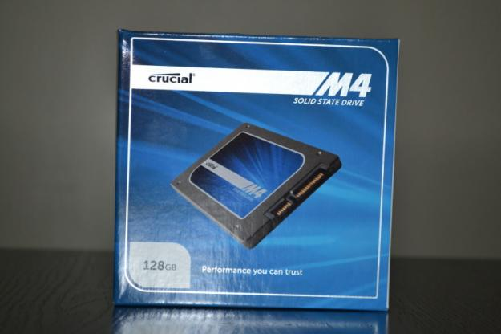
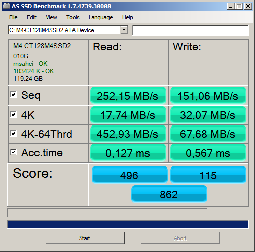
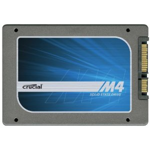
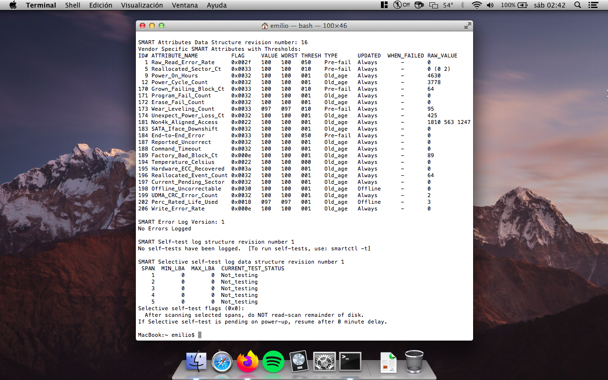
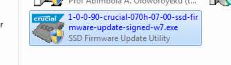
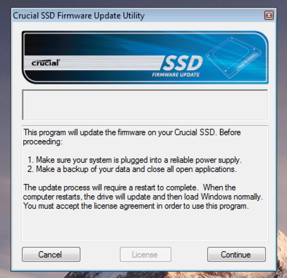

**Ficha Técnica:**  
Nombre: M4  
Fabricante: Crucial  
Precio: 92.57 €

Hace unos días me animé a sustituir el disco duro de mi [Asus Eee PC 1215n](../../../2011/08/asus-eee-pc-1215n/) por un SSD. La unidad original era un Seagate Momentus 5400.6, que contaba con 500 GB de almacenamiento y 8 Mb de caché. Generoso en espacio aunque nada fascinante en rendimiento, vamos. En cuanto al sustituto, opté por este Crucial entre otras cosas por ser una apuesta segura, pero hoy en día la oferta es mucho más amplia que hace unos años y la competencia ha puesto las pilas a los fabricantes; lo que tranquilizará a quienes estén en busca de alternativas.

No obstante estamos aquí para hablar de una unidad Crucial M4 de 128 GB de capacidad. Vienen encapsulados en una carcasa de 2.5'' y se pueden comprar con un kit que permite su instalación en bahías de 3.5 pulgadas, como las de los PCs de escritorio. Junto al SSD encontramos el pequeño folleto informativo sobre la garantía; y en la caja del kit (si lo hemos comprado) encontramos la placa adaptadora, los tornillos correspondientes y un cable SATA desgraciadamente bastante corto. Si te sorprende la ausencia de manuales es porque están disponibles online en www.crucial.com/support

La instalación fué un quebradero de cabeza por culpa de la [estructura del portátil](http://www.youtube.com/watch?v=DgSjmzz8Alg), pero si en el tuyo las unidades son fácilmente accesibles, estarás de enhorabuena. Un SSD no comporta ninguna complicación extra. Una vez con el portátil de nuevo ensamblado, lo arranqué con el conveniente pendrive de instalación de Windows 7. Este sistema ya viene [preparado de serie para trabajar con unidades SSD](http://es.wikipedia.org/wiki/Unidad_de_estado_s%C3%B3lido#Optimizaciones_afines_a_SSD_en_los_sistemas_de_archivos): dejó las particiones perfectamente alineadas y activó las rutinas [TRIM](http://es.wikipedia.org/wiki/TRIM).

Obviamente todo el sistema se instaló mucho más rápido que en el caso del disco mecánico, pero no te emociones. Uno (o al menos, la gran mayoría) no instala Windows todos los días (!). En el uso cotidiano es donde notarás el aumento de rendimiento y es algo realmente palpable. Todas las aplicaciones se incian muy rápido y el sistema carga en un abrir y cerrar de ojos. En este punto debo comentar que aunque la controladora de la placa funcione con el estándar SATA-2 y el SSD soporte SATA-3, el rendimiento es muchísimo mejor que con un disco mecánico. Realmente creo que es una actualización muy rentable si pretendes aumentar la velocidad general de un PC.

Obviamente ejecutar programas y buscar ficheros de forma más ágil es el principal beneficio. Pero copiar archivos desde y hacia otro dispositivo también fué una experiencia mucho más agradable; sobretodo cuando se trata de dos unidades SSD. También me ha llamado muchísimo la atención la reducción del ruido que genera el portátil. Con poca carga de trabajo es probable que los ventiladores se apaguen y se quede totalmente (repito, totalmente) en silencio. Provoca incluso una sensación algo extraña el estar trabajando sin el constante ruidito de un disco mecánico girando. Ah!!! Y dí adios a los "cliks" y "grrrrs" de un disco duro con algo de solera!!!

El disco consume tan solo 3 W, algo semejante a lo que consume un disco duro de portátil. Quizás en este aspecto me esperaba un consumo más bajo que permitiese estirar algo más la duración de la batería. Por otra parte en los test sintéticos hice 2 pruebas. La primera de ellas con el perfil de ahorro de energía y la segunda con el perfil de máximo rendimiento. Los resultados son los que se muestran a continuación. Como puedes ver, la puntuación global es superior en el perfil de alto rendimiento, pero la diferencia tan sólo sería apreciable en operaciones de escritura intensas. Las pequeñas fluctuaciones en los valores de lectura y en los tiempos de acceso se las achaco a procesos del SO en segundo plano, porque son diferencias pequeñas.

En definitiva, un SSD es una gran actualización para cualquier ordenador. Con el tiempo irán saliendo unidades mejores, que acusen cada vez menos el problema de la degradación y aumenten su capacidad y velocidad hasta que finalmente se conviertan en el estándar de la industria. En el caso de este Crucial M4 de 128 GB, la capacidad fué suficiente para mi instalación de Windows 7 y Ubuntu 12.04, obteniendo una amplia mejora en velocidad y respuesta por menos de cien euros. Otras unidades SSD prometen mejor rendimiento, como la Samsung 840 Pro, pero son al menos un 50% más caras y puede que no todo el mundo esté dispuesto a costearlas.

**NOTA: 8.75**

**Lo mejor de Crucial M4:**  
Gran aumento de rendimiento general del ordenador  
Precio asequible por la unidad de 128 GB  
Posibilidad de adquirirlo junto al kit de montaje en 3.5 pulgadas

**Lo peor de Crucial M4 128 GB:**  
Ausencia total de manuales de instalación en papel  
El cable SATA del kit de montaje para 3.5 pulgadas es bastante corto  
Si tu controladora soporta SATA-3 hay otras unidades aún más rápidas

**Actualización Enero 2023:**  
El ordenador me dio un par de fallos puntuales que causaban el bloqueo total del sistema sin una explicación razonable aparente. Se me ocurrió comprobar el nivel de desgaste ya que han pasado 10 años desde la compra. Efectivamente, la salida de la utilidad _smartctl_ me informaba de que esta unidad suele dar problemas en torno a las 5000h de uso, y la mía se acerca ya bastante.

En un [artículo de Tom's Hardware](https://www.tomshardware.com/news/Crucial-m4-Firmware-BSOD,14544.html) del año 2011 se abordaba el problema, explicando que el disco se desconecta de forma aleatoria pasadas esa cantidad de horas de funcionamiento y se mencionaba una actualización del fabricante que resolvía éste inconveniente. En la página de soporte de Crucial se puede encontrar la [última versión de Firmware](https://www.crucial.com/support/ssd-support/m4-25-inch-support), que es del año 2013 así que entiendo que incluye el parche necesario para evitar el problema. 

La forma más sencilla de llevar a cabo esta actualización es desde un sistema Windows: basta con descargar un programa del fabricante, aceptar la licencia de uso y un par de reinicios para completar el proceso. 

