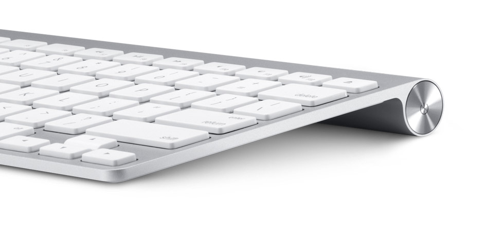
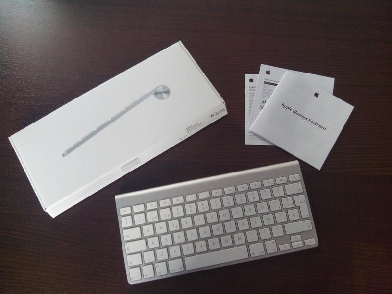
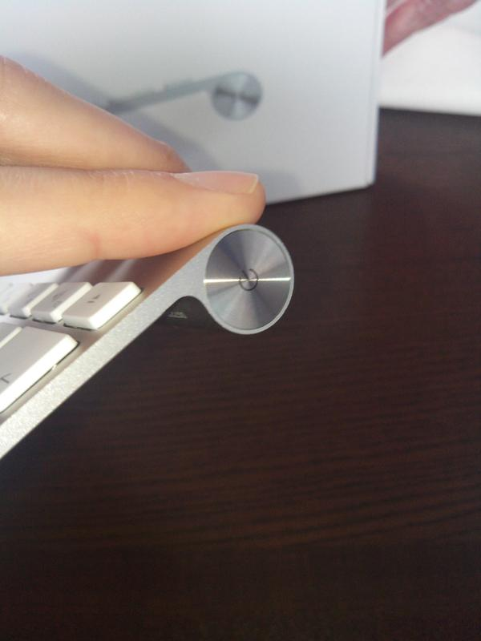
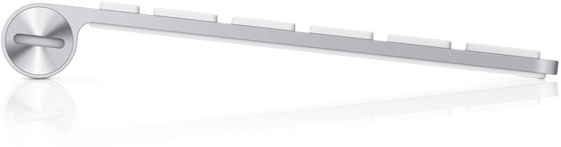
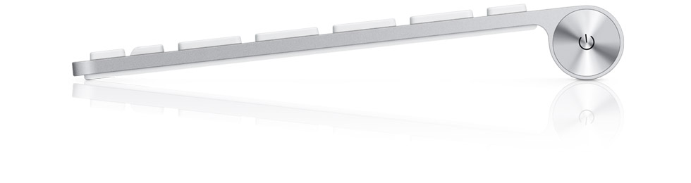

**Ficha Técnica:**  
Nombre: Apple Wireless Keyboard (modelo MC184LL/A)  
Fabricante: Apple  
Precio: 73.00 €  
Página Web: http://www.apple.com/es/keyboard/

Estos días estoy intentando liberar de cables mi escritorio y una cosa tenía muy clara: necesitaba un teclado inalámbrico que poder conectar al PC pero además sin ocupar un puerto USB con receptores de ningún tipo. Mi ordenador cuenta con una conexión Bluetooth que parecía la apropiada para tal fin y empecé a buscar por ahí.

Lo cierto es que no encontré muchas opciones interesantes. Hay varios fabricantes que crean réplicas de los teclados Apple, pero su aspecto y las opiniones de otros usuarios hicieron que los descartase a la velocidad del rayo. Logitech ofrece el fantástico [K810](http://www.logitech.com/es-es/product/bluetooth-illuminated-keyboard-k810?crid=26) pero fue imposible encontrarlo por menos de 90 euros, algo que me parece totalmente desorbitado para un periférico que no incorpora tan siquiera teclado numérico. Finalmente, la opción más sensata pasaba por el teclado de Apple.

Sobre el papel, no parece el mejor teclado para alguien que usa Ubuntu a tiempo completo (o Windows, si fuese el caso) y precise un teclado numérico; pero en el campo de teclados Bluetooth la oferta no es tan amplia como a mi me gustaría. Obviamente, como todo producto Apple, viene [agradablemente](http://www.applesfera.com/curiosidades/lo-imposible-ha-ocurrido-crean-un-perfume-con-olor-a-mac-nuevo) presentado en su caja con las pilas ya puestas y listo para que pulses el botón de encendido y lo emparejes al Mac. En mi caso, activé el Bluetooth del ordenador y lo puse a buscar dispositivos a su alrededor. Luego encendí el teclado y rápidamente lo encontró. Bastó con seleccionarlo y teclear el PIN para que quedasen vinculados. A partir de ahí, el alcance de la conexión Bluetooth es mucho más que suficiente para las tareas cotidianas. Comprobé que podía funcionar correctamente incluso a 7 metros de distancia.

Crear la conexión es solo el principio. Debido a la caprichosa distribución de teclas especiales en el ambiente Mac (Fn, Ctrl, Alt, Cmd) había que probar como se densenvolvía en Unity. Hasta ahora bastaba con la tecla Súper (la tecla de Windows) para traer al frente el tablero de aplicaciones de Unity (y otras funciones secundarias), mientras que la tecla Alt nos presentaba el HUD (en 12.04 y superiores) para realizar algunas acciones en los programas sin tener que despegar las manos del teclado en ningún momento, como por ejemplo abrir una pestaña en chrome. Ahora la tecla para sacar el Dash es Cmd (junto a la barra espaciadora), y el Hud se sigue obteniendo con Alt. Es un cambio minúsculo pero si estás muy habituado a estas funciones, necesitarás un tiempo con el nuevo teclado hasta conseguir cambiar totalmente el chip.

El tacto es excelente, las teclas (tipo chiclet) son muy silenciosas y tienen un buen tamaño. Su funcionamiento suave permite teclear a gran velocidad desde el primer momento y la construcción en un cuerpo sólido de aluminio es muy estable y elegante. La joroba de la parte de atrás del teclado le agrega una ligera inclinación que hace su uso mucho más ergonómico. Es importante destacar que el uso de la tecla de bloqueo de mayúsculas se indica mediante un LED que se enciende en la propia tecla, lo que hace el diseño del dispositivo aún más limpio. Además de estar hecho de una sola pieza metálica, el cuerpo del teclado no se resbala gracias a las gomas de la parte inferior.

 

En el lateral derecho está encastrado el botón de encendido/emparejamiento mientras que a la izquierda se encuentra el cierre del compartimento para pilas, que se puede abrir cómodamente con una simple moneda. Como las pilas vienen ya puestas de fábrica, no es necesario preocuparse por ellas hasta que las sustituyas por primera vez. Son dos pilas alcalinas AA que prometen una duración de varios meses. Como Bluetooth consume poca energía y el teclado se apaga solo cuando detecta que no está siendo usado, confío bastante en que esta estimación sea correcta; pero me hubiera gustado más batería y un conector mini-USB a través del cual se pudiese recargar como si de un teléfono móvil se tratase. Lástima.

Para terminar, algunas peculiaridades sobre este teclado son:
- Las teclas Inicio/Fin/Av.Pág/Re.Pág no están presentes. Yo las uso mucho, y he tenido que aprender a sustituirlas por Fn+Flecha de dirección. No es la mejor solución, desde luego, pero me imagino que todo será habituarse. 
- La tecla suprimir tampoco existe aquí, así que su función la realiza la combinación Fn+Retroceso Por otra parte, es conveniente revisar la configuración de teclado y atajos en Ubuntu; para obtener una experiencia mucho más completa y satisfactoria.

En definitiva, se trata de un teclado de uso increíblemente agradable e impecable aspecto, con ese inconfundible look Apple. No hubiera costado mucho añadir las pocas teclas especiales que se echan de menos o el teclado numérico, pero me imagino que, con el tiempo, aparecerá la versión completa también con conexión Bluetooth. Si lo valoras como un simple teclado, esas carencias y su precio no justifican su compra; pero a falta de competencia en teclados con este tipo de conexión inalámbrica, el Apple Wireless Keyboard es una opción muy recomendable.

**NOTA: 8.5**

**Lo mejor de Apple Wireless Keyboard:**  
Tacto excelente  
Construcción sólida y elegante  
Conexión Bluetooth con buen alcance y sistema de ahorro de energía

**Lo peor de Apple Wireless Keyboard:**  
Se echan de menos las teclas especiales (Supr, Inicio, Fin, ...) y un teclado numérico  
El precio es rematadamente alto para un teclado  
Hubiese sido mucho más apetecible una batería recargable en lugar de dos pilas AA