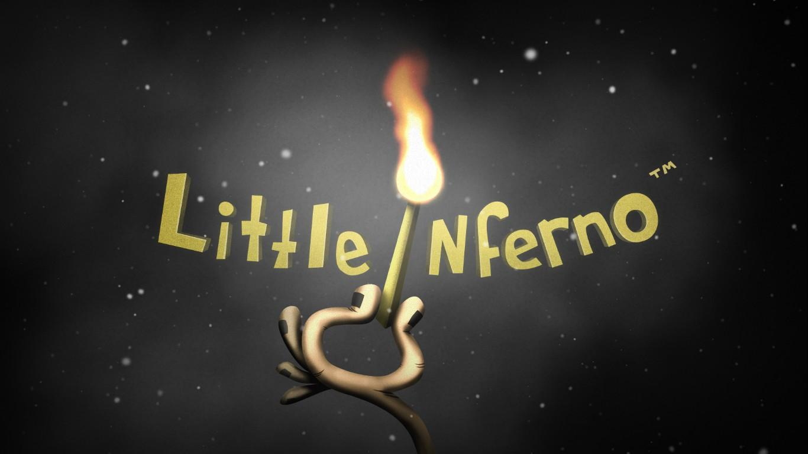
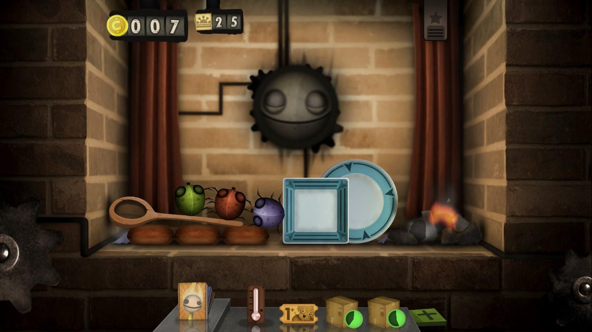
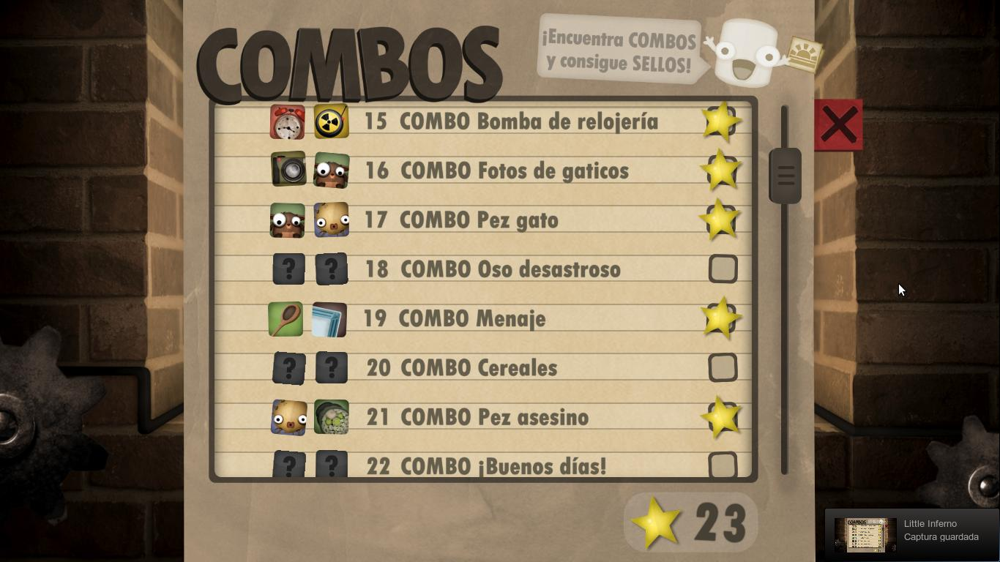
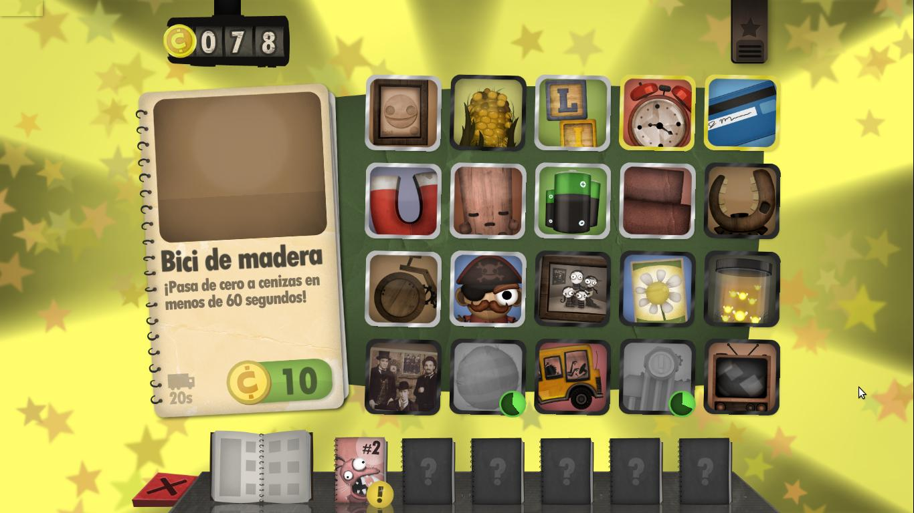
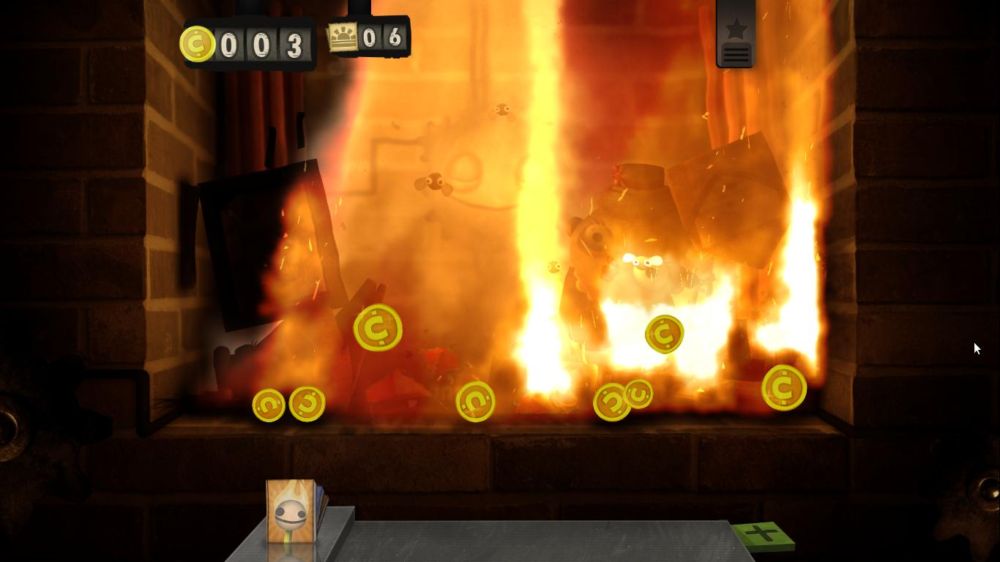

**Ficha Técnica:**  
Título: Little Inferno  
Desarrollador: Tomorrow Corporation  
Editor: Tomorrow Corporation  
Precio: 10.00 $ (aproximadamente)  
Página web: http://tomorrowcorporation.com/littleinferno

Little Inferno no es exactamente un juego. Es algo que se sale de la propia definición de lo que un juego es. Little Inferno es, con más precisión, una noche de navidad con unos primos lejanos, o una tarde con una chica de aspecto "indie" y algo perturbador que acabas de conocer. No es que se base en puzzles, ni en plataformas, ni en ninguna otra mecánica cualquiera. Little Inferno va de quemar cosas (como le gusta a tus primos). Cuantas más, mejor. En cierto modo me recuerda a Los Sims: no hay ninguna meta, solo se trata de disfrutar y experimentar con lo que quiera que hagas durante el tiempo que pases con el juego (como le gusta a la chica).

Contexto: Felicidades!! Ya tienes tu Little Inferno Entertainment Fireplace!! O lo que es lo mismo, un lugar para hacer las delicias de cualquier pirómano virtual. Nos viene de perlas porque afuera lleva varios años nevando sin parar y la previsión meteorológica no es nada halagüeña, así que haz caso de lo que te dicen y mantén el fuego vivo. Bajo la chimenea, nuestra bandeja de objetos, donde recibiremos también las cartas de otros personajes. Con cada cosa nueva que quemas (cartas que recibes, objetos que compras, bichos que bajan por la pared de la chimenea, ...) ganas más dinero y tickets para acelerar la entrega de los objetos en tu bandeja.

Para que no se trate tan sólo de la quema incontrolada, el juego organiza sus items en diversos catálogos que debemos desbloquear mediante la acumulación de "combos", que se hacen al quemar determinados objetos juntos. Por ejemplo, uno de ellos consiste en incendiar al pirata y al petrolero a la vez. ¿Ingenioso? No, pero cumple su misión como requisito para avanzar. Muchos de los combos pueden descubrirse estando atentos a su nombre o a la descripción de los objetos; pero conforme avanzas, las pistas se diluyen y ya no resultan tan evidentes. He ahí el único punto por el que Little Inferno podría ser considerado un juego, una linea de dificultad progresiva. Sin embargo, la originalidad del incendiario asunto se ve mermada por recurrir al trillado "consigue-pasta --> te doy más objetos --> quémalos para conseguir más pasta --> y te daré más objetos...". Que es en definitiva como termina por cerrar el círculo de la jugabilidad, algo nada novedoso.

Si esto fuese un Call of Duty, sabríamos que contamos con varias campañas. Como no lo es, contamos con al menos tres chimeneas para hacer de las nuestras, lo que puede invitar a rejugar, compartir o tratar de avanzar más rápido, de forma más original, etc. Aunque desafortunadamente, los catálogos son los mismos, por lo que acaban pareciéndose más a tres slots donde guardar partidas de tres jugadores distintos. El juego viene aderezado con una estética propia de "Pesadilla antes de Navidad" o "La Novia Cadaver"; y un sonido hilarante con tintes excéntricamente festivos. Se nota la influencia de World of Goo en la herencia que Kyle Gabbler (co-creador) ha traído a Little Inferno. Esa socarronería que asoma en cada vídeo, en cada frase y en cada texto es inconfundible. También lo es la aparición de personajes de los que casi no sabemos nada, como AZUcarilla o El hombre del tiempo. Para muestra, un botón: el tráiler del juego es realmente desternillante y abusa de esa visión americanizada y distorsionada de la diversión en familia de mediados del siglo pasado.

https://www.youtube.com/watch?v=-0TniR3Ghxc

Técnicamente no requiere ningún prodigio de máquina para poder moverse y la simulación del fuego y las brasas está bien conseguida. Los gráficos son más que aceptables y el rendimiento puede calificarse de bueno. Incluso el crepitar de nuestra hogera u otros efectos de sonido también se antojan mucho más que dignos, y el control es preciso y sencillo: todo lo que se puede hacer se hace a golpe de ratón, ni más ni menos. Probablemente sea mucho más divertido si jugamos con una buena pantalla táctil (por ejemplo, en un iPad 2). Lo que el juego pide a gritos es mayor duración o posibilidades en línea.

En definitiva, Little Inferno parece un juego pero en realidad es algo diferente, justo lo que uno busca en un título indie. La sensación que deja es la de que el punto de partida podría haber dado mucho más de sí, que el resultado final sería algo más propio de un juego en Flash. Pero que eso no te desanime para probarlo. A mi me ha recordado mucho al primer [Portal](../../../2007/10/portal-orange-box/). Y eso no puede ser algo malo.

**NOTA: 6.5**

**Lo mejor de Little Inferno:**  
El punto de partida es muy original  
El sarcasmo y su extravagante diseño y arte  
Saca el pirómano que llevamos dentro (y eso es divertido) 😂

**Lo peor de Little Inferno:**  
Saca el pirómano que llevamos dentro (y eso es escalofriante) 😱  
Muy corto, poco rejugable y sin alicientes online  
La mecanica de comprar objetos no se ha resuelto con tanta originalidad

**Requisitos mínimos:**  
Procesador a 1.5 GHz  
1 GB de RAM  
Tarjeta de video compatible con DirectX 9 y Shader Model 2.0  
Windows XP/Vista/7

**NOTA:** No se han publicado unos requisitos recomendados. El juego está disponible para Mac OSX 10.6 (y superiores) así como para Linux. En ambos casos, es necesario contar con una tarjeta gráfica que soporte OpenGL 2.1. También se puede jugar en WiiU e iOS (iPad 2, iPhone 4 y superiores).