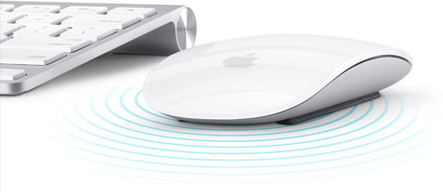
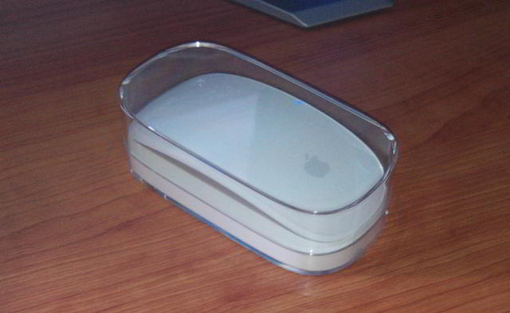
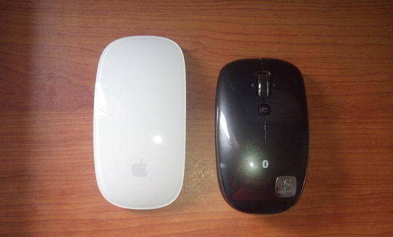
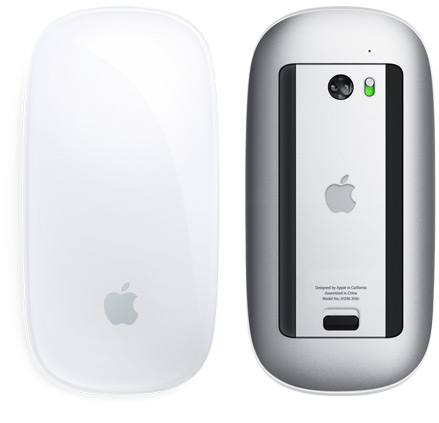
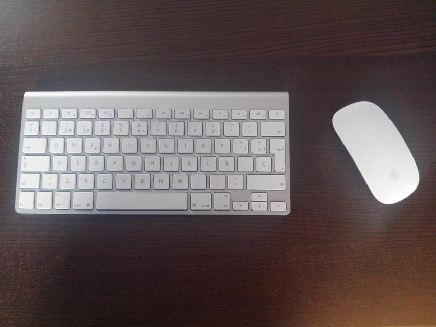

**Ficha Técnica:**  
Nombre: Apple Magic Mouse  
Fabricante: Apple  
Precio: 71.00 €  
Página Web: http://www.apple.com/es/magicmouse/

Y de nuevo termino por recurrir a un producto de Apple para habitar mi escritorio. Tras adquirir el [Apple Wireless Keyboard](../../../2013/06/apple-wireless-keyboard/) comencé a preocuparme por el ratón. Ya había escrito antes que había escogido un ratón Logitech M555b; pero lo cierto es que no terminaba de acostumbrarme a dos características fundamentales: me parecía pequeño e inexplicablemente la rueda no podía ser utilizada como un botón central, algo de lo que yo dependo muchísimo.

Afortunadamente, pude probar un Apple Magic Mouse antes de lanzarme a por el mío (por poco más de 62 euros en Amazon España) y lo cierto es que la sensación es mucho mejor, En primer lugar porque el cuerpo del ratón es algo más alargado y su inclinación más regular. Pero también porque se trata de una superficie táctil que permite realizar gestos de forma similar a un touchpad.

En el paquete sólo encontrarás, además del propio ratón, una pequeña carcasa plástica que lo protege y unos papelitos con información sobre la garantía y su puesta en marcha en entornos Mac. Incluye e incluso trae puestas las dos pilas con las que funciona. En este punto, recalco algo que ya me resultó chocante en un teclado de la categoría del Apple Wireless Keyboard: son pilas AA en lugar de una batería recargable o alguna otra solución más respetuosa con el medio ambiente. Procura también tener pilas de repuesto a mano, pues a pesar de que el ratón entra en reposo tras un tiempo sin usarse, le durarán en torno a un mes con un uso diario moderado.

Emparejarlo a mi PC con Ubuntu fue muy simple: activar el bluetooth del ordenador, ponerlo a buscar dispositivos a su alcance y encender el Magic Mouse con el pequeño interruptor de su parte inferior. Una vez encontrado, se empareja con el pin 0000. Listo. El alcance anunciado es de 10 metros, aunque en mi caso tuvo problemas cuando se interponían paredes. De todas formas, utilicemos el cerebro: es un ratón, un dispositivo pensado para reposar en el mismo escritorio donde se encuentre el ordenador.

El puntero se desplaza rapidísimo. En buena medida es gracias a su sensor láser, mejor que los tradicionales sensores ópticos, y que puesto a prueba sobre diferentes superficies (madera, papel, alfombrilla, metal) aprueba con creces en cada una de ellas.

En Linux no obstante nos ha surgido un problema: el scroll no se realiza tan rápido como debiese (desplazarse en una página hasta el final es sencillamente agotador), así que tendrás que esperar a que aparezca algún parche que lo solucione. En OSX sin embargo, tanto el scroll como el resto de gestos funcionan a la perfección, inclusive los que se realizan con varios dedos (faltaría más!!!).

Por supuesto ni que decir tiene que, como buen producto Cupertino, tiene un aspecto envidiable, sobre todo cuando forma pareja con otros de "su misma especie"...

En resumen, se trata de un buen ratón inalámbrico que funciona por bluetooth, lo que te puede librar de ocupar algún puerto usb con incómodos cables o receptores. Su tacto es muy agradable, el sensor excelente y en OSX brinda una capacidad de acción inigualable, aunque en otros sistemas operativos su utilidad se ve mermada por falta de buenos controladores. Unido a su alto precio y el uso de pilas, sus contras son más determinantes en el resultado final de lo que uno podría esperar.

**NOTA: 7.5**

**Lo mejor de Apple Magic Mouse:**  
Diseño ergonómico y muy acertado  
Posibilidad de gestos como si fuese un touchpad  
Sensor láser y conexión inalámbrica por Bluetooth

**Lo peor de Apple Magic Mouse:**  
Funciona con 2 pilas AA en lugar de baterías  
El precio es muy alto, casi prohibitivo  
El soporte en Linux aún debe mejorar