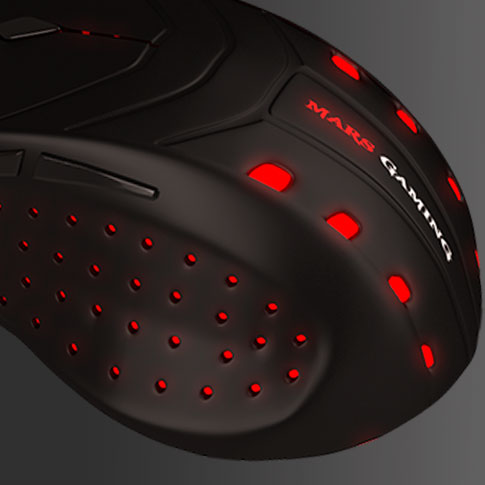

**Ficha Técnica:**  
Nombre: Mars Gaming MM0  
Fabricante: Tacens  
Precio: 5.25 €  
Página Web: http://www.marsgaming.eu/es/productos/mm0.html

**¿Que buscamos?**  
Para empezar, quería un ratón con cable (estoy empezando a hartarme de tener que cargar las baterías o pilas de todo cacharro), un cuerpo grande (para que no me pase lo mismo que con el Logitech M555b) y botones hasta decir basta (no como el Apple Magic Mouse, que es un mouse muy bueno, pero no para jugar). En definitiva, buscaba algo como mi anterior NGS Tracker (tan anterior como de 2007), que era una pasada en todo tipo de situaciones gracias a su selector de resolución, excelente diseño y bendito tamaño. Fué así como me fijé en el Tacens Mars Gaming MMO.

**En detalle**  
Este ratón tiene un diseño apto para ambidiestros, muy ergonómico, y está construido con un suave caucho que le da un tacto muy agradable. Probablemente deje un poco de sudor a la larga, pero es un gran acierto por su comodidad. Lo de la estética del color negro en contraste con zonas iluminadas en color rojo ya lo dejo al gusto de cada uno. No es feo, pero desde luego tampoco es el ratón para una reunión de ejecutivos...

Vamos con los botones que son seis y además son programables: los clics primario y secundario, el clic bajo la rueda, el selector de resolución (800/1600/2800 dpi) y los botones de avance y retroceso que... ¡oh no! Están situados para manejarse con el pulgar si eres diestro, así que al traste con un buen diseño del cuerpo si luego los zurdos van a sentirse incómodos con la disposición de botones. El fabricante asegura que soportan más de cinco millones de pulsaciones cada uno.

La rueda es muy cómoda y rápida; pero además tiene esos "pasos" mecánicos que te permiten subir y bajar de forma totalmente controlada, incluso cuando quieres cambiar de arma a toda pastilla :D En el caso del Logitech M555b, la ausencia de estos pasos hacía que seleccionar otro arma mediante la rueda fuese prácticamente una lotería. En otro tipo de situaciones (por ejemplo, navegando) esto puede no ser tan importante, pero llevo utilizando ruedas con pasos desde que los ratones empezaron a tener rueda de scroll (y a dios pongo por testigo que de eso hace ya mucho tiempo). Por supuesto, tambien permite el scroll horizontal (si es que alguien usa eso).

La longitud del cable es de 1,5 metros; que no es demasiado ☹️

**Mejor que los anteriores?**  
Cuando mi NGS Tracker se estropeó (el botón de clic izquierdo ya no hacía clic o hacía varios con una sola pulsación y el cable no hacía buena conexión) se abrió una etapa en la que he estado probando otros ratones y he tardado mucho en encontrar uno a la altura de la situación. Tuve uno de marca blanca que fucionaba bastante bien, pero con tan solo tres botones (izquierdo, derecho y bajo la rueda) se quedaba corto. Luego vino el M555b al que ya no criticaré más porque el pobre ya no sabe ni por dónde le caen los palos a estas alturas. El Apple Magic Mouse no está pensado para ser un ratón de juegos. Y claro, un trackpad no es lo mismo. Ni siquiera el trackpad de un Macbook.

El Mars Gaming MM0 reune todo lo que tenía el NGS Tracker con alguna mejora sustancial. La resolución máxima ha aumentado de 1600 a un tercer nivel con 2800 puntos por pulgada, lo que es una barbaridad. La rueda tambien permite el scroll horizontal, que hace casi diez años suponía toda una novedad. Iguala el número de botones y se presenta con un mejor tacto y un diseño más cómodo. Es dificil ponerle "peros" importantes. Casi tanto como encontrar buenos ratones con cable; y más aún en un precio tan contenido.

**NOTA: 8.5**

**Lo mejor de Tacens Mars Gaming MM0:**  
El cuerpo grande de tacto muy agradable  
Numero de botones, selector de resolución y rueda de scroll  
Resolución muy alta

**Lo peor de Tacens Mars Gaming MM0:**  
El cable podría ser más largo para los ordenadores de sobremesa  
La disposición de botones no tiene sentido para los zurdos a pesar del diseño ambidiestro  
A la larga puede hacer que te suden las manos