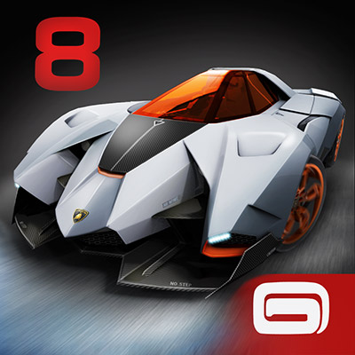

**Ficha Técnica:**  
Título: Asphalt 8: Airborne  
Desarrollador: Gameloft  
Editor: Gameloft  
Precio: Gratuito (compras dentro de la app)  
Pegi: +12  
Página web: http://www.gameloft.com/asphalt8/

La saga Asphalt es un arcade de conducción más centrado en la espectacularidad e inmediatez que en la recreación fiel de las carreras.

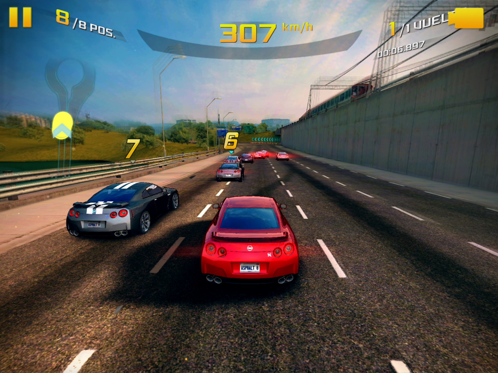

Lo primero a tener en cuenta es el control de los coches. Aceleran por sí solos sin hacer nada, y para girar has de inclinar tu tablet o movil en sentido horario o antihorario. Es bastante preciso aunque te obliga a sostener la tablet en vertical. Por otro lado, un toque en la parte derecha de la pantalla activa el "nitro" (y con sucesivos toques, más "nitro" o el "nitro perfecto"). En el lado izquierdo, activas el freno, que también te permite derrapar o dar marcha atrás si lo mantienes presionado. Son unos controles muy simplificados pero efectivos para ofrecer una diversión sin complicaciones. No tienes control sobre las marchas, la aceleración o frenos delanteros, pero tampoco lo vas a echar en falta.

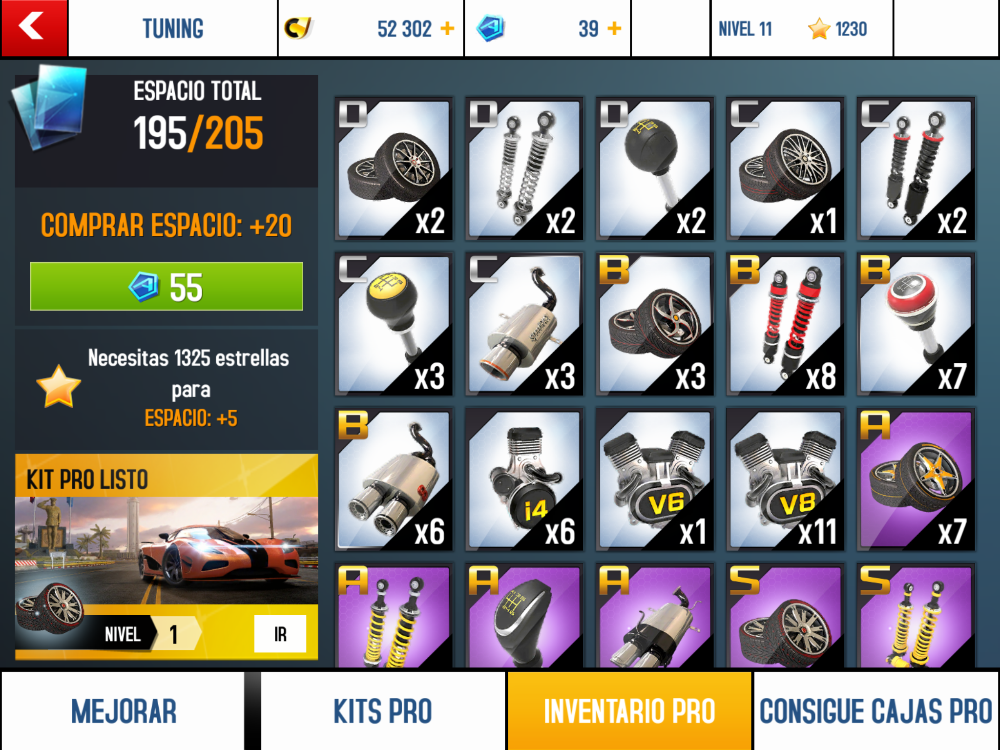

Hay tantos coches disponibles que te sentirás satisfecho en ese sentido. Vienen organizados en las categorías D, C, B, A y S; están representados de forma bastante correcta y su manejo varía lo suficiente de unos a otros para darle un toque de verosimilitud que contribuye a que la curva de dificultad continúe siempre suponiendo un reto aceptable.

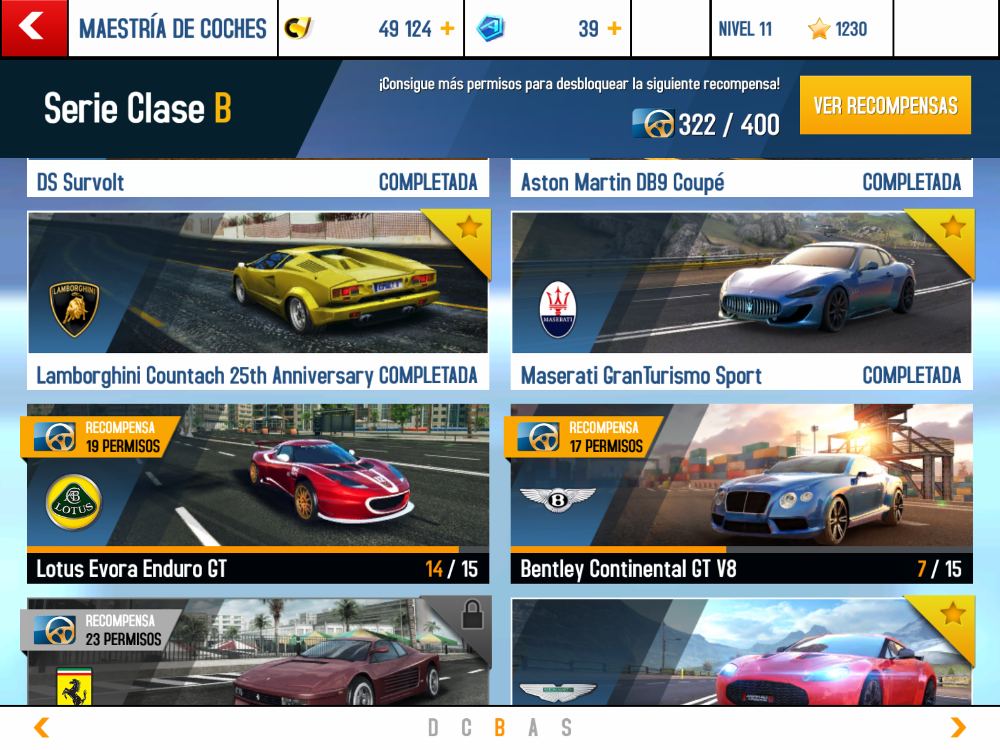

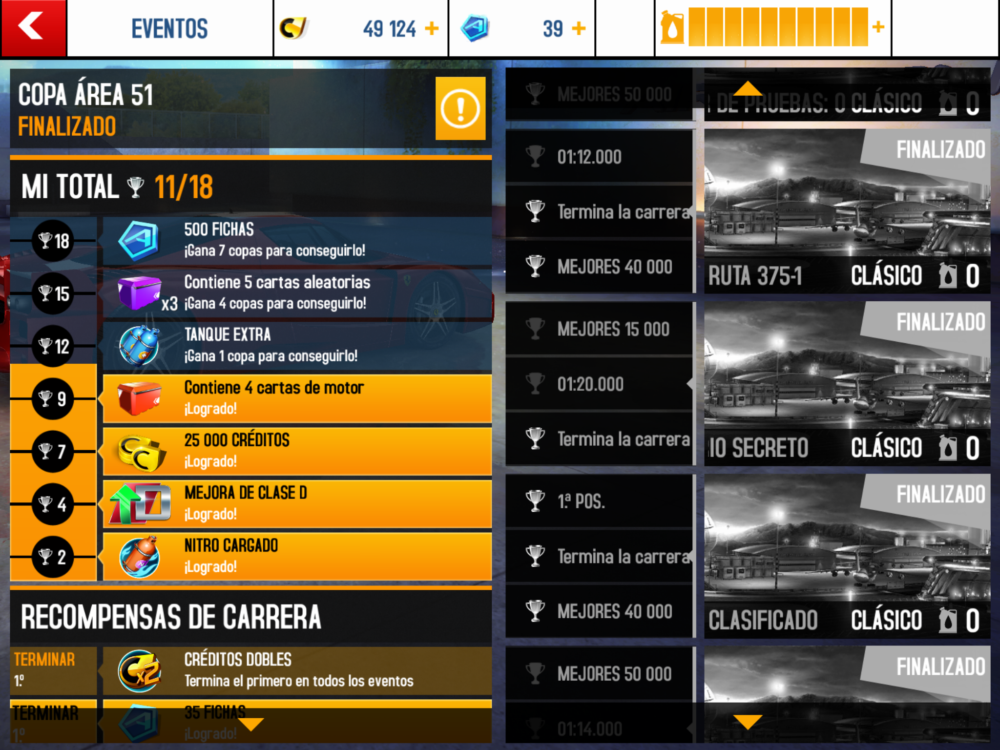

Donde hay menos variedad es en los circuitos. Poco a poco se han añadido algunos con las continuas actualizaciones; pero siguen siendo escasos, aunque variados: Nevada, Tokio, Dubai, Barcelona, Venecia, Londres, Área 51, el Sector 8 (que es un circuito imaginario), San Diego, Mónaco, Tenerife, etc. La recreación de Dubai, Londres y Barcelona es bastante aceptable, aunque en general apenas unos pocos disponen de rutas alternativas. Como es habitual desde hace años (si no recuerdo mal, fue [Need for Speed](../../../2006/01/need-for-speed-most-wanted/) quien lo hizo por primera vez) los circuitos se pueden recorrer también en sentido inverso. Unas rampas bien situadas permiten realizar espectaculares saltos, tirabuzones y "helicópteros" que suman puntos y contribuyen a recargar el nitro. Esos puntos se traducen en dinero para comprar más y mejores coches. Cash, yeah 💵💵💵💵.

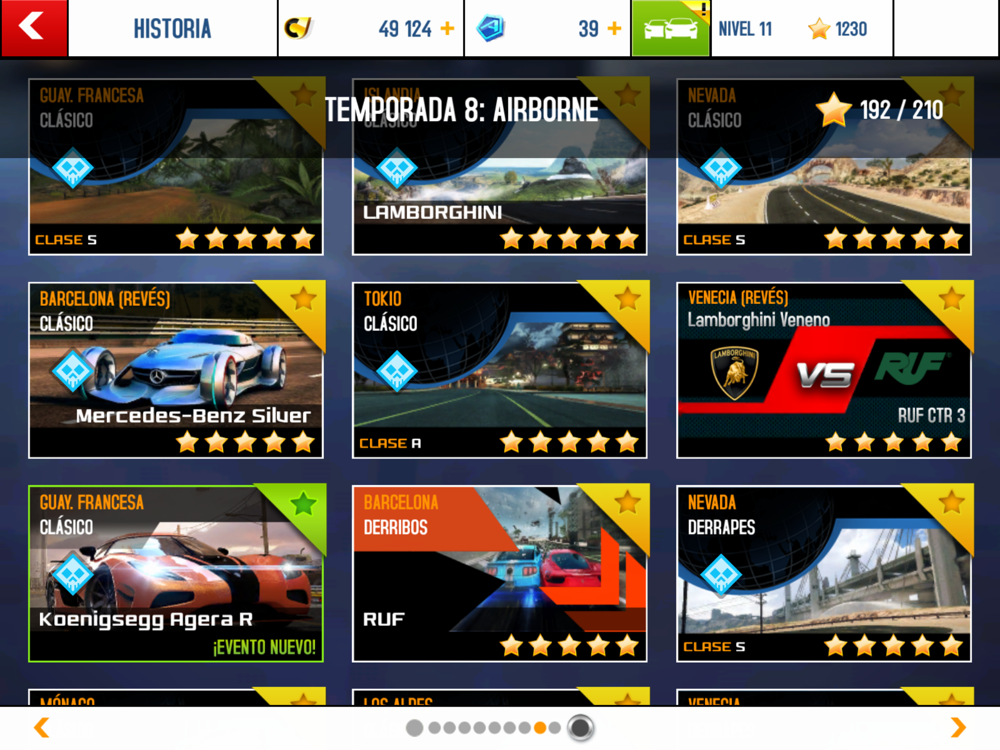

El sistema de compras incluye mejoras para los coches en cuatro apartados: ruedas, suspensión, transmisión y tubo de escape. Estas mejoras vienen complementadas por otras llamadas "Pro" que requieren de unas cartas coleccionables que se pueden comprar también con dinero del juego o con "fichas", que son otra forma de divisa que hay que conseguir compitiendo en el modo multijugador y en los eventos especiales. Los más pudientes, las tienen a su disposición en paquetes de diferentes cantidades y precios como compra in-app.

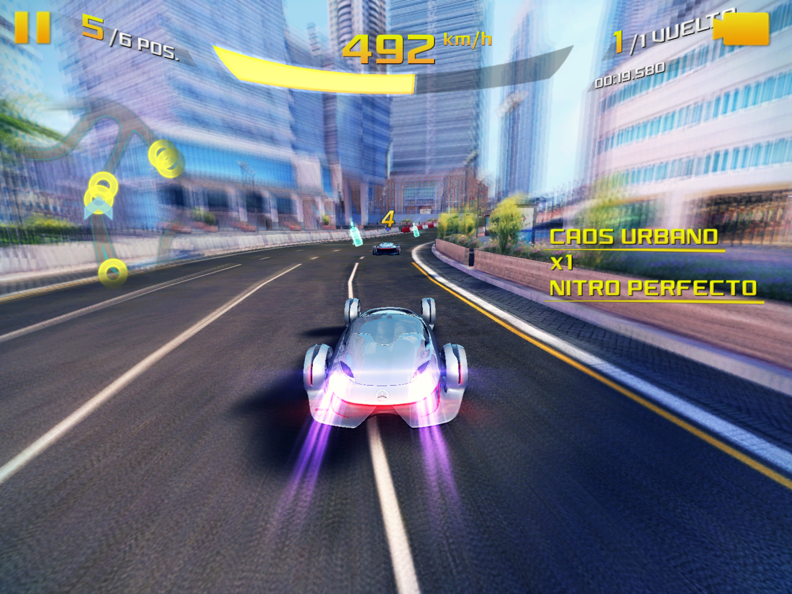

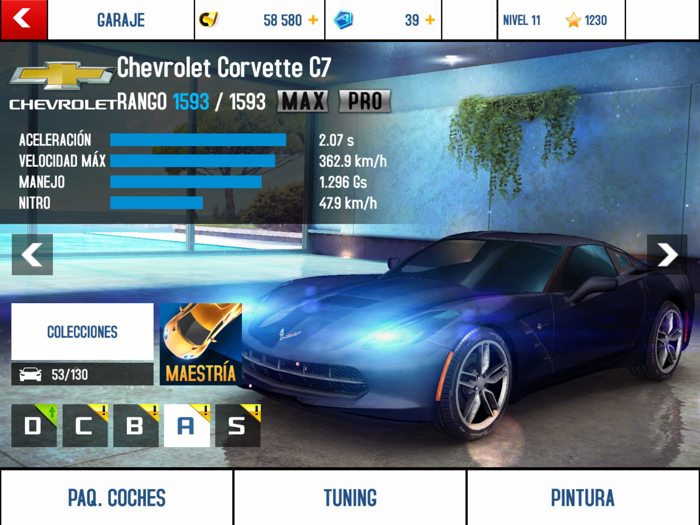

También hay diferentes tipos de carrera. El modo principal está organizado por temporadas, que consisten en carreras clásicas (el primero en llegar gana), carreras perfectas (no se permiten accidentes), eliminaciones (no puedes ir el último y aguantar primero hasta que todos sean eliminados), derribos (destroza más coches de los otros corredores que tu oponente), cara a cara (un coche debe ganarle a otro), infecciones (el ultimo tiene nitro ilimitado e infecta a los demás con la desventaja de explotar tras unos segundos) y derrapes (pasar derrapando bajo una cantidad determinada de arcos). También hay carreras "desenchufadas", donde no hay recargas de nitro en pista. Estos modos de carrera están diseminados a lo largo del modo historia, pero hay excesivas carreras clásicas. Demasiadas. Y no tantas de derrapes, o infecciones, o derribos, que son rematadamente divertidas.

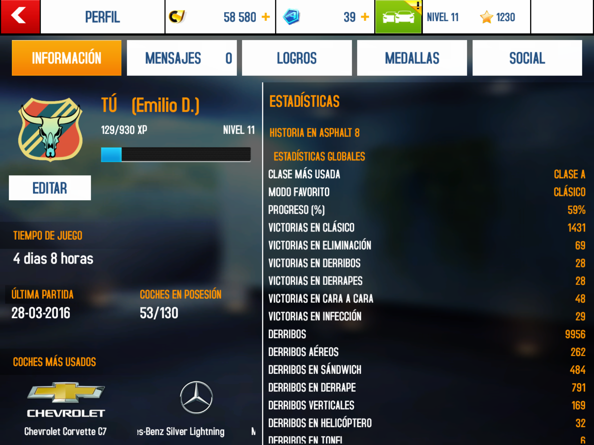

El modo multijugador no está tan pulido. Puede haber bastante desequilibrio entre los jugadores de una misma partida y las recompensas, que crecen conforme encadenas victorias, parecen escasas. En el caso de los eventos, la cosa mejora. Si eres un buen corredor, obtendrás premios bastante interesantes. También existe un modo maestría de quince pruebas para cada vehículo, que premian con mejoras, bonus de nitro, etc. En especial, los puntos de maestría pueden conseguirte coches extra y pegatinas. Las pegatinas y la pintura son las únicas opciones de personalización visual de los vehículos. Por último, hay temporadas especiales como la 9, destinada a los coches que has mejorado al máximo, la de pruebas "Metal" con hasta 24 coches en pista, y la temporada de pruebas especiales (que incluye carreras de relevos, etc.)

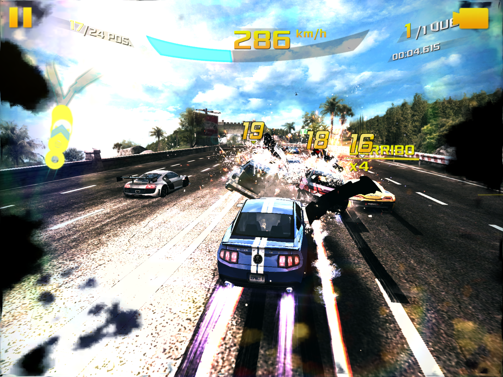

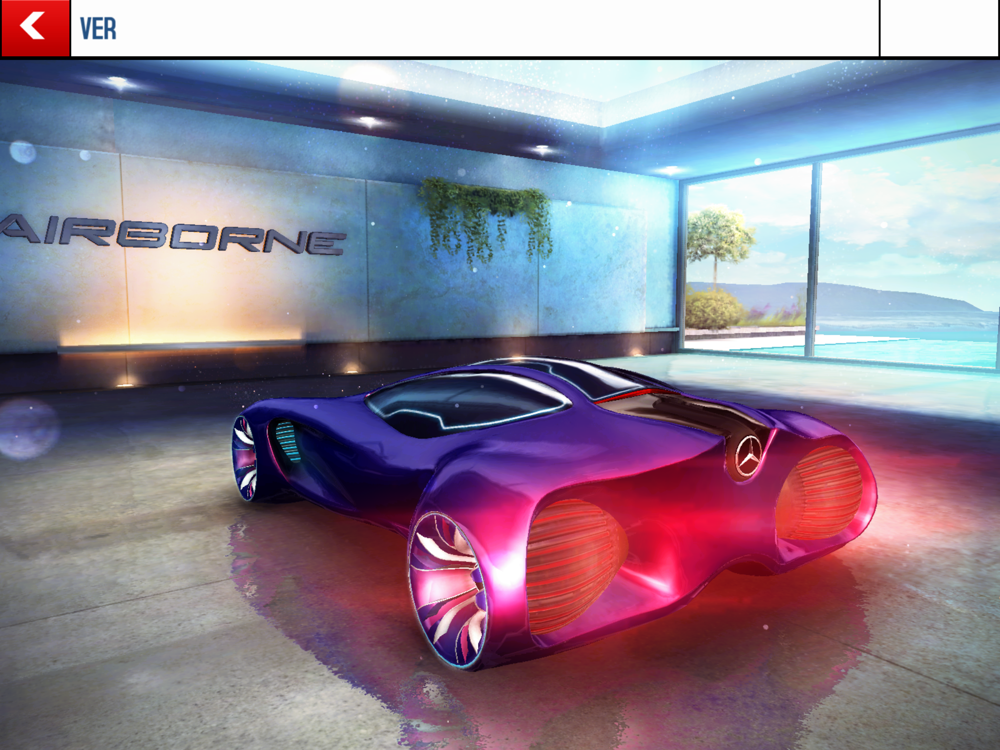

Visto lo visto, parece que gracias a las constantes actualizaciones Asphalt 8 se ha convertido en un juego muy completo, y lo es. Por desgracia, muchas de las novedades requieren tantas fichas que si no quieres hacer compras dentro de la aplicación, quedarán coches pendientes de probar. Es practicamente imposible conseguir completar el 100% del juego. Y mientras por un lado el surtido de vehículos es enorme, hay poca variedad de circuitos. La música también es uno de sus puntos débiles, con pocas canciones y algunas no muy interesantes. Eso sí: el nivel técnico no es malo, tiene buenos efectos gráficos y de sonido (para la tecnología de los dispositivos móviles) con un rendimiento muy aceptable.

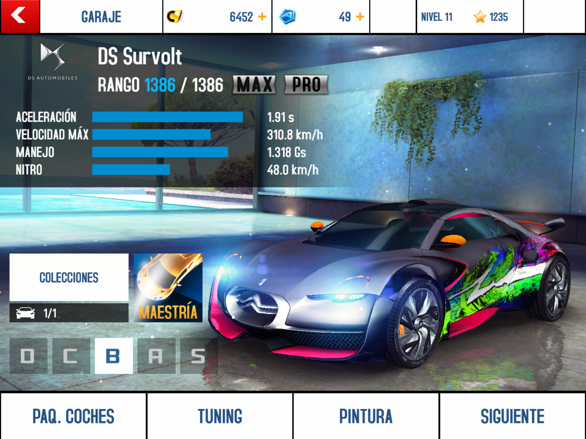

**NOTA: 8.5**

**Lo mejor de Asphalt 8: Airborne:**  
Controles sencillos y buen apartado técnico proporcionan una buena sensación de velocidad  
Enorme variedad de coches, que sigue creciendo con las actualizaciones  
Las acrobacias, derribos y accidentes son espectaculares

**Lo peor de Asphalt 8: Airborne:**  
Pocos circuitos y solo algunos disponen de rutas alternativas  
Hay pocas oportunidades de disfrutar los modos de carrera alternativos  
Multijugador desequilibrado y pocas posibilidades de personalización de los coches

**Requisitos:**  
Sistema iOS (6.1.6 o superior): iPhone 4, iPad o iPod Touch (o superiores).  
Sistema Android, versión 2.3 o superior.

También disponible en Windows, Windows Phone y Amazon Kindle.