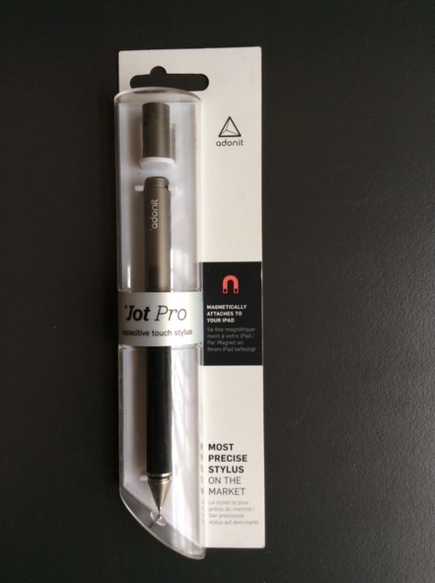
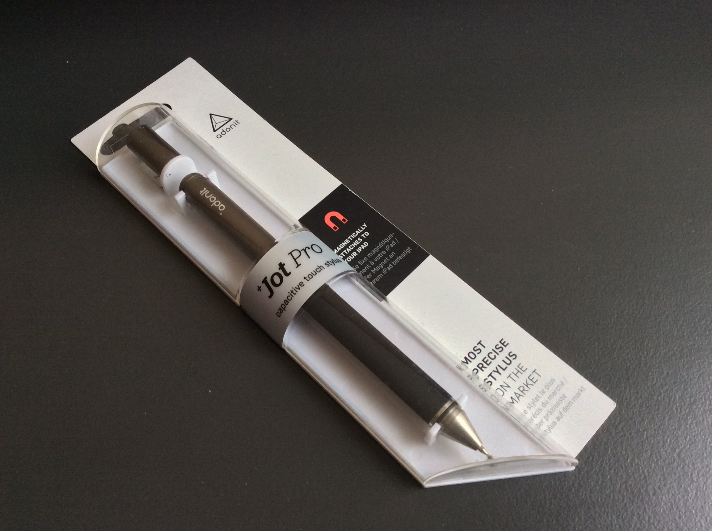

**Ficha Técnica:**  
Nombre: Jot Pro  
Fabricante: Adonit  
Precio: 24.95 €  
Página Web: http://www.adonit.net/jot/pro/

Hace poco estuve probando el lápiz digital Jot Pro de Adonit, que está bastante bien de precio en [Amazon](https://www.amazon.es/gp/product/B00931K1QK/), para ver si conseguía más precisión al escribir partituras en mi iPad Mini 2 con la app NotateMe.

Está muy bien construido en aluminio y tiene un tacto muy comodo, un tamaño apropiado y la posibilidad de quedarse magnéticamente pegado al borde de cualquier iPad. La tapa protege una punta muy fina en la que se encaja una especie de sombrerito de goma, que es el que realiza el contacto con cualquier pantalla capacitiva. En general la sensación es como la de un bolígrafo clásico, bien balanceado y con un agarre de goma que proporciona una respuesta familiar.

Sin embargo, cualquier iPad anterior al iPad Pro no tiene detección de la palma de la mano y se hace difícil escribir sin poder apoyar el dorso de la pezuña. Si lo haces, el iPad detecta varios puntos de entrada y no reconoce las letras. El capuchón de goma permite ver con precisión dónde se está realizando el trazo aunque hay que hacer un poco más de presión de la que a mi me hubiera gustado para que dibuje.

Ahora que existen los iPad Pro, sus usuarios seguramente preferirán utilizar el mucho más preciso Apple Pencil. En general, siendo el Jot Pro de lo mejorcito disponible para el resto de tablets, creo que seguiré empleando el típico lápiz de Amazon Basics, que por cuatro perras funciona prácticamente igual de bien aunque sea algo menos elegante.

**NOTA: 6**

**Lo mejor de Adonit Jot Pro:**  
Tacto, balance y tamaño muy similares a un bolígrafo tradicional  
Permite ser muy preciso gracias a la goma transparente  
Cuerpo magnético para evitar perderlo

**Lo peor de Adonit Jot Pro:**  
No incluye ninguna tecnología interna, así que no hay posibilidades de presion, inclinación, orientación, etc.  
Aunque no es caro, otros lápices mucho más baratos funcionan bastante bien a su lado  
Hay que ejercer un poquito de presión extra para que empiece a dibujar