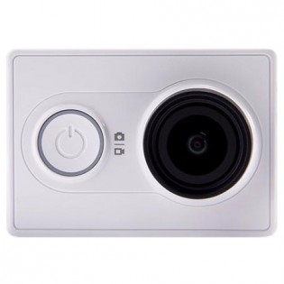
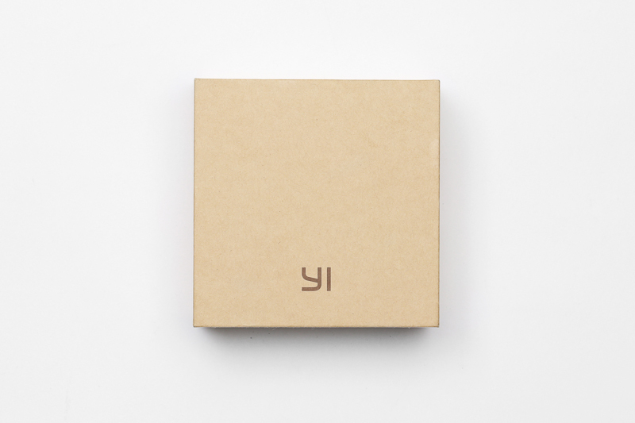
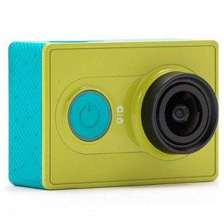

**Ficha Técnica:**  
Nombre: Yi Action Camera  
Fabricante: Xiaomi  
Precio: 73,99 €  
Página Web: http://www.yitechnology.com

He localizado en una oferta de Amazon esta mini-cámara deportiva, muy al estilo de las GoPro, y no he podido resistirme. Si quieres, te cuento el porqué.

Un par de semanas antes, me hice con un trípode y el extremo de un palo de selfie. La rosca mediante la cual se acopla al palo es una rosca estándar y pude montarla sobre el trípode, así que hice un par de pruebas grabando con el iPhone 5c (que pronto jubilaré, aunque esa será otra historia). No está mal, pero en un dispositivo de 16 GB, con unas cuantas aplicaciones instaladas, vídeos y fotos en el carrete, algo de música y tal... poco vídeo puedes hacer. Por otra parte, el volumen de los vídeos saturaba el pequeño micrófono del teléfono y era insoportable. De modo que decidí lanzarme a la búsqueda de algo tipo GoPro... en un precio más comedido. ¡Sorpresa! Xiaomi tenía lo que yo quería.

Las características fundamentales de la cámara son las siguientes:  
- Sensor Sony EXMOR-R de 16 Mpx y procesador de imagen Ambarella A7LS 
- Lente Zeiss Tessar de 155 grados con apertura máxima f/2,8 
- Grabación en estándar h.264 (vídeo) y AAC (audio), con formato .mp4 
- Grabación de sonido hasta 96Khz y 92dbA SNR 
- Conexión USB 2.0, WiFi, Bluetooth 4.0 y salida micro HDMI 1.4 
- Almacenamiento en tarjeta SD (no incluída) - Peso de 72 gramos

Este hardware permite tomar fotografías de hasta 16 Mpx (4608×3456 píxeles, formato 4:3) y grabar en varios modos de video:  
- 2K (2304×1296, formato 16:9) @ 30fps 
- 1080p (1920x1080, formato 16:9) @ 60/30/48/24fps 
- 960p (1280x960, formato 4:3) @ 60/48fps 
- 720p (1280x720, formato 16:9) @ 120/60/48fps 
- 480p (848x480, formato 16:9) @ 240fps 

Probablemente los más interesantes son 2K a 30 cuadros por segundo y Full HD 1080p a 60; mientras que los modos con mayor tasa de frames por segundo pueden venir bien para hacer tomas a cámara lenta sacrificando resolución. He tomado una foto de prueba aprovechando que el día estaba soleado, aunque por internet hay muestras de todo tipo: 

 

En general, se trata de una cámara con muy buena calidad de imagen.

En sí misma, la cámara no dispone de ninguna pantalla y tan solo tienes tres botones. El botón del frontal enciende la cámara, alterna entre el modo de foto o vídeo y apaga el dispositivo si lo mantienes presionado. En la parte superior está el disparador, con el que tomar una foto o iniciar/detener la grabación; mientras que en uno de los laterales está el botón para encender su enlace Wi-fi. Por lo tanto, toda la configuración y manejo se realiza a través de la app Yi Action ([App Store](https://itunes.apple.com/es/app/yi-action-yi-4k-action-camera/id963065779?mt=8), [Google Play](https://play.google.com/store/apps/details?id=com.xiaomi.xy.sportscamera&hl=es)), donde podemos además activar algunas características avanzadas como la corrección de imagen, hacer timelapses, etc. Incluso funciona como una especie de red social para los usuarios de la cámara. Claro, a veces echarías en falta una pantalla LCD en la que ver qué está captando la cámara en tiempo real, sin tener que conectarte a ella desde el teléfono.

Hay a la venta un importante número de accesorios: mando a distancia, carcasa acuática, filtros para la lente, fundas de aluminio y de silicona, todo tipo de sujecciones (a vehiculos o partes del cuerpo), etc. También echaría un vistazo a las baterías de reserva y a una buena SD, que cuente con buenas tasas de escritura y capacidad a partir de 64 GB. Con el último firmware oficial, un minuto de video 2K tomará 1,5 GB; pero existen modificaciones hasta el doble de bitrate, por lo que habrá que contar con suficiente espacio libre.

Es importante señalar que en el paquete (salvo que compremos accesorios) solo encontraremos la cámara, un manual, la batería y un ridículo cable (micro-usb -> usb) de 10 centímetros para la recarga y la transferencia de datos. Afortunadamente, podrás usar un cargador de móvil que tenga el cable más largo e incluso grabar mientras se llena la batería, que por cierto, no dura demasiado: en torno a hora y cuarto grabando en 1080p a 60 fps.

La oferta era la versión china de la cámara en color blanco y sin ningún accesorio. También está disponible en un color verde-lima bastante vistoso e incluso existe una edición internacional en negro (apenas hay diferencias). Ojo! La nueva Xiaomi Yi Action 2 ya está a la venta y graba 4K, así que no confundas una con otra.

Muchos usuarios han hablado de que las diferentes variaciones de la cámara (denotadas por un número de modelo, que en mi caso es el Z23L) pueden presentar algun pequeño fallo, pero nada que la comunidad no haya podido solventar. Si necesitas ayuda para actualizar el firmware, modificar alguna configuración o resolver problemas, mi recomendación es visitar el grupo de Facebook [Xiaomi Yi Action en Español](https://www.facebook.com/groups/Xiaomi.YiAction/).

En definitiva, la Xiaomi Yi es una buena cámara a un precio prácticamente imbatible y con pocos puntos flacos.

**NOTA: 8.5**

**Lo mejor de Xiaomi Yi Action:**  
Buena calidad de imagen, mejorada incluso por la comunidad con firmwares no oficiales y scripts  
Precio realmente asequible  
La app y el firmware se han actualizado bastante

**Lo peor de Xiomi Yi Action:**  
Duración de la batería  
No dispone de pantalla LCD  
Algunas han salido con problemas (solucionables) de enfoque, de batería, de micrófono, ... ¡Consulta en el grupo de facebook si crees que sufres alguno!

**ATENCIÓN:** Si tu firmware no está al día, actualízalo para poder grabar en 2K