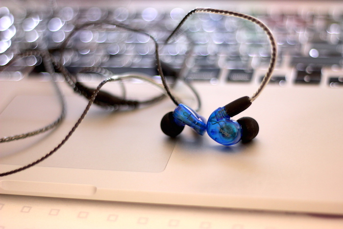

**Ficha Técnica:**  
Nombre: Moxpad X6  
Fabricante: Moxpad  
Precio: 25.99 €  
Página web: http://www.moxpad.com

Hace ya algo más de un año que venía utilizando unos auriculares in-ear Shure SE215 y costando lo que cuestan (más de 100 €) temía que se me estropeasen justo cuando más falta me hacen. Cuando un amigo me habló de los Moxpad X6, no dudé en tirarme a la piscina. Por una fracción del precio de los Shure, eran un caramelo al que no me podía resistir.

Como muchos productos de marcas chinas, es dificil encontrar información fiable sobre sus características, pero aquí resumo algunas de ellas:  
- Hasta 96 db de presión (SPL/mW) 
- Rango de frecuencias desde 20 Hz a 20 KHz 
- Impedancia de 16 ohmios 
- Longitud del cable de 1,35 metros, con micrófono y botón de play/pausa (o descolgar/colgar, según el uso que le estemos dando) 
- Conector mini-jack estándar de tres líneas (las dos de auriculares y una para el micrófono)

He hecho unas cuantas pruebas reproduciendo música y haciendo llamadas telefónicas para probar su funcionamiento. El sonido está bastante bien equilibrado, con un leve realce de los graves y según alguna gente, algunos agudos pierden un poco de definición. En mi opinión el sonido es correcto y más que suficiente para el consumo de música sin pretensiones de audiófilos, que tendrían que buscar algo más exquisito. El micrófono recoge la voz sin problemas, incluso cuando hay algo de ruido de fondo, así que resulta suficiente para hacer llamadas o anotaciones de voz en el teléfono móvil.

La calidad de construcción es correcta, en plástico, y los conectores tienen recubrimiento de oro para conseguir una mejor transmisión de la señal. El cable encaja con ellos haciendo un poco de presión, permitiéndoles rotar con libertad y afortunadamente no parece que vayan a dar problemas a la larga. Se trata de un cable bastante fino que trae el extremo de los conectores con un plástico que actúa como memoria. De esta forma puedes ajustarlo al contorno de tu oreja perfectamente y así se quedará, conservando esa forma para que no se te mueva o terminen cayéndose los auriculares. Aunque incorpora un micrófono y un botón para las funciones de manos libres, no se nota excesivo peso en ese lado. Por todos estos motivos, estos auriculares son muy cómodos y no fatigan aunque los uses durante varias horas seguidas.

Los Moxpad X6 vienen con 4 pares de almohadillas de silicona. Personalmente prefiero las de espuma pero estas también hacen bien su trabajo. Escogí el tamaño más grande de las redondas y encajan lo suficientemente bien como para proporcionarme una buena atenuación. Al estar aislado de los sonidos más fuertes que te rodean, son ideales para trabajar en el escenario y tener una buena señal de monitoraje, o para ponerlos en el bus o el metro y abstraerse del mundanal ruido.

Estéticamente, se trata de unos auriculares de tamaño bastante discreto, muy cómodos y que están disponibles en azul, rojo y negro. Se vende también la combinación Rojo+Azul para que distingas rápidamente cual es tu canal derecho e izquierdo, aunque vienen señalados en el propio cuerpo del auricular mediante las convenientes letras R y L. Completa el paquete una cajita de transporte bastante apañada, pequeña y rígida, donde podremos mantener nuestra unidad a salvo. En comparación, me parece que protege más que la de los Shure SE215 por el hecho de ser rígida, aunque una anilla o un pequeño gancho en el tirador de la cremallera no hubiese estado de más.

**NOTA: 8.75**

**Lo mejor de Moxpad X6:**  
Sonido bien equilibrado y una moderada atenuación del ambiente  
Forma muy ergonómica y cable ajustable  
Incorporan micrófono y control remoto

**Lo peor de Moxpad X6:**  
No vienen con almohadillas de espuma  
No tienen un plástico para ajustarlos a la nuca  
El micrófono solo dispone de un botón de control

