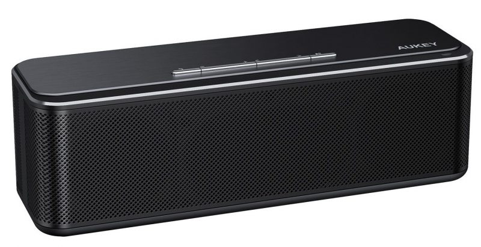
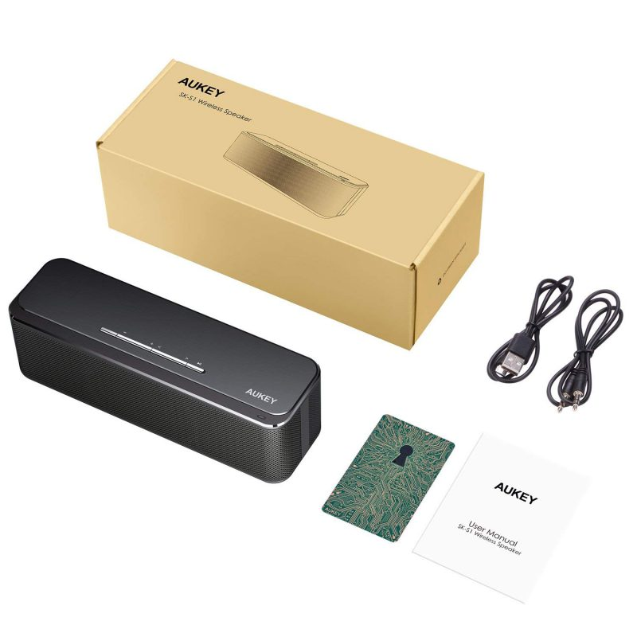
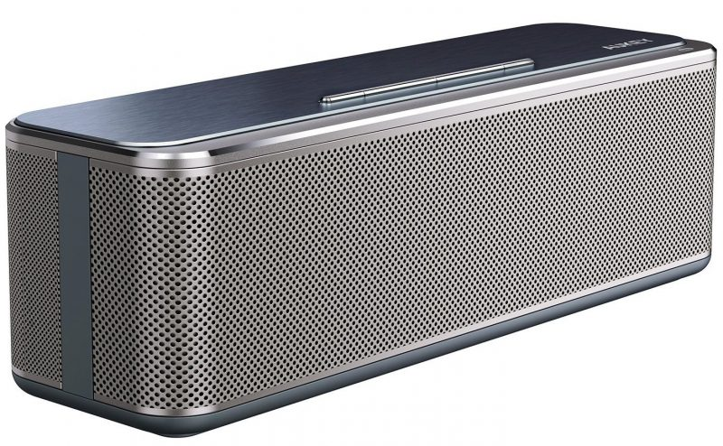
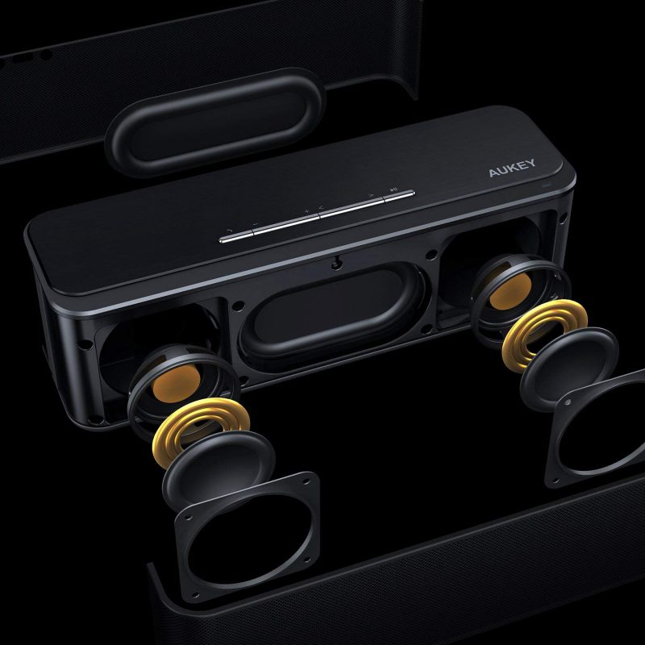
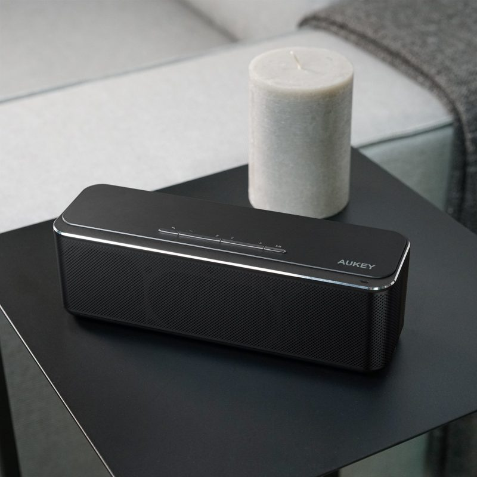

**Ficha técnica:**  
Nombre: AUKEY SK-S1 Wireless Speaker  
Fabricante: AUKEY  
Precio: 39.90 €  
Página web: http://www.aukey.com/

Hace unos pocos días entró por la puerta de mi casa este pequeño altavoz Bluetooth que estuvo de oferta en el Prime Day de Amazon. Comprando un poco a ciegas (algo que jamás haría con periféricos como un monitor o unos altavoces), estaba ansioso por poder experimentar un poco y sacar mis propias conclusiones sobre la calidad de sonido, la potencia y la calidad de construcción del dispositivo. AUKEY es una marca china de periféricos, complementos para móviles, accesorios de ordenador, etc. Tienen algunos productos muy interesantes (hay un hub USB con conexión USB-C del que mucha gente habla maravillas) y los precios son competitivos. ¿Estará este altavoz también a la altura de lo que espero?

**Especificaciones**  
Leyendo las características en el (testimonial) manual de usuario, nos encontramos con dos altavoces de 8W cada uno (16W en total) que pueden proporcionar sonido estéreo (fundamental si vas a reproducir música sin desvirtuarla). También presume de reproducir sonido en un rango que va desde los 60 Hz hasta los 20 KHz. Una afirmación muy ambiciosa, desde luego, sobre la que luego comentaré el resultado de mis pruebas. El sonido puede reproducirse a través de una conexión mini-jack (cable incluido) o Bluetooth. Cuando está conectado de forma inalámbrica, permite utilizar los botones de la parte superior para llamar, colgar, subir o bajar volumen, avanzar/retroceder o saltar entre canciones y poner la reproducción en pausa o continuar. Nada revolucionario, pero tiene todo lo que uno puede pedir en un dispositivo de este tipo. Se carga mediante un cable micro-USB (incluido) y dispone de una batería que debería llegar al menos a las ocho horas de uso. También se puede usar mientras está cargando, algo que parece preocupar a muchos usuarios. Está construído en plástico con unos acabados muy correctos y también existe una versión en color plateado, pero ninguna de ellas es resistente al agua.

**Test**  
Mis primeras pruebas fueron unas simples ondas senoidales para comprobar el rango de reproducción de sonidos del altavoz. Sorprendentemente pude percibir sonido desde los 20Hz (algo totalmente inesperado) y una respuesta bastante aceptable a partir de 50Hz, lo cual es incluso más grave de lo que el fabricante especifica. Sin embargo, los agudos se le resistieron, pues no pudo pasar de 15Khz. Para evitar sesgos y errores, comprobé que mis oídos aun captaban frecuencias superiores en otro equipo, así que no: el altavoz AUKEY no llegará tan arriba. También he comprobado la separación de canales: a unos 25 o 30 cm de distancia del altavoz, el panorama estéreo sonaba convincente, lo que lo puede hacer adecuado para mejorar el sonido integrado de un ordenador portátil, por ejemplo.

Estas pruebas "sintéticas" no son sin embargo una muestra de qué tan bien puede sonar un altavoz. Escogí unas cuantas canciones que pueden exprimir ciertas características para basar el análisis en un caso de uso más realista. 
1. "Worthless" de Dido. Los graves pueden retumbar en todo el edificio si tienes un subwoofer en condiciones. En este altavoz se pueden percibir, pero no resultan tan profundos ni definidos como me gustaría; pero repito que pueden percibirse y eso es mucho.
2. "The Road to Hell" de Chris Rea. La diversa paleta de sonidos de este tema sonaba muy rica y definida. Las notas del bajo gozaban de buen cuerpo y los platos exprimían la parte más aguda del espectro. Aunque lógicamente haya una tendencia a sonar "medioso" por el tamaño de los altavoces, no sonaba estridente; sin embargo la distorsión a partir de los tres cuartos de volumen empezaba a ser notoria.
3. "Camino Soria" de Jaime Urrutia con Eva Amaral. La voz femenina sonaba perfectamente clara y no se entremezclaba con otras frecuencias similares.
4. "Our Lady" de Mark Guiliana Jazz Quartet. Aquí la importancia estaba en poder apreciar la precisión en las frecuencias más altas y la textura de los diferentes platillos. Con una definición más que aceptable y un sonido cálido en los instrumentos de viento, el altavoz pasó la prueba.
5. "El Danubio Azul" de Strauss. La música clásica no suele suponer un gran problema para la amplia mayoría de altavoces, pero como su rango dinámico no se puede comprimir mucho, da una idea de la respuesta dinámica que el altavoz puede conseguir y de cuanto "ruido" agrega a la señal. El resultado fue bastante correcto, sin apenas ruido y el amplio rango dinámico no impedía escuchar matices ni decepcionaba cuando tenía que entregar más volumen.

La potencia de este SK-S1 no despeina pero los 16W del altavoz son más que suficientes para llenar de sonido un dormitorio pequeño o un cuarto de baño y, si bien es cierto que a partir de los tres cuartos del volumen se nota la distorsión, estoy seguro de que también puede defenderse bastante bien para un uso personal en exteriores o dentro de un coche en marcha. Sólo esta distorsión resulta molesta cuando está a tope. Se conectó sin problemas con un par de dispositivos Android e iOS, aunque hay que desconectarlo de uno antes de conectarlo a otro, porque no está visible al resto una vez lo has emparejado. No pude apreciar ninguna diferencia en el rendimiento del altavoz estando conectado a la corriente o funcionando con batería, lo cual es de agradecer. Los sonidos que hace al encender, apagar o llegar al tope de volumen son otra cosa: pueden gustarte o no, pero no se pueden desactivar. Puede parecer un detalle sin importancia (y lo es) pero redondearía el producto.

**Conclusión**  
A este lado del cuadrilátero, con un peso y tamaño bastante práctico, encontramos en el AUKEY SK-S1 un buen altavoz Bluetooth con conexión mini-jack que cumple su cometido con un resultado positivo. El sonido es sorprendentemente bueno reproduciendo música de estilos muy variados y aunque no sea lo mismo que una cadena de alta fidelidad, puede ser un gran compañero de un teléfono móvil, un ordenador o un iPod. Tiene potencia de sobra para utilizarlo en interiores e incluso para salir con él en un bolsillo de la mochila y disfrutar de la música en cualquier parte sin renunciar a un sonido redondo y compensado. En su rango de precios resulta difícil escoger un altavoz de un mínimo de calidad, pero sí que puede sacarle los colores a algunos que rondan los 100€ por tan sólo una fracción de ese precio. Todo esto sumado a un diseño nada estridente y los cables incluidos convierten al AUKEY en una opción muy a tener en cuenta.

**NOTA: 7.5**

**Lo mejor de AUKEY SK-S1 Wireless Speaker:**  
La relación calidad/precio  
Tamaño, conector mini-jack y conexión Bluetooth 4.0  
Potencia y duración de la batería

**Lo peor de AUKEY SK-S1 Wireless Speaker:**  
Distorsión con el volumen medio-alto  
No se puede emparejar a varios dispositivos a la vez  
No es resistente al agua