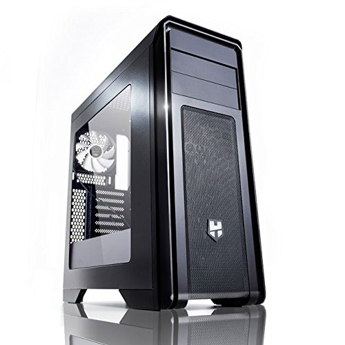
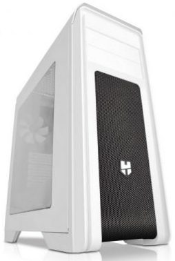
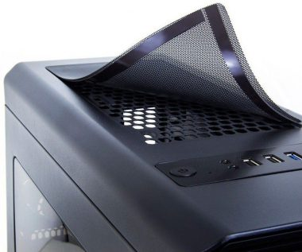
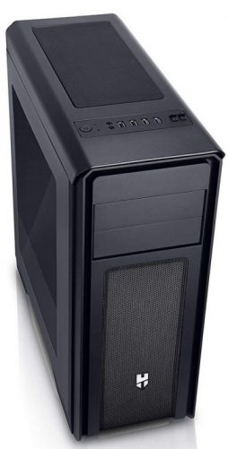
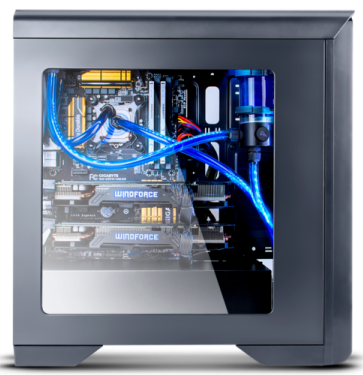

**Ficha técnica:**  
Nombre: Nox Hummer ZX  
Fabricante: Nox  
Precio: 45.99 €  
Página web: http://www.nox-xtreme.com/

Hacía muchísimo que no compraba una caja de ordenador. Concretamente, la última que entró por la puerta de mi casa era la fantástica [Thermaltake Matrix Vx](../../../2006/03/thermaltake-matrix-vx/), y de eso hace ya la friolera de doce años. En ese tiempo, que en tecnología equivale a eones, vimos el auge del modding, la llegada de los smartphone, el ascenso y la caída de los tablet y el total descalabro del mercado de PCs, que aunque seguirán entre nosotros por mucho tiempo, ya no tienen el mismo peso que por aquel entonces. Y es que en la actualidad, este mercado lo sostienen prácticamente los gamers y los grandes parques de ordenadores de oficina. La informática de consumo se fue al portátil, la tablet y el convertible; sin visos de regresar.

En fin, historia aparte, la democratización del modding (Ay! Como echo de menos la revista CustomPC!) inundó rápidamente el mercado de cajas a cada cual más estridente y enrevesada. Será que me hago viejo, que mi vista no toleraría tener tal cantidad de estímulos visuales, líneas imposibles y pantallitas LCD haciendo cosas en mi escritorio. Así que dándome una vuelta por una tienda especializada en mi ciudad, la Nox Hummer ZX me pareció lo mejor que podía obtener sin que provocase un agujero considerable en mi maltrecha economía. A destriparla!

La torre está construída con acero y plástico. No es que haya nada de malo en ello: el acero es resistente y el plástico permite darle un aspecto final bastante convincente, pero desde luego no está a la altura de las gamas premium, donde actualmente el aluminio y el cristal templado son los reyes. La ventana de metacrilato es generosamente grande, pero también obligatoria, y tenemos la opción estética de mantenernos en el elegante negro o un blanco (denominada Hummer ZX Zero) que, mucho me temo, acabará bastante sucio si tu torre no goza de un lugar privilegiado. La caja, de formato algo mayor que las tradicionales mid-tower, descansa afortunadamente sobre unos pies con gomas.

Dos ventiladores ocultos tras la rejilla frontal empujan aire hacia el interior de la caja. Uno atacará directamente a la zona intermedia de la placa base y el que está debajo va directo a los compartimentos de discos duros. El flujo se completa con otro ventilador situado en la parte trasera, muy cerca del disipador del microprocesador, para sacar el aire caliente. Esta forma de refrigeración está sobradamente probada y lo mejor es que dispones de controles con los que apagar estos ventiladores o ponerlos a funcionar de forma lenta o rápida. Al ser los tres de 12 centímetros, ofrecen un equilibrio razonable entre los litros de aire que mueven por hora y el ruido que generan. Además, tanto la rejilla superior como la inferior (por donde respirará el ventilador de la fuente de alimentación que instales) están fijadas de forma magnética a la caja, así que las puedes retirar de forma sencilla y sin esfuerzo si necesitas limpiarlas. Desgraciadamente no puedes hacer lo mismo en la parte frontal. Aunque yo creo que esta ventilación es más que suficiente, otros preferirán aprovechar el espacio extra sobre la placa base para montar un radiador de doble ventilador y un sistema de refrigeración líquida. Sí, esto permite enfriar mucho más tus componentes, a costa de un montaje más complicado y bastantes más euros. Pero si tu presupuesto contempla esto, seguro que también contempla otras cajas superiores.

En la parte superior, además de los controles de ventiladores, tienes dos puertos USB 3.0, dos puertos USB 2.0, un mini-jack de auriculares, otro de micrófono, el botón de encendido y uno minúsculo de reset, que deberías apretar con la ayuda de un bolígrafo si fuese preciso. También ahí estará el LED de estado del disco duro principal. Todos estos puertos vienen con pequeñas tapas de plástico que evitarán que se acumule polvo en el interior, pero me temo que se acabarán perdiendo al no estar sujetas al chasis. Es un lugar muy práctico para colocar los botones y los puertos si tienes la torre en el suelo, pero bastante incómodo si la piensas poner sobre la mesa. También dispones de dos bahías externas de 5 1/4", así que puedes instalar un par de lectores ópticos, pero han desaparecido las externas de 3 1/2", así que olvídate de disquetes (si aun alguien los usa) o componentes de ese tamaño (como lectores de tarjetas, por ejemplo). No es un problema: la mayoría de nosotros ya puede vivir perfectamente sin unos u otros.

A la hora de montar la CPU me encontré con dos dificultades. En primer lugar, al tener la fuente en la parte inferior, el cable de corriente de 8 pines no llegaba a la parte superior de la placa. La fuente ya ha cumplido ocho años así que afortunadamente las más nuevas tendrán el cable algo más largo para evitar estos inconvenientes. Tuve que tirar de soldador y cable para hacer unos empalmes que, aunque no supongan ningún problema ni ahora ni en el futuro, resultaron un incordio ridículo. Esto no es un problema de la caja en sí, pero has de tenerlo en cuenta si vas a aprovechar una fuente de la que ya dispongas. Por otra parte, me parece una mala decisión de diseño que los discos duros se monten por el lado contrario al resto de piezas. Probablemente no te des cuenta al montar el ordenador, porque habrás retirado las dos tapas de la torre, pero te verás de nuevo obligado a sacar ambas cuando quieras pinchar otro disco duro interno. Para los que nos gusta cacharrear, esto ralentiza el proceso.

Puedes montar hasta dos discos duros de 3 1/2" sin necesitar herramientas; pero tanto las tarjetas de expansión, como los lectores de discos, como los SSD extra (que se pueden montar de una forma algo bizarra), requieren ser atornillados. Afortunadamente, todo el cableado se puede organizar a través de las diferentes aberturas en los paneles internos. Con la sola ayuda de unas bridas, puedes dejar montado un sistema bastante ordenado y que no dificulte el paso de aire frío.

En conclusión, estamos frente a una caja con un aspecto que no desentonará en ningún lugar, sobretodo si escogemos la versión en negro. No tenemos porqué renunciar a un buen flujo de ventilación e incluye tres grandes ventiladores que permiten montar un ordenador y mantenerlo razonablemente frío; a la vez que nos brinda la posibilidad de saltar a sistemas de refrigeración líquida. Es una lástima que no haya un mejor sistema de anclaje de componentes que no requiera herramientas y que algunos detalles de su diseño no estén mejor pensados. Sin embargo, cuenta con características que hace unos años eran propias de la gama alta a un precio super-competitivo.

Si tu actual caja no permite una correcta refrigeración de los componentes de tu ordenador o buscas un cambio estético y el número de bahías es suficiente para ti, esta Nox Hummer ZX es una buena opción con la que no tendrás que romper tu cerdito.

**NOTA: 8.5**

**Lo mejor de Nox Hummer ZX:**  
La estética y el precio  
Se puede montar refrigeración líquida  
Los ventiladores incluídos

**Lo peor de Nox Hummer ZX:**  
El montaje necesita herramientas  
Montaje incómodo de los discos duros  
Solo dos bahías de 5 1/4" y dos de 3 1/2"