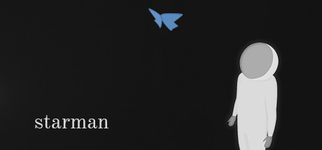
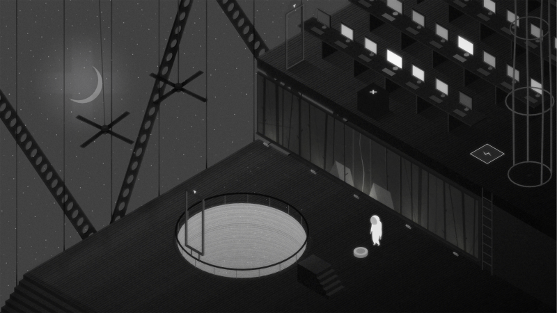
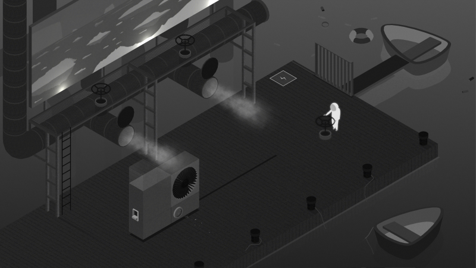
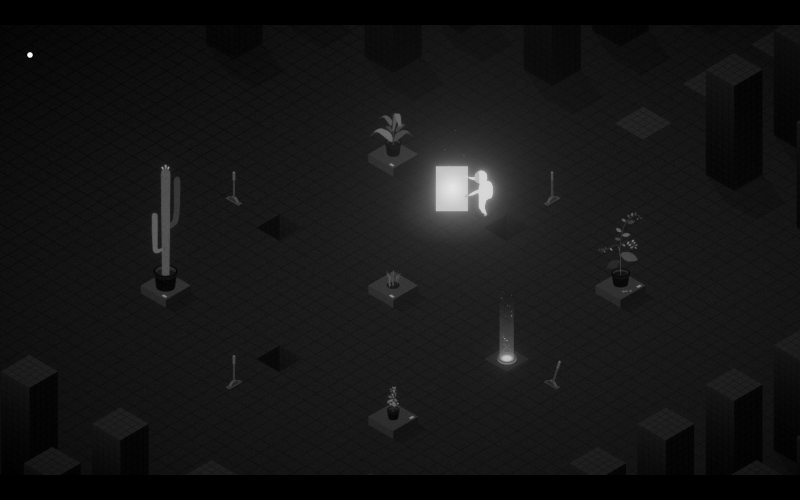
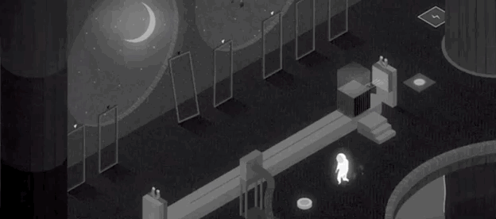

**Ficha Técnica:**  
Título: Starman  
Desarrollador: Nada.Studio  
Precio: 4.99 €  
Página web: http://starmangame.com

Los hermanos Sergio y Jacobo Abril son dos jóvenes de Valladolid que a principios de 2016 crearon un estudio de diseño multidisciplinar, viendo que la arquitectura (su profesión) no atravesaba su mejor momento. La idea de desarrollar un videojuego les sobrevino un día mientras comían una hamburguesa, pero no fue hasta el verano de ese año que supieron el rumbo que su trabajo iba a tomar. Intentaron plasmar en él todo lo que les gustaba, con continuas pruebas y errores, cambios, etc. Y con todo lo aprendido, 2017 sirvió para reescribir de nuevo los primeros niveles, hasta que estuvieron satisfechos con el resultado.

_Starman: Tale of Light_ es un juego de puzzles y aventura que bebe de títulos independientes que seguramente ya conoces, como [Limbo](../../../2012/06/limbo/), de quien innegablemente toma esa estética minimalista en blanco y negro tan característica. Diseminados a lo largo de nueve niveles, la inmensa mayoría de sus rompecabezas se basan en el viejo "apila una caja". No es nada especialmente innovador y aunque el primer nivel sea trivial, los siguientes te obligan a razonar un poco los pasos a seguir.

En la segunda mitad del juego puedes encontrarte algunas variantes: conectar varios aparatos eléctricos, aprovechar la inercia/gravedad, usar imanes y... _Portales!!!_ Porque sí, algún elemento también lo ha tomado prestado de [Portal](../../../2007/10/portal-orange-box/), la obra maestra de Valve.

No obstante, Starman no pretende ser un juego de plataformas. Olvídate de saltar, correr, esquivar, agacharte, etc. No es nada de eso. Con un ritmo pausado (propio de otros como "Monument Valley") y en ausencia de enemigos o de la posibilidad de morir (ni siquiera por electrocución), Starman te invita a experimentar con este interruptor, con aquella manivela o con cualquier pulsador. Ni más, ni menos. Al final de cada nivel recolectarás varios puntos de luz que te abrirán el paso a la siguiente fase hasta que completes el juego, y solo los avisos de logros de Steam pueden despistarte de lo que sucede en pantalla.

En realidad, los niveles son generalmente de resolución simple. Es una lástima porque no hay que estrujarse los sesos demasiado y esto pesa mucho de forma negativa en un juego de puzzles. Puede que haya algún punto donde necesites parar, examinar bien las posibilidades y probar un par de cosas, pero la curva de dificultad es muy suave.

Lo simple de la mecánica se trasladará también a los controles. Bajo una vista isométrica, solo necesitarás hacer clic para desplazarte o interactuar con la mayoría de elementos del escenario, amén de la barra espaciadora para soltarlos. En este aspecto se nota que Starman está diseñado con un dispositivo de pantalla táctil en mente, orientado al jugador casual, pero su sencillez no resta diversión.

Poco más se puede decir de un juego que apenas me ha durado un par de horas. Starman es corto. Muy corto. Demasiado. Es cierto ese refrán de "Lo bueno, si breve, dos veces bueno"; pero Starman es excesivamente breve: un suspiro que se diluye en el tiempo tan fácilmente como su guión, si es que alguna vez lo tuvo. Al contrario que en Limbo, no acudes al rescate de nadie ni huyes de ningún peligro. No hay ningún giro argumental que te sorprenda, ni un final que dé sentido a todo lo anterior. Solo es una muy corta retahíla de pruebas incapaz de levantarte del asiento. Y precisamente eso lo hace, a la vez, genial. No vas a levantarte: no habrá sobresaltos ni te quedarás atascado durante horas, perdiendo la motivación y saliendo de la partida. Todo lo contrario: lo jugarás del tirón, apreciando su ritmo pausado y sus dos horas de gusto por el buen diseño, que catapultan la nota final de este sombrío, ligero, amable, oscuro, mudo, brillante, breve, aséptico y divertido juego.

**NOTA: 6**

**Lo mejor de Starman:**  
Suave curva de dificultad  
Diseño artístico y banda sonora  
Relajante

**Lo peor de Starman:**  
Tremendamente corto  
Carente de guión  
Puzzles sencillos

**Requisitos mínimos:**  
Windows Vista SP1+ o superior (64 bits) / MacOS 10.10 o superior  
Procesador Intel Core 2 Duo a 2,4 GHz  
2 GB de RAM  
Tarjeta gráfica NVIDIA GeForce 320M con 256MB  
DirectX 10  
550 MB de disco duro

**NOTA:** No se han publicado unos requisitos recomendados