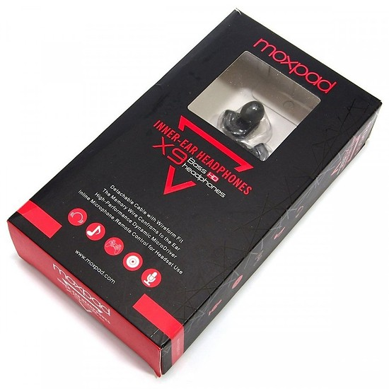
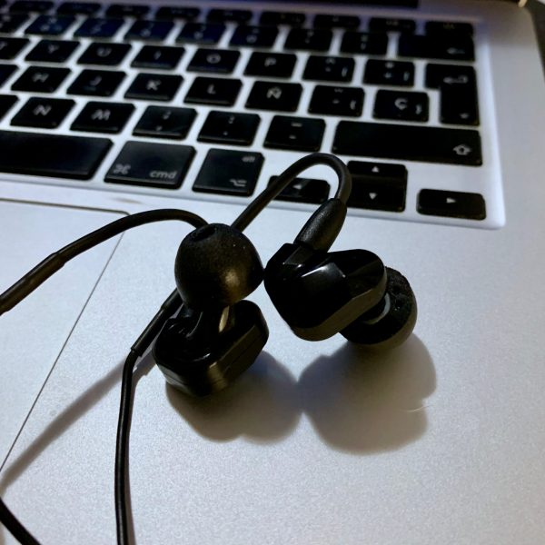

**Ficha Técnica:**  
Nombre: Moxpad X9  
Fabricante: Moxpad  
Precio: 13.99 €  
Página web: http://www.moxpad.com

Algo menos de tres años de uso me duraron los [Moxpad X6](../../../2016/08/moxpad-x6/) que adquirí a mediados de 2016. Satisfecho como me encontraba con su relación calidad-precio, decidí dar una oportunidad a sus hermanos mayores, los X9, que en aliexpress rondaban los 14 euros y ofrecían, en principio, las mismas prestaciones:  
- Hasta 95 db de presión (SPL/mW) 
- Rango de frecuencias desde 20 Hz a 20 KHz 
- Impedancia de 16 ohmios 
- Longitud del cable de 1,35 metros, con micrófono y botón de play/pausa (o descolgar/colgar, según el uso que le estemos dando) 
- Conector mini-jack estándar de tres líneas (las dos de auriculares y una para el micrófono)

La única novedad es que parecen ser auriculares de dos drivers, es decir, hay dos altavoces dentro de cada auricular. Éstos se reparten el trabajo y uno se dedica a reproducir frecuencias más graves y el otro las más agudas. Estéticamente, con un packaging prácticamente calcado y exactamente los mismos componentes (cable, cuatro pares de siliconas y estuche de transporte), los X9 se desmarcan de los anteriores por un acabado opaco en versiones en negro y en rojo. Me decanté por la primera opción.

A los Moxpad X6 les había tenido que sustituir el cable de tipo MMCX hasta en dos ocasiones por unidades de marcas desconocidas, pero lamentablemente no pude hacerlo una tercera vez porque los conectores se rompieron; mientras que mis Shure SE215 llevan seis años con el mismo cable que los acompañaba en la caja. Éste es el mismo que se utilizan en prácticamente toda su gama de IEMs profesionales, así que ¿porque no comprar el cable de marca y esperar alargar la vida de los Moxpad X9? De esta forma, aún sacrificando la conveniencia de tener un micrófono y unos controles básicos incorporados, espero que los auriculares resistan mucho mejor el paso del tiempo.

También, aunque en principio no son compatibles, estoy empleando almohadillas de espuma también de la marca Shure, porque encuentro que me atenúan mucho mejor el ruido externo y su tacto es mucho más agradable que el de las de silicona. Tan sólo hay que ser un poco paciente para introducir el canal del auricular en la almohadilla y ayudarse de un palillo o un utensilio semejante para terminar de colocarla en su sitio. Se puede conseguir, aunque puede desesperar a los más impacientes.

El sonido de los Moxpad X9 es correcto, aunque los graves están bastante potenciados para mi gusto. Si quiero disfrutar de mis discos favoritos, encuentro bastante potencia en los bajos mientras que una pequeña falta de brillo en los medios y agudos. En el escenario, sin embargo, esto me viene de maravilla para escuchar al bajo con claridad por encima de la mezcla general. Hay cierta opacidad en el sonido que todavía me hace dudar sobre si es mejor opción, por su equilibrio, los Moxpad X6. Por otro lado, hay potencia de sobra y si escuchas música electrónica o disco, agradecerás esa mayor presencia de graves y subgraves.

Como prácticamente cualquier par de IEMs, estos Moxpad X9 resultan cómodos y en color negro resultan suficientemente discretos como para evitar más miradas de la cuenta. Su cuerpo de plástico es ligeramente más grande que en el caso de los X6, supongo que para acomodar el segundo driver, aunque hubiese preferido que fuesen más lisos en la parte externa, para esos momentos en los que te acuestas de lado en un sofá o en una cama.

En definitiva, los auriculares no suponen una mejora de sonido sustancial sobre los X6 y el resto de componentes (cable, espumas, estuche) son exactamente los mismos. Si estás pensando adquirir un par de IEMs a buen precio, yo te recomendaría comprar los X6 y sustituir después el cable por un cable original de Shure y unas almohadillas adecuadas para tus oídos. Estos X9 están objetivamente bien, pero no tanto.

**NOTA: 6.5**

**Lo mejor de Moxpad X9:**  
Relación calidad-precio  
Potencia de sonido, especialmente de los graves  
Incorporan micrófono y control remoto

**Lo peor de Moxpad X9:**  
Sonido opaco y agudos faltos de brillo  
Sin almohadillas de espuma ni plástico para ajustar el cable en la nuca  
No suponen una mejora sensible sobre los Moxpad X6

