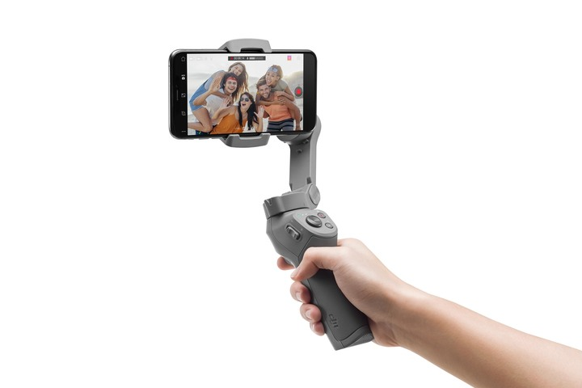
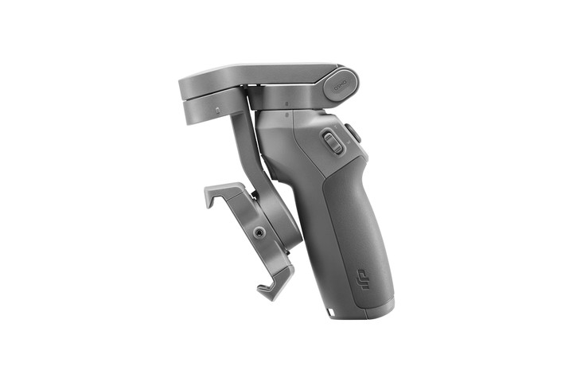
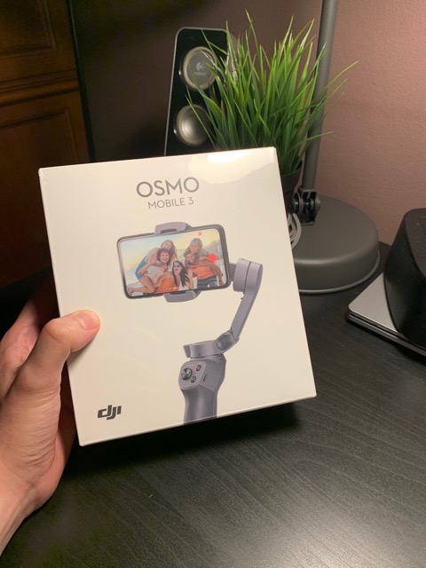
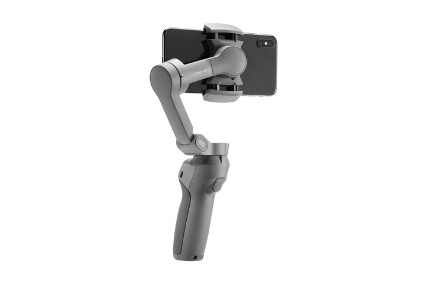

**Ficha Técnica:**  
Nombre: Osmo Mobile 3  
Fabricante: DJI  
Precio: 109 €  
Página web: https://www.dji.com/es/osmo-mobile-3

Los smartphones integran mejores y más modernas cámaras cada año que pasa. Si quieres poder sacarles el máximo partido, un accesorio imprescindible es un estabilizador.

https://www.youtube.com/watch?v=Xah7LpZpFY0

Con la premisa de ser un "gimbal" plegable, DJI presenta un dispositivo con una empuñadura en forma de pistola con controles en su parte superior y gatillo, sobre el cual se eleva la pinza que sujeta el teléfono. Es un dispositivo realmente compacto y efectivo, con una construcción robusta y que pesa ya que en su interior, además, dispone de una generosa batería que puede, a su vez, utilizarse para cargar el teléfono u otros accesorios que puedan enchufarse por USB. El tacto de goma es cómodo y la pinza no rayará tu teléfono. Tiene un tamaño bastante bueno para adaptarse a dispositivos de muchos tamaños y, siendo mi iPhone de 6,1 pulgadas, casi cualquier terminal moderno encajará sin problemas.

El estabilizador se complementa con una App llamada DJI Mimo, que permite aprovechar al máximo todas las órdenes que puedes ejecutar desde la botonera del gimbal: cambiar entre las cámaras frontal y trasera, comenzar o pausar una grabación, volver a centrar el estabilizador al frente, cambiar entre el modo de video, foto, panorámica, etc. etc. La tecnología de DJI permite también realizar seguimiento de personas u objetos simplemente seleccionándolos en la propia imagen de la pantalla del teléfono, de forma muy intuitiva y bastante precisa. Además está la publicación directa en redes sociales de "stories", aprovechando unas plantillas incluidas bastante resultonas. Por supuesto el gimbal permite alternar entre la orientación vertical y la horizontal.

En el paquete encontraremos además una correa ajustable para la muñeca con la que evitar caídas, el cable USB-C de carga (tal vez demasiado corto) y una muy práctica bolsita de terciopelo. Existe una versión con patas de trípode y la posibilidad de contratar una garantía extendida muy interesante si realizas deportes extremos o actividades en las que el estabilizador pueda estar en riesgo.

Pude hacer un video del [viaje a París](../../../2020/10/viaje-a-paris/) que hice junto a mi pareja. Prácticamente todas las tomas están hechas con el estabilizador mientras descubríamos la ciudad. La batería aguantaba el día entero grabando durante bastantes horas de forma intermitente y la posibilidad de plegarlo y guardarlo de nuevo en cualquier bolsillo de la mochila permitían tenerlo siempre a mano y en segundos funcionando otra vez. La imagen queda muchísimo más estable que sin el gimbal, aunque no llega al nivel de soluciones profesionales, lógicamente. Para videos caseros y semi-profesionales, por ejemplo videobloggers, es más que suficiente. Es importante, eso sí, que hagas algunas pruebas durante unos minutos para conseguir habituarte a todas las funciones que puedes realizar desde los botones y el gatillo para que, a la hora de la verdad, puedas encuadrar, cambiar la cámara, la orientación o empezar a grabar sin perder valiosos segundos tratando de recordar cómo se hacía.

Algo que me ha llamado la atención es que, al utilizar la App de DJI, las imágenes no son fotos "Live" como las que toma la aplicación nativa del iPhone y existe un bug a la hora de importar los videos en Final Cut Pro X: las pistas de audio están vacías (aunque realmente el audio se ha grabado). Por extensión, me imagino que sucede lo mismo en iMovie para MacOS (aunque no lo he comprobado). En definitiva, un estabilizador con un precio muy interesante, un formato plegable tremendamente práctico y bien construido, que cumple su función para usos domésticos y avanzados, que apenas vé empañada su nota por detalles que lo llevarían mucho más cerca de la perfección. Incluso por precio, es sin duda el rival a batir.

**NOTA: 9**

**Lo mejor de DJI Osmo Mobile 3:**  
Muy robusto y tacto muy agradable  
Plegable, compacto y portable  
Es muy intuitivo y tiene funciones de "tracking" y "stories" (en la aplicación DJI Mimo)

**Lo peor de DJI Osmo Mobile 3:**  
El cable de carga es demasiado corto  
El peso, debido a la batería  
El bug del audio cuando importas los archivos al editor de video

