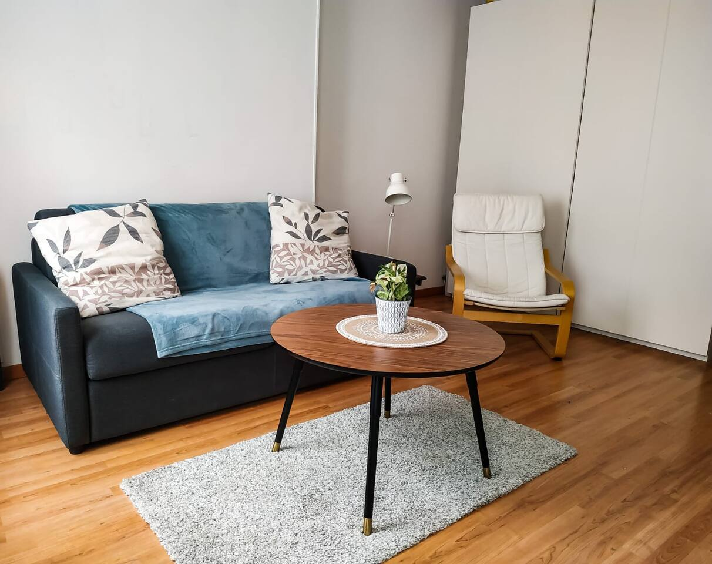
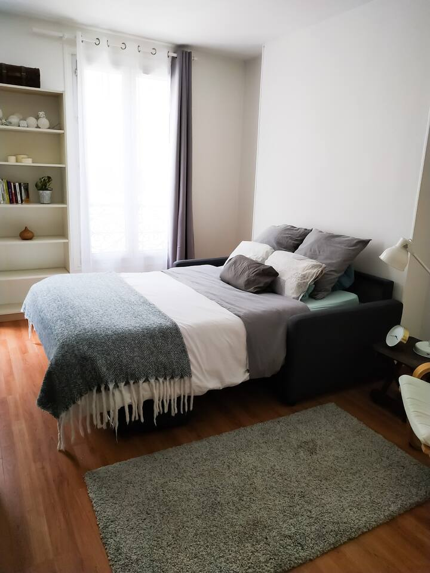

En octubre del año pasado (madre mía como pasa el tiempo!) hicimos una escapada en pareja a París. Ella me convenció con unos pases para un festival y allá que nos fuimos. No de cualquier forma: como quería hacer el video del viaje me compré el [estabilizador DJI Osmo Mobile 3](../../../2019/12/dji-osmo-mobile-3/) para que todo quedase bien inmortalizado con mi iPhone. Pero un viaje así requiere de cierta planificación, que dejo por aquí resumida por si tú también quieres vivir tu aventura parisina. Estos consejos no tienen garantías de ningún tipo pero ahí están, como me gusta decir, sin gluten ni lactosa.

Video del viaje: https://youtu.be/1iZO_LzzWkc

```
Índice:
1. Las Apps
2. Los Vuelos
3. Algunos puntos de interés
4. El equipaje
5. El alojamiento
6. En el aire
7. El transbordo
8. El check-in
9. Primeros pasos
10. Los precios
11. Los horarios
12. Algunos rincones
13. Otros recursos
```
\====

**Las Apps**  
Para organizar tu propio viaje a París o a cualquier otro destino, te recomiendo que te instales algunas Apps en tu teléfono móvil que te facilitarán todo el proceso y te ayudarán a disfrutar más todavía de tu viaje. Te las enumero:  
- [Vueling](https://www.vueling.com/es)
- [App in the air](https://www.appintheair.mobi)
- [Mapify](https://mapify.travel)
- [Google Maps](http://maps.google.com)
- [Packr](https://packr.app)
- [Airbnb](https://www.airbnb.es)
- [Uber](https://www.uber.com/es/es-es/)

**Los vuelos**  
Pude pillar unos billetes de ida y vuelta a través de la app de Vueling por 100€ por persona, lo que entraba dentro del presupuesto que yo había previsto para los aviones. Desde Santiago de Compostela hay (o al menos había) varios vuelos directos semanales con destino al aeropuerto Charles De Gaulle, de dos horas de duración cada uno aproximadamente. Fue realmente útil importar la información del vuelo a App In The Air, desde donde puedo tener todo lo importante en un único sitio, con alertas incluidas y otros datos de interés como por ejemplo las condiciones meteorológicas. 

 

**Algunos puntos de interés**  
Para reunir la lista de sitios que visitar dispones de varios recursos, empezando por las guías en papel de National Geographic, Lonely Planet, etc. También le echamos un vistazo a varios canales de Youtube, especialmente el de alanxelmundo que tiene unos videos muy buenos tanto de París como de otros destinos a los que quiero viajar: https://youtu.be/pRLtyPjQ\_dE  
Otra App interesante es Mapify, que es una especie de Pinterest de viajes, donde puedes encontrar fotos que otros viajeros han tomado en el destino que tú selecciones. Muchas de estas fotos están tomadas de forma artística y original así que añadirás demasiados, pero no te preocupes: en este momento la estrategia es recolectar. Después, salta a Google Maps y crea una chincheta para cada uno de esos puntos. Es el momento de filtrar. Si alguno queda muy alejado y no encuentras especial interés por visitar el lugar, sáltalo. No estaría de más que te descargases el mapa de la zona a tu dispositivo, para ahorrar transferencia de datos cuando te encuentres allí. Por último, haz una lista de los días que estarás en la ciudad y vete agrupando los puntos de interés cercanos dentro del mismo día para ahorrar tiempo (y dinero) en viajes. No olvides poner atención a los días de cierre de cada museo para no fallar. Listo, ya tienes tu ruta. Mi lista de POIs incluye (aunque no los tengo organizados):  
- Torre Eiffel
- Catacumbas
- Catedral de Notre Dame
- Cripta arqueológica
- Basílica de Sacre Coeur
- Saint Chapelle
- Palacio y Jardines de Luxemburgo
- Moulin Rouge
- Place du Tertre
- Arco del triunfo
- La Bastilla
- Casa museo de Victor Hugo
- Museo del Louvre
- Instituto del mundo árabe
- Mercado de los niños rojos
- Paseo en barco por el rio Sena
- Ópera Garnier

Cuando se trate de museos, atracciones o espectáculos, infórmate bien con antelación de dónde puedes conseguir mejores precios y a que horas hay menos afluencia de gente para visitar lo que quieras. En general, como una de las ciudades más turísticas del mundo, las colas son inmensas. La de las catacumbas superaba las 3 horas de espera, por no hablar de la Torre Eiffel. Si eres una persona discapacitada/incapacitada y tienes tu tarjeta (o un documento oficial) que lo acredite, simplemente acércate a cualquier persona de seguridad cuando llegues a estos sitios y ellos te escoltarán para que no esperes. Con los precios de las entradas, lo mismo, te ahorrarás un dineral.


**El equipaje**  
A lo largo de las semanas previas al viaje, apunta todo lo necesario en Packr, ya que además la app te sugiere enseres habituales, la ropa según el tiempo que hará en el destino y te calcula qué cantidades meter en la maleta. Lo que debe llevar cada uno es muy personal, pero la gran mayoría de nosotros coincidirá en llevar esto o algo similar, de ahí que Packr te vaya a ahorrar tiempo y disgustos. Como nosotros viajamos en otoño (una época preciosa para visitar la ciudad) llevábamos abrigos, guantes... pero si vas en verano necesitarás gorra, unas bermudas, etc.  
- Neceser, mini-botiquín y toallitas jabonosas
- Ropa, pijama, calzado cómodo y zapatillas o chanclas
- Secador de pelo
- Botas, abrigo, guantes, gorro y bufanda
- Chicles
- Guía de viaje
- Auriculares con cable y Airpods
- Cargadores, estabilizador y PowerBank
- Cables Lightning, USB-C y Micro-USB
- Una mochila para el día a día
- Bolígrafo y post-its o un pequeño bloc de notas
- Algo de dinero en efectivo y una tarjeta de crédito
- Documentos personales
- Medicinas (si fuese preciso) e informes médicos relacionados
- Foto tamaño carnet

En cuanto a las dimensiones, cuando nosotros hicimos el viaje, Vueling nos establecía las siguientes dimensiones:  
- Un bulto de equipaje de mano de 55x40x20 y hasta 10 Kg, la típica bolsa de viaje pequeña o mochila que irá en el compartimento superior. 
- Un bolso de mano de 35x20x20, como por ejemplo un bolso o un maletín de ordenador, que deberás colocar entre tus pies. 
- El equipaje facturado no puede superar los 15 Kg. Nosotros facturamos una sola maleta que iba bastante llena pero fue suficiente. 

No olvides consultar la web de la compañía unos días antes de salir, ya que puede que los requisitos sean distintos en el momento en el que vayas a viajar. A la hora de distribuir el equipaje, mi norma es clara: en la maleta que vayas a facturar, mete ropa, botas, neceser, secador, pijamas, etc. En la mochila, trata de empaquetar al fondo una muda y unos calcetines (por lo que pueda pasar o para los días en que camines en exceso), medicinas y prendas de abrigo. Hacia la mitad, los cargadores, el estabilizador y la PowerBank (y el cableado correspondiente). En un compartimento aparte (aunque seguro) deberías llevar la documentación personal y sanitaria, medicamentos, el boli y el bloc de notas. Por último en un compartimento más pequeño y accesible rápidamente los auriculares, los chicles y la guía de viaje. Para objetos críticos, como tu teléfono móvil, llaves y billetero, yo recomiendo un bolsillo interior de tu cazadora, o los bolsillos delanteros de tu pantalón, para evitar tentar a los amigos de lo ajeno.

**Alojamiento**   
Decidimos que lo mejor para nosotros sería una estancia de una semana en un pequeño piso de la oferta de Airbnb y dado que teníamos tickets para el festival que se celebraba en el teatro Le Trianon, buscamos algo cercano y económico. Los precios me parecieron todos altísimos pero rebuscando un poco se pueden encontrar cosas razonables. En pleno corazón de Montmartre, en el 74 Rue Duhesme, estaba el apartamento de Caroline:







Valoré especialmente que dispusiese de conexión WiFi para no tener que preocuparme de la tarifa de datos de mi teléfono. La ausencia de costes de Roaming es algo que, por necesario, parece mentira que haya tardado tanto en hacerse realidad, pero nunca sabes si tu transferencia mensual será suficiente cuando a diario dependes de datos para tu aplicación de mapas, consultar información y horarios, comunicación con familiares, copias de seguridad de fotos y videos en la nube, etc. El anuncio del apartamento también asegura que dispones de desayunos incluidos y así fue: había un pequeño surtido de diferentes infusiones y una cafetera de cápsulas. Por supuesto, la mini-cocina y el microondas permiten que desayunes, comas o cenes lo que tú quieras en el propio apartamento, pero deberás hacer la compra de lo que vayas a consumir. También había calefacción y he de decir que en el apartamento había una temperatura muy agradable cuando llegamos. La semana completa nos salió por algo menos de 400€, lo que supone un gran diferencia con cualquier hotel y la posibilidad de ahorrar algo de dinero en las comidas.

**En el aire**  
Como te imaginas, los chicles los necesitarás durante el vuelo para aliviar un poco tus canales auditivos del dolor que provocan las diferencias de presión al despegar y aterrizar. También los auriculares (preferiblemente con reducción de ruido ambiental) para poder relajarte y consumir contenidos en tu teléfono si previamente los has descargado: una película, algo de música, un par de episodios de una serie... lo que te apetezca. Yo particularmente prefiero algo de música que me permita al mismo tiempo hojear la guía de viaje y repasar tanto los puntos de interés que ya he marcado previamente como rescatar alguno que haya pasado por alto. Recuerda que si quieres consumir algo del cátering debes pagarlo con una tarjeta de crédito, ya que las de débito no funcionan off-line. Si puedes, añade tus tarjetas a la aplicación de pago de tu teléfono para poder pagar con el chip NFC y no tener que recurrir cada dos por tres a la billetera, que además con lo estrechos que son los espacios dentro de un avión, es un rollo. Y cuidado con los precios, para que tengas una idea, en el viaje de vuelta comimos un sandwich (6,50 €), un bocadillo de atún (6,50 €) y un kit-kat (2,50 €). Si te despistas, la merienda te sale a precio de estrella Michelín.

**El transbordo**   
Aterrizamos en la Terminal 3. Al salir, sigue el sendero indicado hacia el tren RER y allí mismo está la estación de tren Roissy-Pole. Es el momento de que te hagas la tarjeta [Passe Navigo](https://www.paris.es/passe-navigo) para desplazarte sin problemas por toda la ciudad utilizando transportes públicos. Necesitas una foto carnet. Te lo recomiendo encarecidamente ya que cuesta 5 euros y luego puedes pagar un precio variable según escojas su validez, para nuestro caso una semana por 22,80€ por persona, con lo que en cuanto llegues a tu alojamiento prácticamente ya la habrás amortizado. Además, junto a la tarjeta, recibirás un tríptico con todas las líneas y paradas de metro, tren y tranvía, así como sus zonas tarifarias. ¡No lo pierdas! Aunque yo tenía previsto tomar un Uber para llegar al apartamento (alrededor de 50€) y poder hacer el check-in sin que fuese muy tarde, pudimos ahorrar un montón de dinero de esta forma a lo largo de todo el viaje.

Desde Roissy-Pole, tomamos el tren RER-B hasta Gare du Nord, una estación dentro de la ciudad en la que puedes tomar después el metro hasta donde decidas alojarte. La frecuencia del tren es de 15 minutos aproximadamente, y la del metro, apenas un par. Nuestra anfitriona nos indicó las dos líneas que nos llevarían prácticamente hasta la puerta y el nombre de las estaciones más cercanas:  
- Linea 4, hacia Porte de Ginancourt y parada en Simplon
- Linea 12, hacia Aubervilliers y parada en Jules Joffrin Tomamos la primera.

El día de retorno, puedes simplemente hacer el trayecto a la inversa. Si excedes la vigencia de la Navigo, puedes "recargarla". En nuestro caso, el día de retorno ya no estaba cubierto (era el lunes de la semana siguiente) así que el metro y el tren de vuelta al aeropuerto los pagamos a precio estándar. El RER-B desde Gare du Nord hasta el aeropuerto Charles de Gaulle (Roissy-Pole) salía a 10,30 € por persona.

**El check-in**  
Si ya es de noche, a estas alturas seguramente te mueres de hambre. No hay escapatoria posible así que toca pasar por caja. Con el GPS en mano, entre la boca del metro y el alojamiento, eché el ojo a [Nostra Pizza](http://nostrapizzaparis.fr), un local situado en el 14 Rue Joseph Dijon. Son esa clase de sitios que cierran bastante tarde y donde puedes tomarte un tentempié sencillo y económico antes de dormir. Pero primero, vamos a dejar las maletas. No es raro que hoy en día el check-in lo puedas hacer tú mismo sin tener que encontrarte con el anfitrión al llegar a tu Airbnb. Puede parecer impersonal, pero te da la libertad de llegar cuando te plazca y sin agobios. En Paris, casi todos los edificios abren sus puertas mediante un código numérico. Ya arriba, para entrar en el apartamento tuvimos que abrir una caja con combinación que colgaba del tirador. La anfitriona nos había enviado los códigos con suficiente antelación y aunque vives unos segundos de incertidumbre mientras juegas a no equivocarte (al más puro estilo de un Escape Room), es un método la mar de práctico. El día que te vas, dejas la llave en la caja, cierras y listo. En todo momento pudimos comunicarnos con Caroline por WhatsApp y no tuvimos ningún problema. Tras volver sobre mis pasos para comer un poco de pizza, caí rendido en cama.

**Primeros pasos**   
No soy muy de madrugar, mucho menos estando de vacaciones. El primer día, por la mañana, baja a la cafetería que mejor pinta tenga y disfruta del desayuno. Cómete un buen croissant. Así, en francés. No un cruasán. No no, mejor el auténtico. Croissant. Con esa "r" tan francesa que tú sabes imitar. Nosotros lo hicimos camino de Sacre Coeur, en [La Cave Cafe](http://www.lacavecafe.fr) (124 Rue Marcadet) ¿Ya lo has hecho? Bien, ahora preocúpate solo de comprar un par de cosas básicas para la nevera de tu alojamiento y algo de comida que puedas preparar de forma rápida y sin complicaciones, para esas ocasiones en las que vuelvas cansado de ejercer de turista. Es fundamental que te hagas con un par de botellitas de agua pequeñas, pequeños snacks, chocolate, fiambre y pan para hacer bocadillos pequeños... Más adelante podrás rellenar las botellas y no necesitarás gastar dinero continuamente mientras descubres la ciudad.

**Los precios**   
Todo aquel que visita París te dirá que es una ciudad muy cara. Efectivamente el centro lo es, pero la ventaja de viajar alquilando un apartamento es que puedes ahorrar bastante dinero si te las apañas mínimamente para cocinar, preparar bocadillos, etc. Alrededor de nuestro alojamiento había una amplia variedad de pequeños comercios de todo tipo: carnicerías, fruterías, supermercados de barrio (Franprix, Carrefour, etc), etc... Una idea para tener listo algo muy sencillo es comprar un pollo asado (Poulet cuit, en torno a 8-10€), pan y unas patatas. Así, puedes hacerte bocadillos para comer sobre la marcha durante el día y cenar después cociendo las patatas en casa. Como media, todos los productos básicos (leche, infusiones, cereales, plátanos, tomates, etc.) están en torno a un 50% más caros que en España.

**Los horarios**   
Por lo general, las tiendas están abiertas a partir de las 9:30h hasta las 19:30h. Es habitual que los miércoles lo amplíen hasta las 21h y que en las zonas turísticas abran incluso en domingo. Lógicamente, la hostelería y los pubs extenderán su horario un poco más. Por su parte, los museos suelen abrir entre las 9:30h y las 11:00h, pero cierran a las 18:00h. También extienden su horario uno o dos días de la semana. Puedes [consultar estos horarios online](https://www.paris.es/museos).

**Algunos rincones**   
Ya te he hablado del Nostra Pizza y La Cave Cafe. Hubo un par de noches que cenamos en [Patakrep](http://patakrep.fr) (89 Rue Duhesme), un pequeño restaurante de barrio en la esquina de nuestra calle. Nos gustó también porque a pesar de que llegábamos habitualmente tarde, para la hora a la que los franceses acostumbran cenar, nos atendieron muy amablemente. No te pierdas sus Galettes. Un par de portales más arriba de nuestro alojamiento encontramos [El Tast](http://www.eltast.fr) (70 Rue Duhesme), un agradable lugar donde cenar o disfrutar una copa de vino por la noche. El dueño (valenciano) y el camarero que nos atendió (argentino) se alegraron mucho de vernos por allí y nos hicieron sentir muy a gusto. Para las copas los días de ambiente nocturno, que son varios a la semana, tienes [Le Village](http://levillagebistrot.com) (8 Rue Versigny) justo frente al Patakrep.

\====

**Otros recursos**  
- www.paris.es
- Teléfonos de emergencias en Paris: 
  1. Ambulancias: 15 
  2. Policía: 17
- Prefijo de Francia: +33
- Prefijo de París: 01
- Teléfono Vueling España: +34 902808005