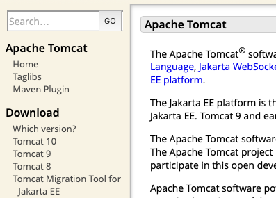
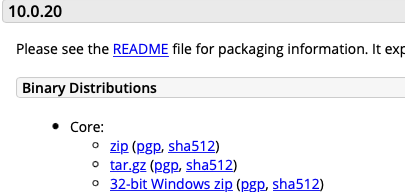
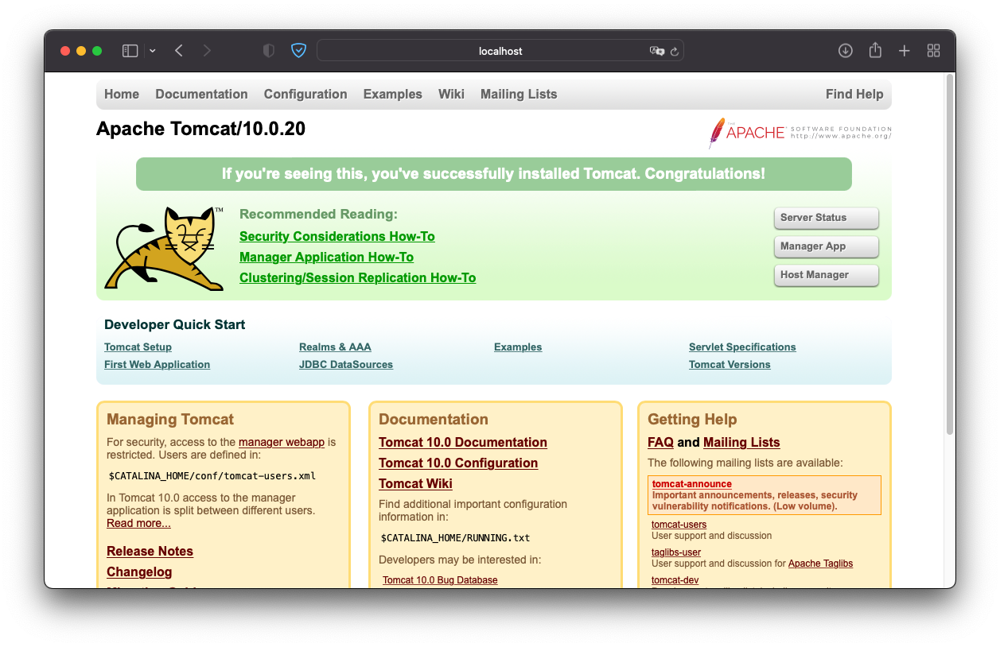

Muy fácil! Primero nos dirigimos a la página web oficial de [Apache Tomcat](https://tomcat.apache.org) y nos descargamos la versión que queramos, seguramente la última: 

 

En este caso, la última version estable publicada es la 10.0.20. De todos los paquetes disponibles, nos bajamos simplemente el que viene como fichero zip: 

 

En mi caso, se ha descargado en la carpeta de Descargas de mi Mac y ya se ha descomprimido automáticamente, por lo que basta con abrir el terminal y trasladarlo todo a una ubicación más apropiada: 
```
$ sudo mv ~/Downloads/apache-tomcat-10.0.20 /usr/local/tomcat
``` 
Ahora, establecemos nuestro usuario como propietario (cambia mi nombre por tu nombre de usuario): 
```
$ sudo chown -R emilio /usr/local/tomcat
``` 
Y por último damos permisos de ejecución a los binarios: 
```
$ sudo chmod +x /usr/local/tomcat/bin/*.sh
```
Listo, ahora el servidor se puede arrancar y parar mediante los siguientes comandos: 
```
$ /usr/local/tomcat/bin/startup.sh $ /usr/local/tomcat/bin/shutdown.sh
``` 
Y si está corriendo podemos acceder a los contenidos en local a través de http://localhost:8080  
Como ejemplo, mostrará la página que puedes ver en la siguiente imagen:

