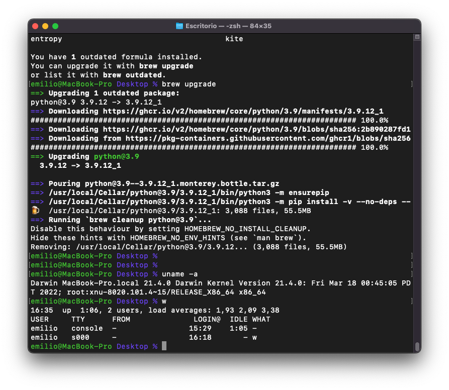
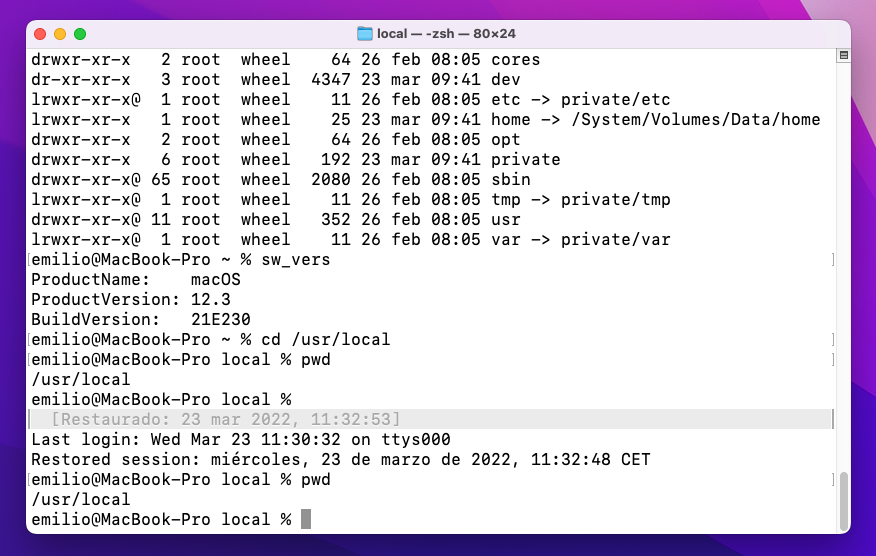

 

El intérprete de terminal de comandos por defecto en MacOS desde hace un par de años (concretamente desde la versión 10.15 Catalina) es [Zsh](https://www.zsh.org). Éste intérprete viene configurado para mostrar un aspecto realmente limpio y sobrio, con texto negro sobre fondo blanco (o viceversa cuando estamos usando el modo oscuro del entorno gráfico). 

Lo cierto es que quise saltarme esa apariencia tan austera y poder al menos darle un pequeño toque de color que además facilitase la lectura cuando llevas un rato ejecutando comandos. En particular, he puesto mi nombre de usuario y el de la máquina en color verde, seguido del directorio actual en azul; y para ello he tenido que recurrir al archivo de configuración ".zshrc" que debería estar alojado en el directorio de usuario. 

Si no lo tienes, debes crearlo. Si ya lo tienes, basta con que añadas al principio un par de líneas: 
```
autoload -U colors && colors 
PS1="%F{green}%n@%m %F{blue}%1~ %# %{$reset_color%}"
``` 
Si tienes el terminal ya abierto, puedes forzar que recargue la configuración sin necesidad de cerrarlo y volver a abrirlo. Ejecuta este comando: 
```
$ source ~/.zshrc
``` 
Y además puedes hacer que aun cuando cerramos y salimos de la terminal, al volver a abrirla todavía tengamos a la vista la salida de los comandos introducidos con anterioridad y estemos situados en el mismo directorio donde lo dejamos. 

 

Para activar este comportamiento podemos recurrir a Preferencias del Sistema/General y desmarcar la opción "Cerrar las ventanas al salir de una app". Pero este ajuste afecta a todas las aplicaciones, lo cual puede no ser del todo deseable. Para mí, lo mejor es activarlo de forma específica para la aplicación que queramos. En el caso del terminal, se hace con el siguiente comando: 
```
$ defaults write com.apple.Terminal NSQuitAlwaysKeepsWindows -bool true
```
A partir de la siguiente sesión, tendremos el comportamiento deseado, tal y como aparece en la imagen. Si queremos volver a la configuración anterior, cambiaremos el valor "true" por "false".

Mucha información la he encontrado en Stack Overflow: https://stackoverflow.com/questions/689765/how-can-i-change-the-color-of-my-prompt-in-zsh-different-from-normal-text