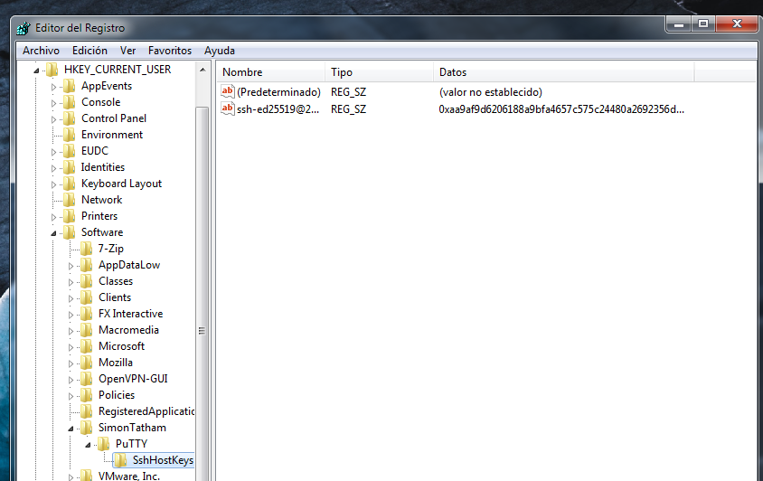

Hoy me he encontrado con la siguiente situación: quería transferir un archivo a desde un ordenador con Windows a mi Mac a través de la red local. Hay unas cuantas formas de hacerlo pero la primera que se me ha ocurrido ha sido mediante el protocolo SCP, que es suficientemente rápido y fácil como para solucionar el problema sin demasiadas complicaciones.

En primer lugar, hay que configurar el Mac para que podamos hacer login remoto (por SSH). Esto se hace activando la opción de "Sesión Remota" en la categoría "Compartir" de las Preferencias del Sistema: 

 

Es importante que en esta pantalla hagamos clic sobre el símbolo "+" y añadir nuestro usuario de MacOS. En el lado del Mac (que actuará como servidor) ya está todo listo. Vamos a Windows.

Un buen cliente de SCP es PSCP, del mismo desarrollador de la utilidad [Putty](https://putty.org). Basta con descargar el ejecutable necesario para tu plataforma ya que no requiere instalación: 

 

Por comodidad, lo he descargado al escritorio, aunque si lo vas a usar habitualmente puede que te resulte más cómodo moverlo a otra ubicación que se encuentre en el PATH del Símbolo de sistema (p.ej. a `C:\Windows\System32\`). Ahora en mi escritorio tengo el ejecutable y el archivo que quiero transferir: 

 


Ya sólo queda ejecutar el comando que realizará la transferencia. Desde un intérprete de comandos, me posiciono en el Escritorio y lanzo la siguiente orden: 
```
$ pscp -P 22 test.zip emilio@192.168.1.35:/Users/emilio
```
El flag -P establece el puerto de la conexión (por defecto el 22 para conexiones SSH), y después del nombre del fichero establecemos el destino: usuario "emilio" en la IP local de mi Mac, seguido de dos puntos y una ruta donde este usuario tiene permisos de escritura (por ejemplo, su carpeta personal). Si es la primera vez que ejecutas este comando, se te preguntará si confías en el host (y se mostrará su firma criptográfica): 


Cabe resaltar que en lugar de la IP del Mac, puedo modificar el comando y referirme a él por su nombre de host local, e incluso que el destino sea otra carpeta como la de descargas: 
```
$ pscp -P 22 test.zip emilio@MacBook-Pro:/Users/emilio/Downloads/
```
Las siguientes veces que te conectes a esta máquina no se te pedirá confirmar su clave criptográfica ya que Putty las almacena en el registro de Windows. Si quieres comprobarlas (o incluso eliminarlas) las encontrarás bajo la ruta: `HKEY_CURRENT_USER\Software\SimonTatham\PuTTY\SshHostKeys` 



En MacOS (y creo que también en Linux) tenemos ya por defecto disponible un cliente equivalente en el terminal, llamado "scp". El comando funciona con la misma sintaxis y de forma prácticamente idéntica. Las claves quedan luego almacenadas en este fichero: `~/.ssh/known_hosts`