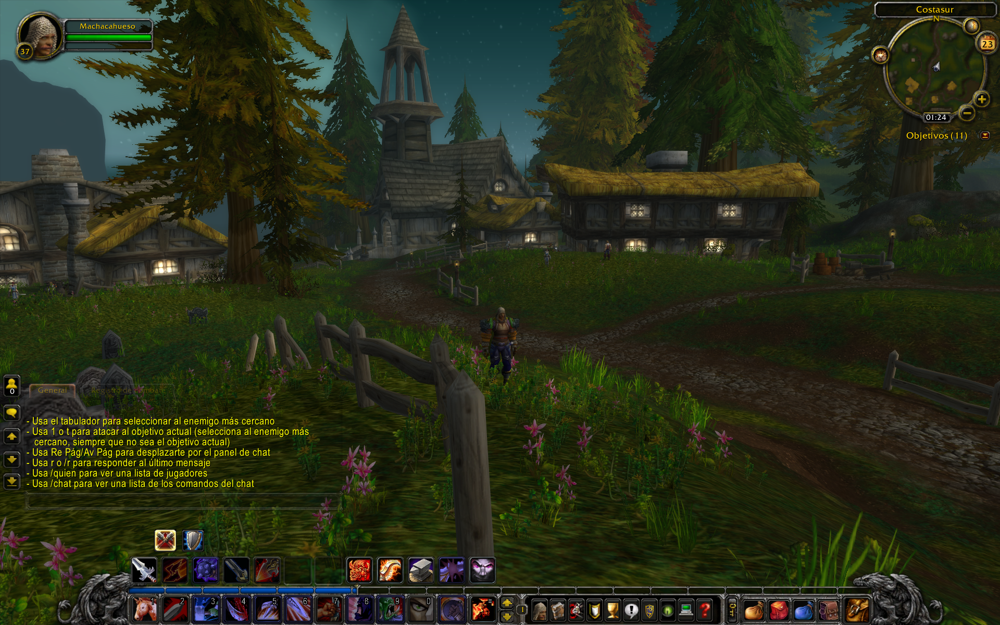

**Cliente**  
Hace un par de años que Apple retiró de MacOS el soporte para aplicaciones de 32-bit. A estas alturas, salvo que utilices aplicaciones muy antiguas y abandonadas, esto no debería ser un problema, pero sí que existen algunos programas que ya no podrás ejecutar en versiones nuevas del SO. Una de ellas es el antiguo cliente de [World of Warcraft](../../../2007/02/world-of-warcraft/). Pero podemos utilizar la aplicación de Windows a través de traducción de librerías con Wine.

Para facilitarlo, instalamos Winery. Puedes descargarlo manualmente desde https://github.com/Gcenx/WineskinServer/releases pero yo prefiero hacerlo con Homebrew, con lo que también se instalarán sus actualizaciones de forma automatizada: 
```
$ brew install --cask --no-quarantine gcenx/wine/wineskin
``` 
El flag `--no-quarantine` evitará tener que insistirle (botón derecho/abrir) a MacOS para abrir la aplicación.

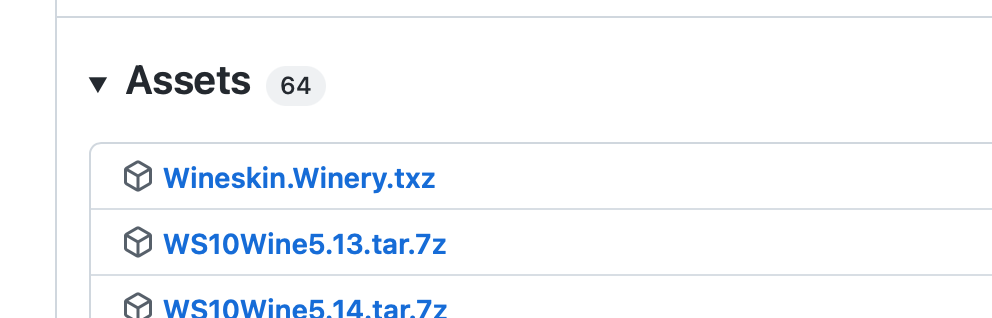 

Si has optado por descargarlo manualmente, lo encontrarás bajo el apartado de Assets comprimido con extensión .txz, y una vez lo hayamos bajado y desempaquetado, tendremos la aplicación tal y cómo se puede ver en esta imagen: 

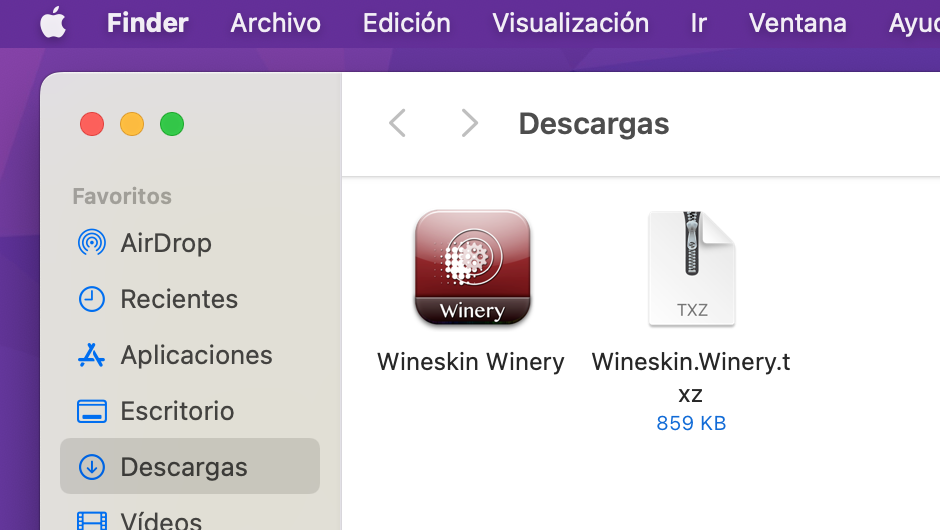 

Puedes arrastrarla por ejemplo a tu carpeta de Aplicaciones.

Ejecútala y te encontrarás con algo muy similar a esto: 

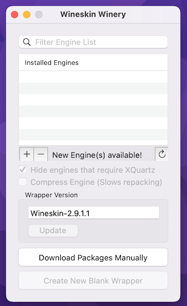

En primer lugar pulsa la flecha de refrescar y a continuación en el símbolo "+" para comprobar qué motores nuevos puede haber disponibles y escoger el más reciente. Al momento de escribir esto, el más nuevo es WS11WineCX64Bit21.2.0. Este nombre no nos dice nada, pero el número de versión es el más alto. Confirmamos que lo queremos descargar e instalar: 

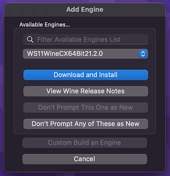 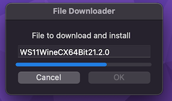

Una vez que tenemos nuestro motor de traducción, ya podemos crear la envoltura. Hacemos click en "Create New Blank Wrapper" y le damos un nombre, por ejemplo "World of Warcraft". Este paso le tomará un poco de tiempo a la máquina ya que tiene que configurar una versión específica de Wine con el motor de traducción que le hemos indicado. Una vez esté listo, haz clic en "View wrapper in Finder". 

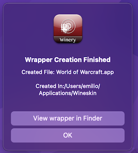 

La ventana que se abre contiene lo que será la supuesta aplicación pero por ahora está vacía. Haz clic con el botón derecho sobre ella y elige "Mostrar contenido del paquete". Ahora ejecuta la app Wineskin que hay dentro y selecciona "Install Software": 

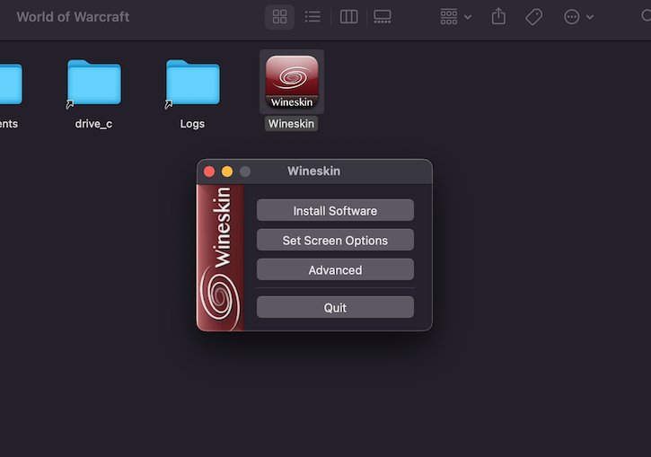 

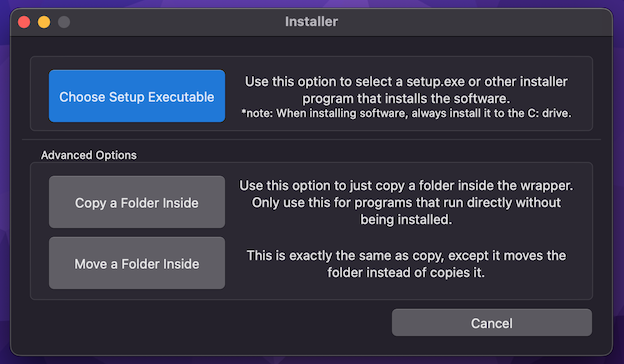 

Ahora podemos escoger si copiar o mover toda la carpeta con el juego (para Windows). Yo voy a escoger copiar, seleccionaré el directorio donde están todos los archivos del juego y confirmaré cual es el archivo que lanza la aplicación (que en este caso es "Wow.exe") 

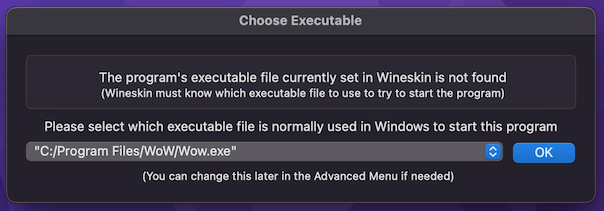 

Se puede toquetear alguna cosa más, como el icono de la aplicación, por ejemplo, pero en principio no es necesario hacer nada extra para conseguir que el juego funcione bajo macOS.


**Servidor**  
También puedes tener tu servidor privado con soporte hasta la versión 3.3.5a (Wrath of the Lich King). Funcionará en Windows, MacOS y Linux.

Empezaremos instalando [Docker](https://www.docker.com), ya sea descargándolo de la web oficial o, como en mi caso, a través de Homebrew:
```
$ brew install --cask docker
```
A continuación, descargaremos el software [azerothcore](https://github.com/azerothcore/acore-docker/archive/refs/heads/master.zip), una implementación hecha mediante ingeniería inversa del servidor de juego que correrá como un contenedor, lo que hará mucho más fácil tanto la instalación de todas las herramientas necesarias como su actualización y mantenimiento. Descomprimimos sus contenidos donde no nos estorben, entramos al directorio mediante la terminal y obtenemos la última versión de los paquetes necesarios: 
```
$ docker compose pull
``` 
Una vez que este proceso haya concluido, lo cual depende principalmente de la velocidad de la conexión a internet, importaremos a las bases de datos del servidor todos los datos del juego.
```
$ docker compose up ac-db-import
``` 
Y el siguiente paso consiste en arrancar el contenedor del servidor:
```
$ docker compose up -d
```
El servidor ya está funcionando pero necesitamos un usuario con el que poder autenticarnos. Para ello, vamos a conectarnos al proceso del servidor a través de una terminal. Para saber el nombre del proceso, introducimos: 
```
$ docker compose ps
```
En mi caso existe un proceso llamado `acore-docker-ac-worldserver-1` al que me puedo conectar con la siguiente orden:
```
$ docker attach acore-docker-ac-worldserver-1
``` 
El simbolo del terminal cambiará a _AC>_. Crear el usuario es tan fácil como: 
```
AC> account create USUARIO CONTRASEÑA 
AC> account set gmlevel USUARIO 3 -1
``` 
Donde USUARIO y CONTRASEÑA serán tus credenciales para conectarte al servidor y le habremos dado permisos de GM. Puedes desconectar la terminal del servidor pulsando seguidas las combinaciones de teclas Ctrl+P y Ctrl+Q. 

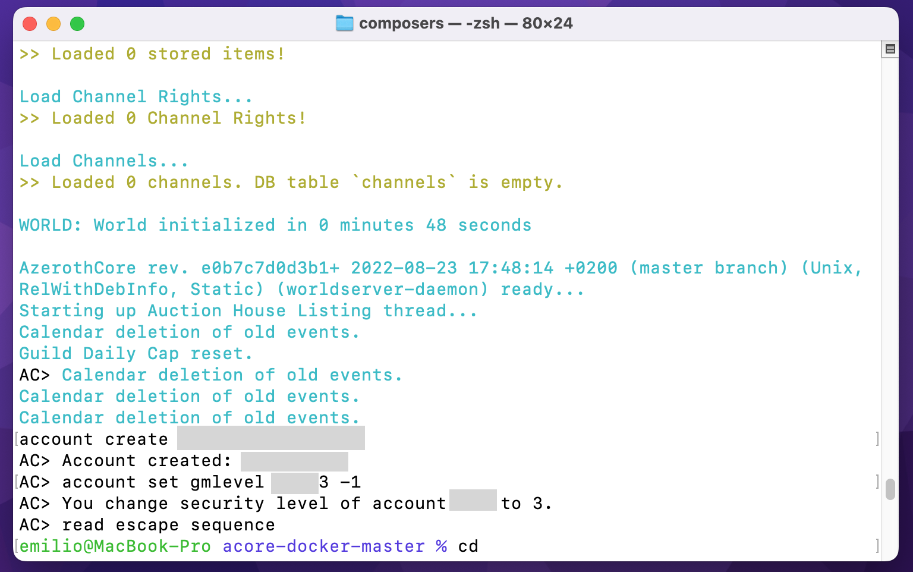

**Configurar el cliente**  
Entramos en la carpeta del juego (de nuevo, clic derecho sobre la app, escogemos "Mostrar contenido del paquete", y navegamos a la ruta `drive_c/Program Files/WoW) y abrimos el archivo _realmlist.wtf_ con un editor de texto plano. Borramos todo lo que pone y escribimos simplemente:  
```
set realmlist logon.chromiecraft.com
```
Si juegas desde el mismo ordenador donde tienes el servidor, puedes referirte a él como "localhost" y si es desde otra máquina de tu red local, incluso puedes utilizar el nombre de host (por ejemplo, en mi caso, "MacBook-Pro").

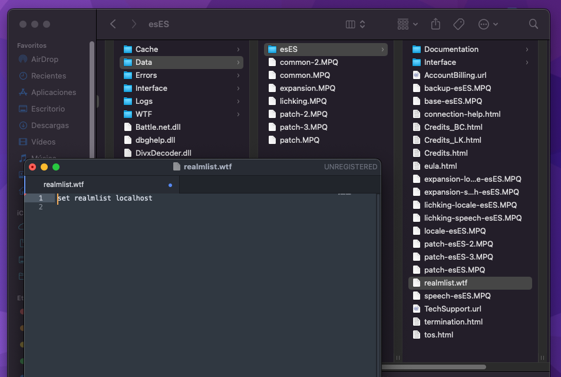

Más info:  
- https://www.chromiecraft.com/es/como-instalar-un-servidor-de-wow-en-tu-computadora/
- https://www.azerothcore.org/wiki/install-with-docker