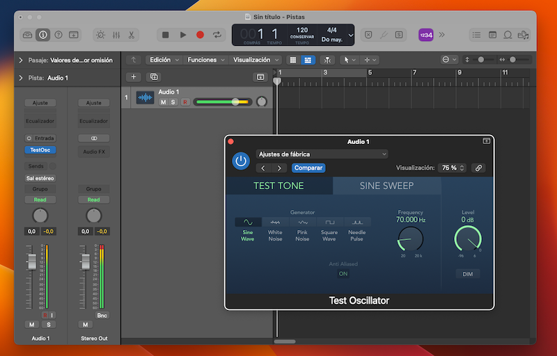

**Ficha Técnica:**  
Nombre: Sundara  
Fabricante: HIFIMAN  
Precio: 349 €  
Página web: https://hifiman.com/products/detail/286

**ATENCIÓN:**  
Parte de esta review está acompañada de texto generado con ChatGPT (versión Dec 15) para explicar las características generales de este tipo de auriculares. Puedes identificar estas partes porque se encuentran escritas _en letra cursiva_.

Ya hace tiempo que necesitaba unos buenos auriculares tanto para disfrute personal como para trabajar. Venía mezclando con unos altavoces [Logitech Z-4e](../../../2006/01/logitech-z-4) (reparados ya mil y una veces) porque los conozco a la perfección, pero es cierto que a veces me gustaría tener algo más cercano a unos monitores de referencia más exacta. Descarté los sospechosos habituales (Sony WH-1000XM5, Apple AirPods Max y similares) porque tienen un perfil de sonido mucho más orientado a consumo y además la conexión bluetooth introduce un lag y una compresión nada deseables, de modo que me introduje en la madriguera de conejo que es investigar acerca de productos de audio y me encontré con este modelo que vamos a repasar en esta entrada.

_HIFIMAN es una marca de audio conocida por sus auriculares y amplificadores de alta calidad. La marca ofrece una variedad de auriculares inalámbricos y con cable, incluyendo modelos de tecnología planar y dinámica. Algunos de los auriculares más populares de HIFIMAN incluyen el Sundara, el Ananda, y el Edition X V2. Los auriculares de HIFIMAN son conocidos por tener un sonido claro y detallado y por ser cómodos de usar durante períodos prolongados. La marca también es conocida por utilizar materiales de alta calidad en la construcción de sus auriculares y por ofrecer una garantía de por vida para sus productos._

Llevo seis meses empleando el modelo Sundara y he de decir que estoy muy impresionado por su calidad y por la nitidez del sonido, gracias a su tecnología de imanes planares y diseño abierto.

_Los auriculares planares son un tipo de auriculares que utilizan una membrana plana y un imán plano en lugar de una bobina y un imán cilíndrico. La membrana plana es más delgada y más ligera que la de los auriculares dinámicos tradicionales, lo que permite que se mueva de manera más rápida y precisa. Esto produce un sonido más detallado y con menos distorsión. Los auriculares planares también suelen tener una sensibilidad y una impedancia más bajas que los auriculares dinámicos, lo que significa que pueden ser más fáciles de manejar para dispositivos móviles y amplificadores de menor potencia. En general, los auriculares planares son valorados por su sonido claro y detallado, aunque también suelen ser más costosos que otros tipos de auriculares.

Los auriculares abiertos tienen algunas ventajas únicas sobre los auriculares cerrados:  
- Mayor apertura de sonido: los auriculares abiertos tienen una mayor apertura de sonido, lo que significa que pueden proporcionar una sensación más inmersiva y natural al escuchar música. Esto se debe a que los auriculares abiertos no obstruyen completamente el oído y permiten que el sonido entre y salga del oído de manera más natural. 
- Menos sensación de aislamiento: los auriculares abiertos no bloquean completamente el ruido ambiental, lo que significa que el usuario puede escuchar lo que sucede a su alrededor mientras escucha música. Esto puede ser beneficioso en situaciones donde es importante estar atento al entorno, como al caminar por la calle o en el transporte público.
- Mayor transparencia: los auriculares abiertos suelen tener una mayor transparencia y detalle en el sonido debido a que no bloquean completamente el oído. Esto puede ser beneficioso para músicos o productores que necesitan escuchar con precisión todos los elementos de una canción o pista. 
- Menos calor: los auriculares cerrados bloquean completamente el oído y pueden hacer que el oído se caliente y sude durante períodos prolongados de uso. Los auriculares abiertos permiten que el aire circule y pueden ser más cómodos de usar durante períodos prolongados._

En este caso, los Sundara ofrecen una definición muy buena en todos los rangos de frecuencias. El fabricante afirma que pueden reproducir un rango que va desde los 6Hz hasta los 75 KHz, aunque el oído humano no alcanza tales extremos. Comprobarlo es muy fácil y te animo a que lo hagas tú también: en Logic Pro he creado una pista de audio vacía y he introducido un módulo llamado "Test Oscilator" con el que puedes manejar diferentes tipos de ondas (senoidal, cuadrada, ruido blanco y rosa, etc.) y variar la frecuencia en la que se emiten. En los auriculares he podido escuchar sin problema la frecuencia de 20Hz, que es toda una experiencia en si misma, pero no puedo decir lo mismo a partir de 16,5 KHz, seguramente debido al deterioro natural de mis oídos a mi edad. Probablemente esos sonidos se estén reproduciendo, pero no puedo percibirlos. 

Esta prueba técnica no quiere decir nada por sí sola así que he estado escuchando toda la música que he podido durante estos meses y he de destacar el sonido natural y abierto propio de unos auriculares de esta clase. Los graves cuentan con buena definición pero no se encuentran exagerados, por lo que no se comen a las frecuencias medias. De la misma manera los agudos tampoco están sobreexpuestos pero sí que permiten percibir los detalles más sutiles con claridad. En general tienen una textura cálida en prácticamente todo el espectro, ninguna frecuencia parece estar excesivamente presente frente a las demás y este equilibrio te permitirá percibir todos los instrumentos con una gran claridad, por lo que si los quieres emplear para mezcla o Mastering, pueden ser una opción muy a tener en cuenta.

Los Sundara vienen en una caja con terciopelo acompañados de un cable de 1,5m reemplazable y con conexión minijack en forma de L, además de un adaptador a Jack de 6,35mm. Las almohadillas de cuero sintético (muy cómodas y grandes) ya vienen montadas. Las cápsulas que alojan los auriculares propiamente dichos están construidas en aluminio y todo el conjunto se siente muy robusto. En el (breve) manual incluído viene explicado como ajustar la diadema, fabricada en metal. No reposará directamente sobre tu cabeza ya que cuenta con una banda interna de goma con aspecto de cuero para más comodidad. Hablando de comodidad, el peso es de 372g. Comparado con auriculares de diadema baratos son bastante pesados, pero se encuentran dentro de lo normal en cascos de esta categoría. No me han supuesto ninguna incomodidad a lo largo de varias horas de llevarlos puestos. Reconozco que echo de menos que traigan una funda dura o, al menos, una bolsa de transporte adecuada, ya que me gustaría poder llevármelos sin ponerlos en riesgo.

Hay que tener en cuenta eso sí que la impedancia de 37ø y su sensibilidad de 95 dB no serán aptas para su uso con dispositivos móviles. En mi caso, conectados a un iPhone, apenas recibían potencia como para ser realmente útiles. Sin embargo, sí que funcionan perfectamente conectados directamente a un MacBook (no digamos ya a interfaces de sonido externas o amplificadores). Si tienes dudas acerca de la posibilidad de utilizar unos auriculares con tus dispositivos, ésta calculadora online puede ser de mucha ayuda: https://www.headphonesty.com/headphone-power-calculator/

Por último, cabe señalar que por su diseño abierto estos auriculares son bastante delicados y no deberías emplearlos en exteriores o lugares donde la suciedad pueda colarse en su interior, pero existe una versión cerrada de los mismos.

**NOTA: 9**

**Lo mejor de HIFIMAN Sundara:**  
Calidad de sonido muy superior a la competencia en su rango de precios  
Sonido equilibrado y muy fidedigno  
Construcción robusta en metal y cuero sintético

**Lo peor de HIFIMAN Sundara:**  
Su diseño abierto no los hace aptos para usar por la calle  
La alta impedancia impide su uso con teléfonos móviles si no tenemos un pre-amplificador  
No incluyen funda o bolsa de transporte

