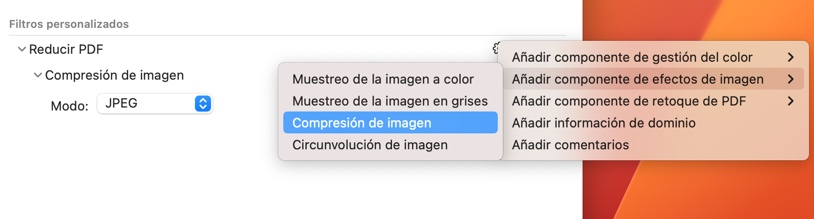

Tengo varios archivos PDF que se acercan o incluso superan el gigabyte de tamaño como resultado de escanear documentos de varias páginas. Son ficheros poco prácticos ya no solamente por su peso si no porque cargar semejante archivo en memoria hace que consultarlos sea un proceso más costoso de lo que sería deseable. 

 

Hay una forma sin embargo de reducir el tamaño de archivo en MacOS empleando ColorSync, una de esas herramientas incluídas por defecto en el sistema y muy desconocidas para la mayoría de nosotros. Este programa se puede lanzar desde Launchpad/Otros. 

 

En la ventana que se abre, debemos crear un nuevo filtro personalizado, pulsando el botón "+" y añadir un componente de efectos de imagen. Escogeremos la compresión de imagen y la configuraremos como se ve en la siguiente captura de pantalla: 

 

Una vez hecho esto, podemos acudir al menú Archivo/Abrir o simplemente arrastrar el PDF que queramos reducir sobre el icono de ColorSync en el Dock y este se abrirá. 

 

En la barra inferior podemos seleccionar el filtro que hemos creado y pulsar en aplicar. Por último, podemos guardar el documento (sobreescribiendo el original) o acudir a Archivo/Guardar como para poder guardarlo con otro nombre. 

 

Dependiendo del tipo de documento, los resultados serán más o menos efectivos. En archivos con muchas imágenes es donde notaremos mayor beneficio. He hecho algunas pruebas y estos han sido algunos resultados:  
- Original 1,2 GB a 100 MB  
- Original 586 MB a 98,6 MB  
- Original 360 MB a 49 MB  
- Original 360 KB a 36 KB 

En general, para documentos con mezcla de textos, imágenes en B/N e imágenes en color, el tamaño final oscila entre un 60% o incluso un 10% del original.