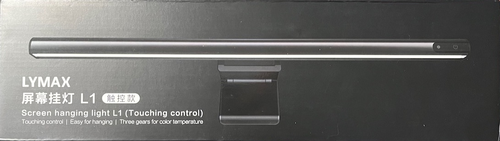
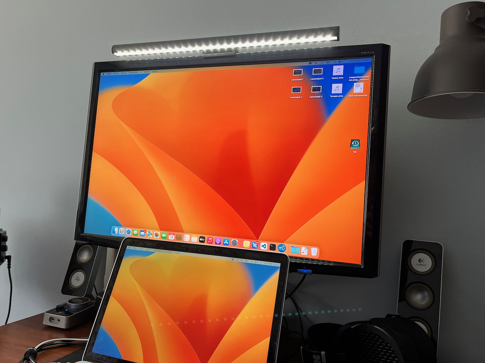
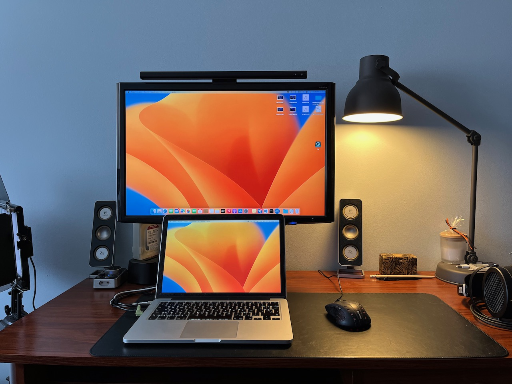
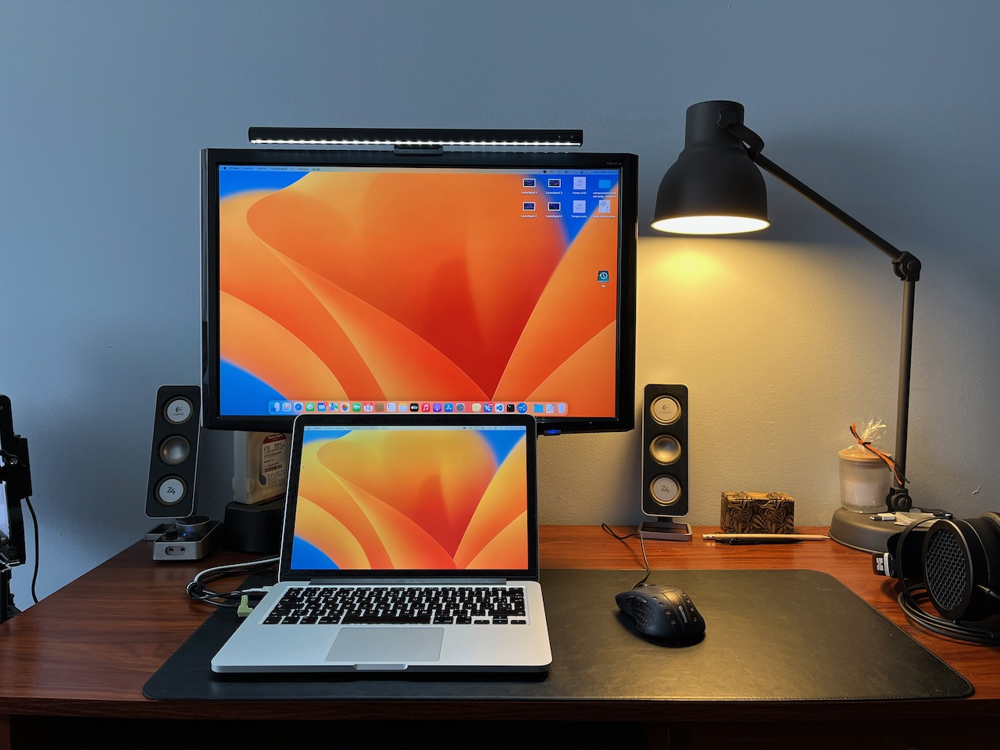
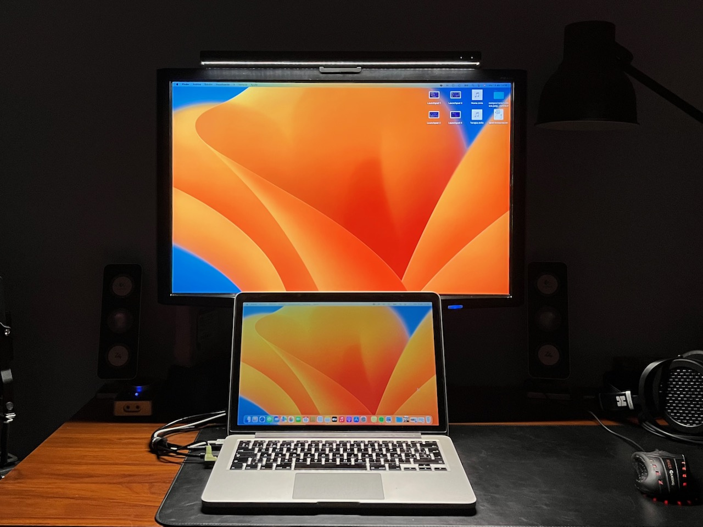
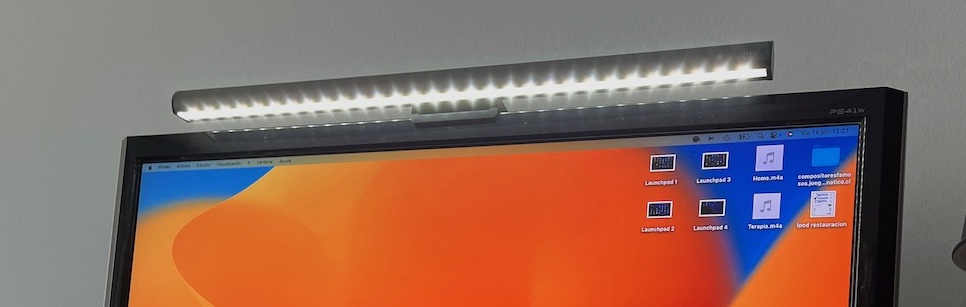

**Ficha Técnica:**  
Nombre: L1 Screen hanging light (Touching control)  
Fabricante: Lymax  
Precio: 21,63 €

Si pasas muchas horas frente a la pantalla o te gusta trabajar a oscuras es posible que hayas experimentado fatiga ocular o tensión en los ojos. La iluminación inadecuada puede ser la causa principal de estos problemas, y ahí es donde entran en juego las barras de luz para monitor como la Lymax L1. Estas lámparas proporcionan una luz continua sin apenas parpadeos, sin molestos reflejos en la pantalla y que además te proporcionan una tenue y agradable luz ambiente en tu mesa de trabajo que puede mejorar significativamente tu experiencia de visualización.

La Lymax L1 mide 420 mm de largo se coloca en la parte superior del monitor, apoyada en una sencilla peana ajustable al grosor del marco de la pantalla. También permite ajustar la inclinación y proporciona una iluminación suave y uniforme a tu alrededor. Está diseñada para ser compatible con una amplia gama de monitores, por lo que puedes estar seguro de que funcionará con el tuyo. La versión que yo he adquirido se maneja mediante dos controles táctiles en la propia barra, aunque existe una versión con un controlador inalámbrico e incluso la posibilidad de tener dos barras para aquellos que utilicen dos monitores.

Cuenta con una potencia de 3,5W, más que suficiente para iluminar un espacio de trabajo, y tiene tres ajustes de temperatura de luz entre 2900K y 6000K, lo que significa que puedes adaptar la iluminación a tus necesidades y preferencias personales según quieras que sea más cálida o fría. La lámpara se conecta mediante USB y los controles táctiles están situados en la parte derecha. El primero es el de encendido/apagado y el segundo es el que ajusta la temperatura e intensidad de la luz mediante una pulsación corta o larga. Según el fabricante, está construida con aluminio y plástico ABS, y realmente parece bastante robusta. Teniendo en cuenta que va a vivir sobre el monitor, no creo que la durabilidad fuese a ser un problema, pero se agradece el uso de buenos materiales. Es totalmente negra y su apariencia no resulta estridente, independientemente del estilo de tu lugar de trabajo.

En estas dos fotos puedes ver la diferencia en una habitación iluminada suavemente por un flexo y luz natural que entra por la ventana, y cómo incluso así se nota la luz de la barra en la zona del escritorio donde están el teclado y el ratón: 

 

Y con la habitación completamente a oscuras: 

Aun con todo, hay algunos inconvenientes que necesites tener en cuenta. El primero es que si quieres ajustar finamente la temperatura de la luz, los únicos tres ajustes disponibles te limitarán mucho. En segundo lugar, si utilizas un monitor ultrawide esta lámpara se te va a quedar corta. Y en tercer lugar, si adquieres la versión con controlador inalámbrico, necesitarás ponerle una pila de botón (aunque el fabricante incluya una y vaya a durarle mucho tiempo).

Personalmente he optado por la versión sin el control remoto ya que creo que una de las principales ventajas de estas lámparas es que no ocupan espacio en tu escritorio y una vez encendida no necesito ajustar nada (personalmente la tengo en temperatura media e intensidad al máximo).

En general, la Lymax L1 es una barra de luz para monitor sólida y asequible que puede mejorar significativamente tu experiencia de visualización. Si pasas muchas horas frente a tu monitor, la Lymax L1 puede reducir la fatiga ocular y mejorar la claridad de la imagen, lo que hace que sea una excelente inversión para cualquier persona que desee mejorar su productividad y comodidad al trabajar en el ordenador.

**NOTA: 7.5**

**Lo mejor de Lymax L1:**  
Luz continua muy agradable para la zona de trabajo y sin reflejos en la pantalla  
Precio  
Construcción robusta y manejo muy simple

**Lo peor de Lymax L1:**  
Solo tres ajustes de temperatura  
Muy corta si usas monitores ultrawide o de gran tamaño  
El controlador inalámbrico requiere pilas