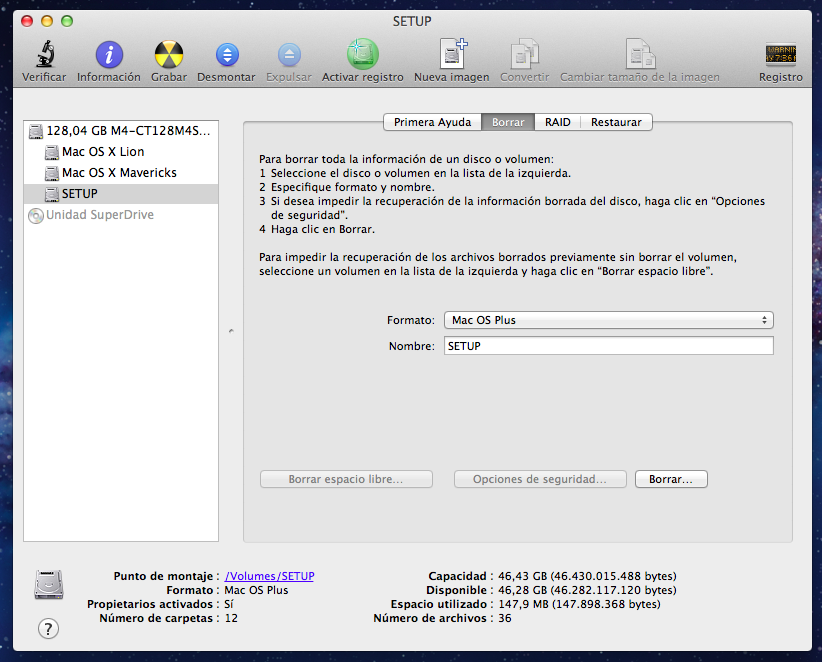
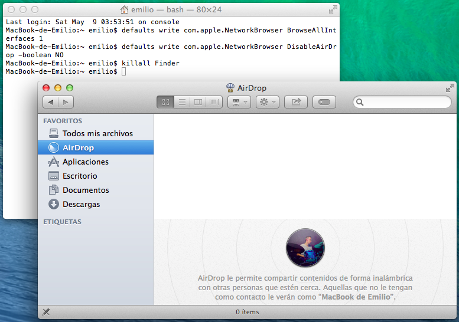

Tengo MacBook de 13 pulgadas de mediados de 2007 blanco con las siguientes especificaciones:  
- Core 2 Dúo a 2,16 Ghz 
- 2 GB de RAM DDR-2 667 Mhz 
- 120 GB de disco duro 
- Tarjeta gráfica integrada Intel GMA 950 y pantalla con resolución 1280x800 
- Wi-fi a/b/g/n, puerto Ethernet y Bluetooth 2.0 
- 2 puertos USB 2.0, Display Port, Firewire 400, etc. 
- Teclado estadounidense.

El exterior del ordenador está perfectamente cuidado, a excepción de un par de marcas en el plástico de las esquinas, un fallo muy común en los MacBook de poliuretano; la batería original está completamente muerta (no retiene nada de carga), pero aparentemente nada más.
Conservo el cargador original en buen estado, la caja original con todos los accesorios, una funda de neopreno oficial de Apple y el DVD de instalación de OS X Snow Leopard, que por aquel entonces se vendía por separado. El ordenador fue originalmente vendido con OS X 10.4.9 (Tiger) y podía llegar a ejecutar oficialmente la versión 10.7.5 (Lion).


Uno puede pensar que una máquina así ya solo serviría para vender por piezas, sobretodo debido a un fallo que hacía que se bloquease al conectarse a una red Wi-Fi. Sin embargo, no es más que un bug de software y además se pueden utilizar sistemas operativos mucho más modernos, tanto MacOS, como Windows, como Linux.
Además, aprovecharé para sustituir algunos componentes y realizar una buena limpieza interna del equipo.


**Cambiar pasta térmica**  
Una pista de que el portátil necesitaba la limpieza eran las temperaturas que podía ver en MacOS mediante iStat Menus, o en Windows con CoreTemp. Sin haber hecho apenas nada, solo arrancando el equipo, el procesador estaba a unos bastante preocupantes 75ºC y solo bajaba hasta 57º después de unos cuantos minutos sin hacer nada. 


El ventilador estaba corriendo de forma bastante ruidosa la mayor parte del tiempo dado que jamás se le había cambiado la pasta térmica al procesador o a la tarjeta gráfica. Desmontar el equipo es un poco más laborioso que en los MacBook con diseño unibody, pero se puede hacer con un simple destornillador de estrella. Me apoyé también mucho algunos videos de youtube, como [éste](https://www.youtube.com/watch?v=pHDVSPOM_EY), hasta tener el equipo finalmente desmontado ante mí.


Para la limpieza empleé un pequeño pincel y quité todo el polvo que cubría los componentes. A continuación, usé un paño de microfibra empapado en alcohol para retirar todos los restos de la antigua pasta térmica del procesador y la tarjeta gráfica hasta dejarlos relucientes: 


Ésta es una parte muy importante porque aquí debe producirse la primera transferencia de calor: por contacto entre el procesador y el disipador. Éste lo conducirá hasta el radiador, se radiará al aire que hay a su alrededor y es el único ventilador del equipo el que debe encargarse de expulsar ese aire caliente hacia el exterior. Una vez quité la pasta original ya reseca y solidificada, apliqué una pasta térmica nueva, la Thermal Grizzly Kryonaut. También hice una limpieza profunda en las aspas del ventilador y las láminas del radiador antes de volver a colocarlos.

Había bastante polvo y suciedad acumulados tras 14 años en el interior del equipo y la pasta térmica se había degradado tanto que esperaba ver una sustancial diferencia en el funcionamiento del equipo. De un plumazo, el equipo arrancó y la temperatura se estabilizó en unos frescos 36ºC. Haciendo algunas tareas durante un rato, subió a los 45-50º:


 

Esto significa que el ordenador estaba funcionando con una diferencia de 20ºC tras arrancar y unos 10-15ºC menos durante una carga de trabajo moderada. Pero lo mejor es que automáticamente el MacBook se volvió una máquina mucho más silenciosa ya que ahora no suele superar los 60ºC. Si lo hace, el ventilador empieza a girar a pocas revoluciones y su velocidad de giro aumenta si la temperatura lo sigue haciendo. Al estar en general por debajo de ese umbral, trabajar en él es una experiencia mucho más placentera.

**Cambiar teclado**  
Éste portátil fue comprado en EE.UU. en su momento, por lo que venía con un teclado tipo ANSI. Esto se puede reconocer fácilmente por la forma de la tecla Intro, o por el hecho de que no hay ninguna tecla entre la letra Z y May. Izq. 


Los teclados ANSI suelen ser bastante valorados entre los programadores porque tienen un acceso cómodo a símbolos muy comunes en todos los lenguajes sin necesidad de utilizar combinaciones de teclas. A mi en particular no me preocupaba en absoluto la ausencia de la letra Ñ o la disposición de los signos de puntuación, acentos, llaves, etc... pero es cierto que en el día a día cometo más equivocaciones porque estoy acostumbrado a los teclados ISO españoles, los más comunes.  
Según iFixit, se puede sustituir toda esta parte de la carcasa y conectar un teclado de diferente tipo sin ningún problema. Además, ya que el ordenador acusaba desconchados en el borde del plástico (algo muy común en esta generación de Macs), preferí lanzarme a la búsqueda de un repuesto con teclado español. Sinceramente, la búsqueda es complicada. No hay repuestos originales, obviamente, y por eBay se pueden encontrar algunos, pero o bien se encuentran en muy mal estado, o corresponden a otro idioma. Sin embargo pude encontrar una cubierta con teclado español en un estado razonablemente bueno, así que simplemente enchufé ese y volví a cerrar el equipo, que ahora tiene incluso un mejor aspecto. 


**Batería, memoria y SSD**  
A partir de ahí sustituí la batería por una compatible con la misma capacidad de la original, aunque de color negro. Con 25 euros, compré dos módulos de 2GB para instalar los 4 GB de RAM que supuse que aceptaba como máximo, y por último le cambié el disco duro por el SSD [Crucial M4](../../../2013/02/crucial-m4/) que ya tenía por casa.

Debo decir sin embargo que el máximo de memoria que acepta el ordenador es de 3 GB, que sigue siendo más de lo que tenía, pero tampoco tanto. Este aumento en la memoria no va a ponerlo a la altura de mi MacBook Pro de 2014, pero sí que se nota un poco más de soltura en el sistema. De todas formas el mayor incremento en velocidad de respuesta viene provocado por el cambio a un SSD, que además con esa capacidad también podrá tener una partición con Windows 10 para ejecutar algunas aplicaciones que no están disponibles en Mac o incluso una con Linux. La batería le ha devuelto al menos un par de horas de la autonomía perdida.


**Instalación de un sistema operativo nuevo**  
Hice una instalación limpia de Snow Leopard aprovechando que tenía el disco a mano. Al concluir la instalación, en un arranque de nostalgia, me puse a explorar un poquito cómo era el sistema operativo más moderno de hace más de una década. Si tú también eres curioso, te diré que está plagado de cadáveres: iChat, iPhoto, Mobile Me...

Y efectivamente, cuando llegó la hora de conectarme a la red inalámbrica de casa, el sistema se quedó colgado. Esperé, y esperé, y desesperé. A golpe de Google, encontré gente con problemas similares que solucionaron desactivando el soporte para IPv6 en la configuración de Red. Y efectivamente así fue: automáticamente el sistema se conectó a la red sin mayores problemas.

**MacOS y Software**  
En cuanto al software, si tenemos en cuenta que este ordenador se quedó en OS X Lion, no vamos a poder hacer gran cosa: ninguno de los navegadores más comunes lo siguen soportando y no puedes instalar las últimas versiones de Firefox ni de Chrome. Lo mismo para Office (debes recurrir a la versión de 2011), iMovie, GarageBand, Logic Pro X, Final Cut Pro X, etc. etc. etc. O localizas versiones antiguas, o Apple te negará la posibilidad de descargarlas desde la Mac App Store por no disponer de un equipo con un SO actualizado. 

Afortunadamente, existe la posibilidad de instalar versiones más modernas de MacOS de forma no oficial. Es posible hacerlo por varios métodos pero el único con el que he obtenido resultados es con SFOTT, que además es un método muy transparente y al mismo tiempo fácil de seguir.

Hasta 2006 los Macs basados en procesadores PowerPC e Intel (32 bits) disponían de un EFI, un Kernel y unos controladores de 32 bits. Con la llegada de los Core 2 Duo de 64-bits se iniciaba una transición: se podían correr aplicaciones de 64 bits con el Kernel y los controladores de 32 bits mediante tecnologías de traducción de llamadas y direcciones. Y por otro lado, si el hardware disponía de controladores de 64 bits, se podía ejecutar un Kernel del mismo tipo de forma que las aplicaciones de 64 bits ya no necesitaban esas tecnologías extra y sus llamadas al sistema se podían realizar de forma nativa y transparente. El arranque EFI no obstante, seguía siendo un sistema de 32 bits. 

 

En 2008 Apple introdujo nuevos ordenadores con sistemas de arranque EFI de 64 bits manteniendo la compatibilidad de Mac OS X con los EFI de 32 bits para los ordenadores anteriores, aunque se cargase un Kernel y drivers de 64 bits según el tipo de procesador de la máquina. Y finalmente en 2012 se culminaba la transición con la publicación de Mountain Lion, descartando el soporte a EFI, Kernel y drivers de 32 bits. Por eso los Macs anteriores a 2008 cuya EFI era de 32 bits (como mi MacBook) no pudieron actualizarse más allá de Lion. 

 

Podemos saltarnos esta restricción si intervenimos el sistema, cargamos un EFI de 32 bits e instalamos controladores para el hardware obsoleto, si disponemos de ellos. Por desgracia para mi MacBook, oficialmente no hay drivers de 64 bits para su tarjeta gráfica integrada, una Intel GMA 950. Si conseguimos actualizar, el rendimiento gráfico será bastante pobre, pero se han podido rescatar unos controladores Beta de 64 bits que existieron en su momento en una Developer Preview de Snow Leopard; e instalarlos es mejor que nada.

Hay otras cosas que no funcionan:  
- El brillo de pantalla no se puede ajustar ni mediante las teclas de función ni desde las preferencias del sistema
- El ordenador no es capaz de despertar del estado de reposo
- La retroiluminación de la pantalla no se apaga cuando conectas un monitor externo (por DisplayPort) y cierras la tapa del portátil
- La cámara iSight va muchísimo peor que en OS X 10.7.5, así que no la considero funcional

Vamos a necesitar:  
- La app de instalación del nuevo SO, p.ej.: _Install OS X Mavericks.app_
- Descargar SFOTT desde [aquí](/files/2024/05/sfott_beta.pkg)
- Descargar estos Ketxs desde [aquí](/files/2024/05/kexts.zip)

_Install OS X Mavericks.app_ es el instalador que te puedes descargar de la Mac App Store y debe estar en la carpeta /Aplicaciones. Si no lo tienes en tu pestaña de aplicaciones compradas de la tienda (porque en su momento no lo adquiriste), deberás localizarlo por otros medios. Las versiones de Mavericks lanzadas por Apple van desde la 10.9.0 hasta la 10.9.5. Si tienes el instalador de esta última, perfecto. Si no es así y quieres actualizar a posteriori, ojo porque tendrás que reparchear el sistema.

**Procedimiento**  
Usaremos SFOTT para crear un disco de instalación y cambiar su Bootloader EFI por uno que permita instalar el SO en un ordenador oficialmente no soportado. Una vez que lo tengamos corriendo, podremos instalar los drivers. No te preocupes si no tienes un pendrive a mano: haré el proceso utilizando una partición del disco duro y la borraré una vez que ya no la necesite. Desde la Utilidad de discos del Mac, prepararemos el equipo. Como yo quiero conservar OS X Lion por si surgen problemas he reducido el tamaño de su partición y he añadido dos particiones con formato MacOS Plus (con registro): una de 40 GB para Mavericks y otra de 8 GB para el instalador (_SETUP_). 

 

Instalamos SFOTT y lo ejecutamos. Nos pedirá la contraseña de nuestro usuario (que debe tener permisos de administrador) y se abrirá en el terminal. Voy a enumerar brevemente los pasos que hay que hacer, pero puedes verlos en varias capturas [aquí](https://web.archive.org/web/20220924223531/https://oemden.com/sixty-four-on-thirty-two-sfott/privatetest/) y también en [este video](https://www.youtube.com/watch?v=uESlYP1uuJs). Primero debemos escoger idioma y aceptar las condiciones antes de llegar al menú principal. Allí selecciona la opción _3 Settings_. En el submenú que se muestra debes seleccionar:

- _2 Choose USB/media for the sfott key_: La partición o disco donde crear el instalador parcheado, en mi caso la partición _Setup_ de 8 GB
- _3 Select the computer to use_: Si estás haciendo esto en el propio Mac que quieras actualizar, simplemente selecciona la opción _1 Choose current computer_. En caso contrario necesitas conocer el modelo exacto y el ID de placa del ordenador en cuestión
- _4 Select OS X System Version_: Obviamente seleccionamos Mavericks si esa es la versión que vamos a parchear
- _5 Select OS X Installer_: Al haber copiado el archivo _Install OS X Mavericks.app_ en tu carpeta de aplicaciones, bastará con seleccionar la primera opción para que el script localice el instalador de forma automática. También hay una opción que acepta Drag&Drop por si te resulta más cómodo teniéndolo en otra ubicación.

Ahora volvemos al menú principal. Seleccionamos la opción _4 Create / Patch SFOTT Key_ y a continuación la _2 Create a New key in Autorun_ Confirmaremos los siguientes pasos hasta terminar el proceso. Es el momento de reiniciar el Mac mientras pulsamos la tecla Opción (_alt_) para arrancar desde la partición Setup, que ha sido renombrada a SFOTT. Realiza la instalación del sistema operativo y acuérdate de seleccionar que se instale en la partición que quieras, en mi caso la que creé antes de 40 GB de espacio. Si todo ha ido bien, tu sistema se reiniciará para que termines de configurar el sistema y llegarás a tu flamante nuevo escritorio.

**Actualizaciones menores**  
Si te encuentras en la versión 10.9.5 del sistema, enhorabuena, ya has terminado. Puedes ponerte a instalar los controladores, actualizar las aplicaciones a través del App Store y añadir los programas que quieras a tu ordenador.  
Sin embargo, en mi caso solo pude encontrar un instalador apropiado para la versión 10.9.1; y se sabe que en la 10.9.2 Apple modificaba el cargador de arranque EFI, por lo que me tocará re-parchear el sistema. El proceso no es complicado, pero tampoco es que esté fantásticamente documentado, así que... Abre la Mac App Store y haz clic en la pestaña de actualizaciones. Ha pasado tanto tiempo que podemos decir con toda seguridad que te aparecerá la actualización a la versión 10.9.5 como la última disponible para Mavericks. También puede que aparezcan otras actualizaciones (iTunes, Remote Desktop, etc.). En cuanto se haya descargado la actualización del sistema operativo, el ordenador te pedirá que lo reinicies para completar el proceso.  
Reinicié y me encontré con que el ordenador había vuelto a arrancar con la partición de OS X Lion. Lo que hay que hacer es apagar, volver a encender pulsando la tecla Opción (_alt_) y volver a cargar la partición (o disco) SFOTT, con la que instalamos el SO. Una vez cargue y vuelvas a ver la pantalla de bienvenida de la instalación, haz clic en el menú Utilidades y abre una ventana de Terminal. En primer lugar recuperaremos el permiso de escritura ejecutando:
```
$ sfott
```
Y a continuación ejecutamos SFOTT:
```
$ /Applications/Utilities/Scripts/SFOTT.sh
```
El proceso es similar a la creación del instalador. Escogemos idioma, aceptamos los términos de uso y ya estamos de vuelta en el menú principal. Accedemos a la opción _3 Settings_ y esta vez establecemos:  
- _3 Select the computer to add_: Al tratarse del propio ordenador, escogemos _1 Choose Current Computer_
- _4 Select OS X System Version_: Seleccionamos _1 OS X Mavericks_
- _9 Choose Target System to re-Patch_: Aquí escogemos la partición donde tenemos instalado Mavericks ya actualizado

Volvemos al menú principal (1) y escogemos la opción _6 Re-Patch Existing System_ y confirmamos los pasos restantes. Por último, el propio script de SFOTT nos ofrecerá reiniciar el equipo. Aceptamos y en el reinicio mantenemos pulsado de nuevo la tecla Opción (_alt_) para asegurarnos de que seleccionamos arrancar con la partición donde tenemos instalado el SO con la última actualización. Bingo!

**Bug de Spotlight**  
En determinados casos (generalmente después de aplicar alguna actualización) un bug impedirá que Spotlight indexe el disco correctamente, pero lo puedes solucionar de una forma muy sencilla. En el Finder, dirígete a tu carpeta de Aplicaciones/Utilidades y abre una terminal. Hay un archivo oculto en el disco evitando el funcionamiento del buscador que debes borrar con permisos de administrador, así que:
```
$ sudo rm -f /.metadata_never_index
```
Y a continuación reiniciamos el indexado:
```
$ sudo mdutil -i on /
```
**Bug de AirDrop**  
En algunos modelos tampoco podrás utilizar AirDrop. Podemos reactivarlo con dos comandos sencillos:
```
$ defaults write com.apple.NetworkBrowser BrowseAllInterfaces 1
$ defaults write com.apple.NetworkBrowser DisableAirDrop -boolean NO
$ killall Finder
```



**Bug de IPv6**  
El bloqueo que se producía en Snow Leopard no se produjo en las versiones nuevas del SO, por lo que supuse que se trataría de algún problema de software propio de OS X 10.6.x.


**Audio y video**  
Además verás que no tienes audio y que el rendimiento gráfico es pésimo. Descarga y abre la aplicación [Kext Utility.app](/files/2024/05/Kext_Utility.zip) y el sistema te pedirá tu contraseña para continuar.


Hay varios archivos kext. Arrástralos a la ventana de Kext Utility para que los procese y los instale. Son los drivers de audio y video para el MacBook 2,1 (mid 2007), pero necesitarás los correspondientes a tu modelo de ordenador si es diferente. Cuando la aplicación termine, basta con reiniciar el equipo. 


**Rendimiento en Mac OS X 10.9.5**  
Mavericks fue una versión que se centró mucho en mejorar el rendimiento de los Mac y la duración de la batería. Lástima que no tengamos el soporte para poner el ordenador a dormir porque en este sentido hubiese ganado un montón de autonomía. Inevitablemente una máquina así tiene unas capacidades muy limitadas hoy en día: reproducir video en resolución 720p desde Youtube no es imposible, pero supone un esfuerzo; la mayoría de páginas web se toman unos segundos más de la cuenta para cargar, debido a la ingente cantidad de datos y procesos que llevan por debajo; los juegos... bueno, un mac nunca ha sido una máquina idónea para jugar, etc etc. 


**Ubuntu 24.04 LTS**  
Instalar una versión moderna de Linux no es algo trivial por el mismo motivo que no se podía actualizar este MacBook de forma oficial más allá de Lion: necesitamos un cargador de arranque de 32-bit para iniciar el sistema.

El primer paso es descargar la ISO desde la página web de [Ubuntu](https://ubuntu.com/download/desktop) y formatear un pendrive adecuadamente. La forma más cómoda es acudir a la Utilidad de discos y darle formato MS-DOS (FAT) asegurándonos al terminar de que el esquema de particiones resultante sea MBR. 

 

El programa Unetbootin te permitirá crear un USB con el que arrancar la máquina y ejecutar el instalador del SO. Es cierto que hay otras formas de hacerlo o que MacOS te ofrece grabar la ISO en un CD en blanco, pero ninguna de estas opciones nos vale ya que no nos van a permitir alterar el contenido del disco creado. Por algún motivo, la única versión de [Unetbootin](https://sourceforge.net/projects/unetbootin/files/UNetbootin/613/) que pude hacer funcionar en OS X Snow Leopard fue la 613, que todavía se puede descargar desde Sourceforge (o desde [aquí](/files/2024/05/unetbootin-mac-613.zip)). Ahora bien, necesitas que tu cuenta tenga privilegios de administrador para poder ejecutarla. 

 


Una vez realizado el proceso de crear el disco de instalación, necesitaremos un cargador EFI de 32-bits. Por defecto desde hace muchas versiones no se incluye ninguna configuración de estas características en los instaladores de Ubuntu así que podemos descargarnos alguna otra de internet. Mucha gente está empleando con éxito este archivo [bootia32.efi](https://github.com/jfwells/linux-asus-t100ta/tree/master/boot) publicado en Github (o [aquí](/files/2024/05/bootia32.efi)). Descárgalo y cópialo en la carpeta `/EFI/boot` del pendrive de instalación. El firmware sabrá arrancar con él cuando llegue el momento. 


**Arranque EFI**  
Conecté el pendrive a un puerto USB del MacBook y lo encendí mientras mantenía pulsada la tecla `alt` para mostrar el menú de arranque nativo. Si todo ha ido bien y el pendrive ha sido creado correctamente, se mostrará como una opción con otro icono que representa un dispositivo externo y convenientemente nombrada `EFI Boot`: 


Al seleccionarla se nos presentará el menú de GRUB, el gestor de arranque de Ubuntu por defecto (y de muchas otras distribuciones Linux). En este punto es importante pulsar la tecla `e` para cambiar los parámetros de inicio y retirar las opciones `--- quiet splash` ya que esto mostrará todo el proceso de arranque y sabremos si el sistema está cargando o si se ha bloqueado en algún punto. A continuación basta con pulsar F10 para comenzar la carga de Ubuntu. 

 

 

 


**Instalación**  
Después de un buen rato cargando (ten en cuenta que hablamos de un hardware con muchos años a sus espaldas e interfaces USB 2.0) habremos llegado al entorno Live de Ubuntu. La instalación debe transcurrir con normalidad durante los primeros pasos del asistente y en el momento de escoger el particionado del disco, debes tener en pantalla algo similar a esto: 

 

Yo he escogido el formato Btrfs para la partición de sistema (/), he creado una partición de intercambio (swap) de 4GB y el instalador montará la partición EFI existente bajo la ruta `/boot/efi`. Y aunque podría parecer que todo va a salir bien... las cosas están a punto de torcerse. Durante la instalación surgirá un error: 

 

El motivo es que esta versión de Ubuntu no contempla ser instalada en un equipo con EFI de 32-bits y falla al intentar instalar Grub en el disco duro, por lo que nos va a tocar hacer un poco de magia desde la terminal para solucionarlo. Ya que tenemos el sistema de ficheros de destino montado en la ruta `/target`, vamos a instalar un paquete de configuración de Grub de 32-bit para nuestra EFI y ejecutar una orden que instale esta configuración en nuestra partición EFI. Si vas a descargar el paquete desde internet, basta con:
```
$ sudo apt-get install grub-efi-ia32-bin
```
Y una vez esté instalado:
```
$ sudo grub-install --target i386-efi --boot-directory=/target/boot --efi-directory=/target/boot/efi --bootloader-id="$(lsb_release -ds)" --recheck /dev/sda
```

Si necesitas encontrar una copia del paquete, lo tienes también [aquí](/files/2024/05/grub-efi-ia32-bin_2.12-1ubuntu7_amd64.deb).

 

Una vez completado este paso, ya podemos apagar el equipo. Ubuntu estará instalado y para arrancarlo solo necesitas volver a mantener pulsada la tecla `alt` al encender el ordenador. Esta vez la opción `EFI Boot` aparecerá con el icono del disco interno y te llevará al menú de Grub. 

 

Aunque no se habrá configurado tu usuario, un asistente te guiará en el proceso para crearlo en el primer inicio, como si de una instalación OEM se tratase. 


Como el teclado no tiene tecla `Alt Gr` a la derecha de la barra espaciadora, he configurado la tecla Súper (`Cmd`) como tecla de caracteres alternativos


**Referencias**  
Especificaciones del MacBook: https://everymac.com/systems/apple/macbook/specs/macbook-core-2-duo-2.16-white-13-mid-2007-specs.html

Solución al error de conexión a IPv6: https://apple.stackexchange.com/questions/200612/macbook-with-10-6-8-snow-leopard-freezes-after-wi-fi-connection

Guía de iFixIt: https://es.ifixit.com/Gu%C3%ADa/MacBook+Core+2+Duo+Heat+Sink+Replacement/524?lang=en

Actualizaciones no oficiales:  
- https://techfindings.one/archives/1780
- https://forums.macrumors.com/threads/how-to-yosemite-on-macbook-mid2007-with-audio-and-graphics.1916198/
- https://forums.macrumors.com/threads/install-yosemite-on-any-mac-unsupported-sfott.1802962/
- https://oemden.com/sfott-version-1-4-2-for-10-9-2-update-get-mavericks-back-up-and-running/
- https://forums.macrumors.com/threads/guide-success-install-10-8-on-old-unsupported-mac.1325709/#lg=\_xfUid-1-1588856674&slide=0

Linux:
- https://mjg59.livejournal.com/138188.html 
- https://ubuntuforums.org/showthread.php?t=2287767 
- https://ubuntuforums.org/archive/index.php/t-2367200.html 
- https://mattgadient.com/linux-dvd-images-and-how-to-for-32-bit-efi-macs-late-2006-models/ 
- https://slimbook.com/blog/tutoriales-2/post/3-maneras-de-como-reinstalar-o-reparar-grub-boot-repair-archlinux-o-antergos-58
