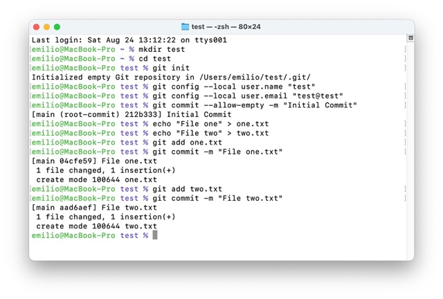
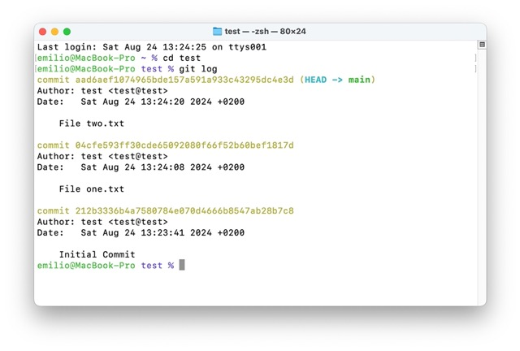
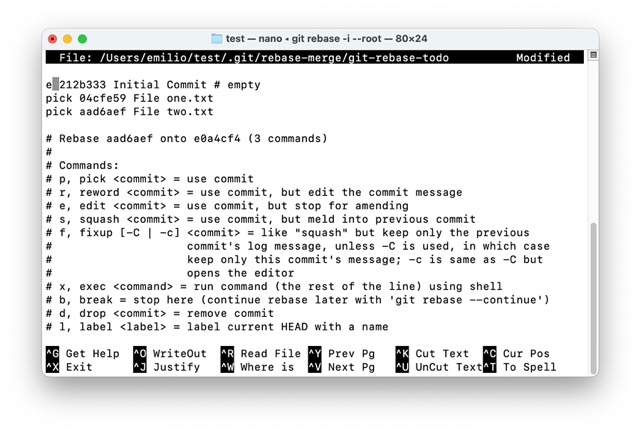
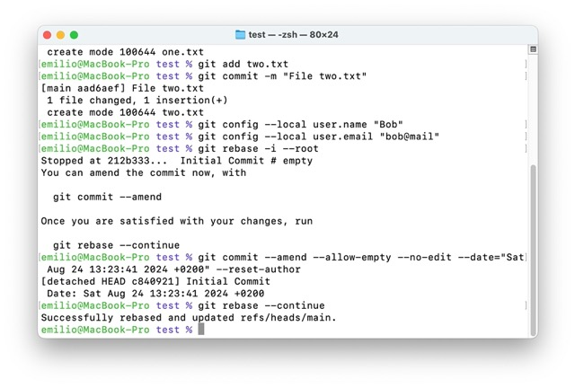
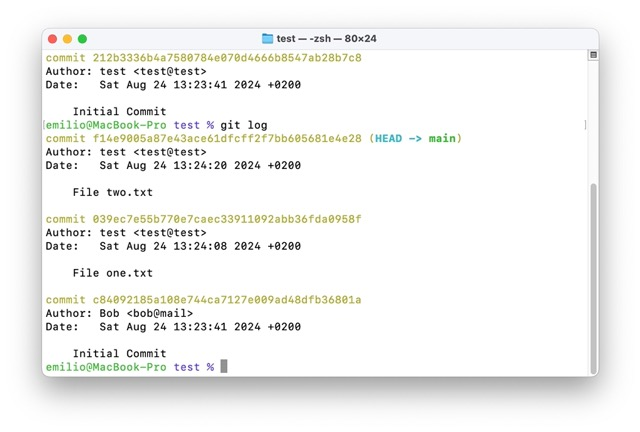
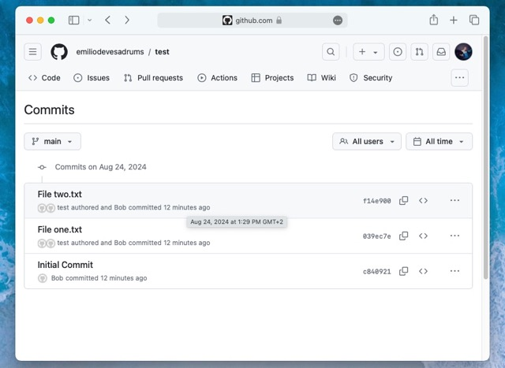
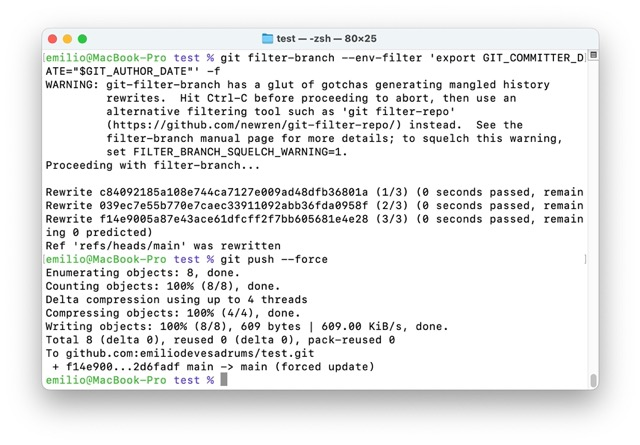
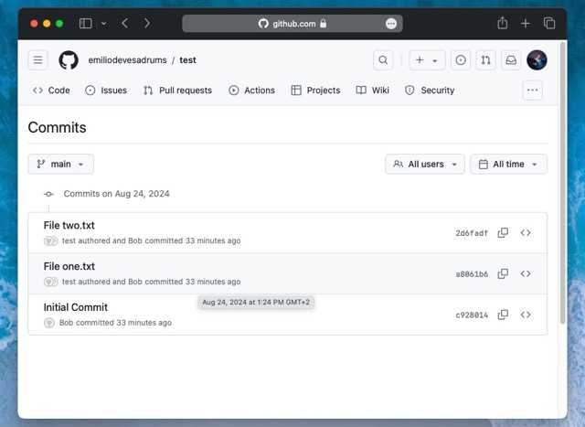

Vamos a ver un ejemplo de cómo podemos reescribir la historia de un repositorio de git sin perder por el camino las fechas de los commits originales y, de paso, poder establecer un mismo autor para todos, o incluso importar un repositorio como subdirectorio de otro

**Estado inicial**

Creamos un repositorio de prueba con un usuario y un email cualquiera (de forma local). En este repositorio haremos tres commits: uno inicial (vacío), y dos para añadir consecutivamente los ficheros `one.txt` y `two.txt`: 

 

Por el momento no deberíamos encontrar ninguna sorpresa si vemos el log: 



**Cómo NO reescribir la historia**

Uno podría pensar que para cambiar el autor de un commit, o el mensaje, el orden, o lo que sea... bastaría con hacer un "`amend`" del commit en cuestión, lo que puede requerir hacer `rebase` si se trata de modificar un commit que no es el último. Sin embargo, en lugar de actualizar lo estrictamente necesario sin tocar nada más, veríamos que el commit en cuestión aparece repentinamente como el más reciente, aún cuando hayamos especificado una fecha anterior para el mismo".

Veámoslo con un ejemplo. Supongamos que ahora quiero cambiar el autor de mi commit inicial. Recurriré a:
```
% git config --local user.name "Bob"
% git config --local user.email "bob@mail"
```
Y a continuación haré un rebase interactivo desde el principio de la historia:
```
% git rebase -i --root
```
El rebase interactivo me muestra un editor donde puedo seleccionar que acción realizar sobre cada commit: 

 

Sin entrar en mucho más detalle:  
- `pick`: Deja el commit tal y como está 
- `edit`: Se detiene el rebase para hacer cualquier cambio antes de `amend`. Se puede abreviar con "`e`" 
- `reword`: Se detiene el rebase para cambiar el mensaje del commit. Se puede abreviar con "`r`" 
- `drop`: Elimina un commit. Se puede abreviar con "`d`" 
- `squash (s)` o `fixup (f)` Unifican commits

Como he marcado que quiero editar el primer commit, al cerrar el editor comenzará un rebase y se detendrá en ese commit. Voy a hacer un amend intentando preservar la fecha original del commit y actualizando los datos del autor:
```
% git commit --amend --allow-empty --no-edit --date="Sat Aug 24 13:23:41 2024 +0200" --reset-author
```
Y dejo que continue la operación de rebase con:
```
% git rebase --continue
```



Si consulto el log, podré ver estos cambios: 



**Vista de la historia en GitHub.com**

Supongamos que ahora sincronizo mi repositorio local con uno remoto:
```
% git remote add origin git@github.com:username/test.git
% git push --set-upstream origin main
```
En la vista web algo no cuadra... 



Todos los commits parecen hechos a la misma hora, que no se corresponden con las que veo en el log local; y el autor no coincide con quien hace el commit. Esto se explica porque en git la figura del autor y del committer no han de coincidir necesariamente, ya que puede que en un entorno de trabajo haya varias personas trabajando sobre el mismo repositorio (incluso sobre las mismas ramas) y las tareas se pueden repartir.

**Como reescribir la historia**

Cuando somos el único autor del repo, puede que prefiramos que prevalezca un solo nombre y el orden cronológico de los commits a pesar de hacer un rebase. Me ha llegado a pasar que, tras fusionar una rama con otra, me aparecían los commits totalmente desordenados al intentar hacer un amend. En ese caso, lo solucionaré con:
```
% git filter-branch --env-filter 'export GIT_COMMITTER_DATE="$GIT_AUTHOR_DATE"' -f
```
Que escribe en la fecha del committer el valor de la fecha del autor. 

 

Y lo puedes comprobar en Github si fuerzas otro push:
```
% git push --force
```



**Fusionar repositorio como subdirectorio de otro**

Supongamos que tengo un repositorio que llamare OldRepo y otro que será NewRepo (y así los angloparlantes que aterricen por aquí entenderán lo que queremos hacer). En OldRepo, creamos una nueva rama (para no alterar la principal): 
```
# git checkout -b old_repo_branch
```
Y movemos todos los archivos con todos los commits a un nuevo subdirectorio llamado "old\_repo\_src" 
```
# git filter-branch --tree-filter "mkdir -p old_repo_src; git mv -k * old_repo_src" HEAD
```
Ahora tomamos el has del primer commit: 
```
# FIRST_COMMIT_HASH=$(git rev-list HEAD | tail -n 1)
```
Y añadimos un prefijo a todos:
```
# git filter-branch -f --msg-filter 'sed "1 s/^/[OldRepo] /"' ${FIRST_COMMIT_HASH}..HEAD
``` 
Y a continuación: 
```
# git rebase -i --root
```
Ahora entramos en NewRepo:
```
# git remote add OldRepo '../OldRepo'
```
Y traemos todo el contenido: 
```
# git fetch OldRepo
# git checkout OldRepo/old_repo_branch
# git rebase main
```
Por último, ponemos todo el código anterior en una rama del repositorio nuevo: 
```
# git checkout -b old_repo_src
``` 
Y eliminamos el remoto que apunta al viejo repositorio: 
```
# git remote rm OldRepo
```
Con esto habremos podido migrar un repositorio a un subdirectorio dentro de otro repositorio manteniendo el historial de commits y, además, dentro de su propia rama para evitar conflictos con los ficheros de las ramas en las que estuviésemos trabajando.

**Más información**

En los siguientes enlaces encontrarás más información útil sobre como re-escribir la historia de git. Ten precaución siempre que lo hagas, sobre todo si en el repositorio hay otros usuarios trabajando:  
- https://stackoverflow.com/questions/28536980/git-change-commit-date-to-author-date 
- https://stackoverflow.com/questions/41301627/how-to-update-git-commit-author-but-keep-original-date-when-amending 
- https://stackoverflow.com/questions/750172/how-do-i-change-the-author-and-committer-name-email-for-multiple-commits
- https://leyanlo.medium.com/how-to-move-one-git-repository-into-a-subdirectory-of-another-with-rebase-2b297b628c57