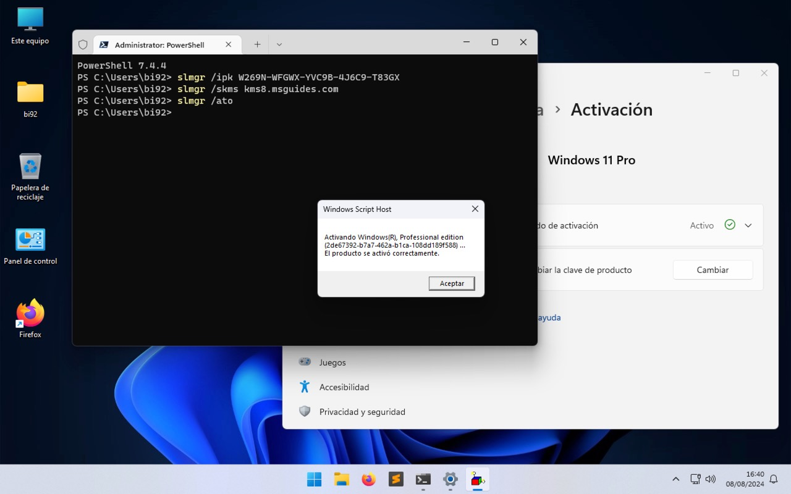

En Windows 11 es posible completar la instalación del sistema operativo aunque no tengas una clave de activación de licencia, pero como resultado algunas funciones del sistema estarán bloqueadas hasta que no haya sido activada una licencia válida.

Hace unos pocos días quise probar la última versión de este SO en una máquina virtual y procedí a realizar la activación con una clave cualquiera contra un servidor KMS que encontré. El proceso se realiza ejecutando tres simples instrucciones en la línea de comandos con privilegios de administrador:
```
$ slmgr /ipk W269N-WFGWX-YVC9B-4J6C9-T83GX
$ slmgr /skms kms8.msguides.com
$ slmgr /ato
```
Donde:  
- **slmgr /ipk** Instala la clave de producto
- **slmgr /skms** Configura un servidor KMS
- **slmgr /ato** Activa Windows en línea

Estos tres comandos son fundamentales cuando se trata de activar Windows desde la línea de comandos. Es especialmente útil para administradores de sistemas, técnicos, o usuarios avanzados que necesiten automatizar la activación de Windows en varios equipos. Recuerda siempre usar claves legítimas y seguir las políticas de licenciamiento de Microsoft para evitar problemas legales y técnicos.