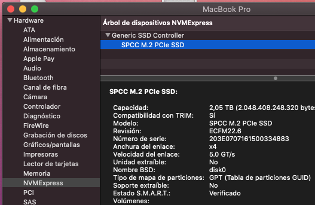
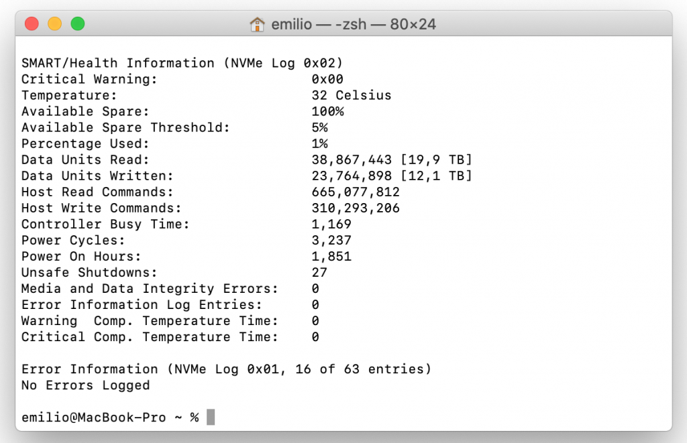
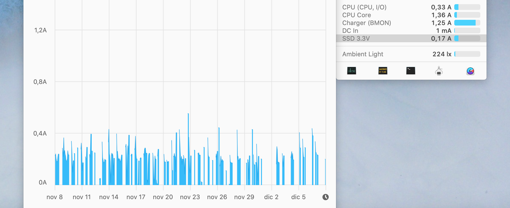
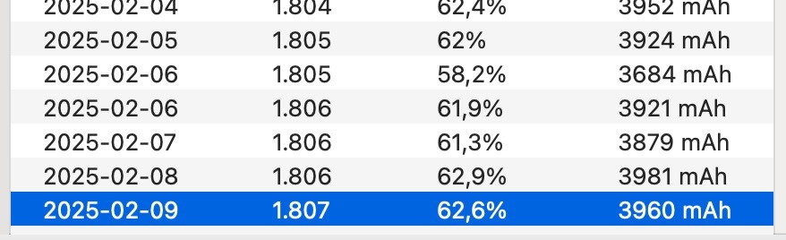

 

Mi ordenador principal en el día a día desde que lo compré en Octubre de 2014 es un MacBook Pro de 13'' al que trato de mantener en buenas condiciones.

### SSD NVMe  
En el momento de comprar este portátil, sus 256GB de capacidad interna (SSD) me parecieron más que suficientes, y lo fueron durante bastantes años. Por supuesto, muchas cosas (documentos, fotos y videos) se habían ido a la nube y eso me permitió ir ahorrando espacio libre de aquí y de allá, pero la situación era ya insostenible y tampoco confío al 100% en los servicios de almacenamiento online.

Tras consultar varios enlaces y videos, me decidí a sacar el SSD original y sustituirlo por uno de 2 TB. El lugar donde se puede encontrar más y mejor información es [este hilo](https://forums.macrumors.com/threads/upgrading-2013-2014-macbook-pro-ssd-to-m-2-nvme.2034976/) de los foros de MacRumors. En él se explican en detalle cada paso del proceso y junto a las instrucciones hay unas tablas donde se comparan diferentes modelos de SSD por rendimiento, consumo y eficiencia energética. Buceando, incluso encontré [esta hoja de cálculo](https://docs.google.com/spreadsheets/d/1B27_j9NDPU3cNlj2HKcrfpJKHkOf-Oi1DbuuQva2gT4/edit#gid=0&fvid=2092992544) con las características técnicas de muchos más modelos. También hay varios videos explicando el proceso de forma mucho más visual, por ejemplo [éste](https://www.youtube.com/watch?v=QOxfuDSmXRg) o [éste otro](https://www.youtube.com/watch?v=vcYdaePtCGw). También la correspondiente [guía](https://es.ifixit.com/Gu%C3%ADa/Reemplazo++del+SSD+del+MacBook+Pro+13-Inch+Retina+Display+de+mediados+de+2014/27849) de iFixit.

El modelo de SSD que sale mejor parado (o al menos, uno de ellos) es el [Sabrent Rocket](https://www.amazon.es/dp/B07MTQTNVR). Ojo con no confundirlo con el RocketQ, que utiliza tecnología QLC (de peor durabilidad). Sin embargo, comentan en el foro que los últimos modelos que se vienen fabricando han perdido algo de memoria caché. En la práctica la diferencia no es grande pero es un punto negativo. En mi caso, no obstante, me decanté (por características, capacidad y precio) por un [Silicon Power de 2 TB](https://www.amazon.es/gp/product/B07SGC689R/). En esencia, son lo mismo, pero con garantía de 5 años. De las opiniones de otros compradores hace tiempo que no me fio. 


Por supuesto, es necesario un adaptador entre el conector M.2 y el conector de Apple. Aunque el [adaptador Sintech](https://www.amazon.es/dp/B07FYY3H5F) recomendado por todos ya no está disponible en Amazon España, se pueden comprar otros que cumplen con la misma función (yo escogí [este](https://www.amazon.es/gp/product/B07889YRFT/)) o [uno muy similar](https://es.aliexpress.com/item/33027201181.html) en Aliexpress. Mi recomendación es que escojas el modelo corto, ya que el alargado provoca que el stick se doble ligeramente al atornillarlo a la placa.

Para poder aprovechar el SSD original de Apple, necesitaba una carcasa con el conector apropiado. Encontré [ésta](https://www.amazon.es/gp/product/B07TQHDB6Z/) de nuevo de la marca Sintech. Y por último, un destornillador Pentalobe P5, un Torx T5 (ambos viejos conocidos de los productos de Apple) y un Philips 2 (el típico destornillador de estrella). Si no tienes [los dos primeros](https://www.amazon.es/gp/product/B07WPSW3QF/), por Amazon los puedes encontrar con facilidad.

Hay algo más a lo que prestar atención. Es importante que estés utilizando un sistema operativo más o menos reciente, preferiblemente superior a Mac OS X 10.12 High Sierra, para que la BootROM de tu ordenador soporte los SSD de terceros. De todas formas, tanto las tablas de compatibilidad de equipos y SSDs como las de las BootROMs se actualizan con regularidad en el primer post del hilo de MacRumors que enlacé al principio.

En el caso de los MacBook Pro de finales de 2013 y mediados de 2014 además existía un problema con la hibernación del equipo que provoca que no pueda despertarse correctamente y se quede colgado al reactivarse. La solución típica a esto pasa por desactivar la hibernación vía terminal. Las más arriesgadas, incluían flashear una BootROM parcheada (lo que requiere paciencia, un programador de chips y buenos conocimientos) o instalar un chip customizado llamado [Matt card](http://www.cmizapper.com/products/mattcard.html) en uno de los puertos internos de servicio del Mac (más lío aún).

Afortunadamente ya no es necesario realizar nada de esto pues con MacOS Big Sur, Apple actualizó estos firmware arreglando esos bugs a partir de la versión 424. Puedes intentar actualizar tu sistema hasta la última versión del sistema operativo disponible y comprobar si se ha actualizado tu firmware o hacerlo manualmente. No olvides hacer una copia de seguridad de todos tus documentos, bibliotecas y aplicaciones que necesites conservar. 


**Actualizar BootROM manualmente**  
Primero descargamos el último sistema operativo oficialmente soportado por la máquina, que en este caso era Mac OS 11 Big Sur. Desde el terminal puedo consultar a los servidores de Apple si el instalador todavía está disponible:
```
% softwareupdate --list-full-installers
```
Y efectivamente, lo descargo con:
```
% softwareupdate --fetch-full-installer --full-installer-version 11.7.10
```
Paciencia porque necesita descargarse más de 12 GB. 


Una vez descargado, hay que abrir la carpeta de Aplicaciones y hacer clic secundario para escoger "Mostrar el contenido del paquete" y poder navegar por la estructura interna del instalador: 

 

Ahora nos movemos por la ruta `Contents/Shared Support/` hasta la imagen SharedSupport.dmg y hacemos doble clic para montarla. 

 

Dentro de la imagen encontraremos la carpeta `com_apple_MobileAsset_MacSoftwareUpdate` y en su interior un archivo comprimido con un nombre como, por ejemplo: `55e5f0c9e714afdb0ba1c6-f3012c25d9a45f20ba.zip` 

 

Descomprime su contenido en donde quieras y sigue por la ruta: `AssetData/boot/EFI/EFIPayloads/`. Dentro de este directorio encontraremos un fichero ".scap" para cada modelo de Mac soportado. 


En mi caso, voy a copiar el archivo `MBP111.scap`. Asegúrate de que estas escogiendo el apropiado para tu máquina:  
- IM: iMac 
- MB: MacBook 
- MBA: MacBook Air 
- MBP: MacBook Pro 
- MM: Mac mini 
- MP: Mac Pro

Por último, volvemos al terminal y ejecutamos:
```
% sudo bless -mount / --verbose --recovery -firmware /Users/emilio/Desktop/MBP111.scap
```
(Debes sustituir la ruta del fichero por la adecuada o, simplemente en lugar de escribirla, arrastrar el archivo a la terminal): 


Por último, apaga el equipo y vuelve a encenderlo. No debes reiniciar, sino apagar y encender desde cero, para provocar el proceso de actualización. Brevemente verás el logo de Apple y una barra de progreso y a continuación el Mac se reiniciará y el SO cargará con normalidad. Puedes emplear una herramienta como Silent Knight para asegurarte de que tienes tu BootROM en la última versión disponible para tu máquina, así como el estado de algunos sistemas de seguridad: 


**Sustituir el SSD**  
Dependiendo de tu modelo exacto de portátil, puede que varíe ligeramente la instalación del SSD, pero el proceso se reduce a lo siguiente:  
1. Preparar una unidad USB desde donde poder reinstalar el sistema más adelante
2. Retirar la tapa inferior del equipo
3. Desconectar la batería (por precaución)
4. Desatornillar y extraer el stick de Apple
5. Conectar en su lugar el SSD nuevo (con el adaptador correspondiente)
6. Atornillar, conectar la batería y cerrar el equipo
7. Encender el ordenador con la unidad USB conectada y pulsando Alt
8. Inicializar el nuevo SSD desde el administrador de discos y reinstalar MacOS 

Una vez hayas seguido todos estos pasos, te encontrarás ante un sistema vacío, con lo que ya puedes restaurar tus datos y programas.

Una buena idea es verificar que el sistema detecta el SSD y lo está haciendo funcionar a la máxima velocidad que admita la interfaz, en mi caso: 



Las diferencias que he encontrado en cuanto a rendimiento son sustanciales. El SSD original me arrojaba estos resultados en el Blackmagic Disk Speed Test: 

 

Y el SSD Silicon Power de 2 TB: 

 

La mejoría habla por sí sola y ya tengo espacio de sobra en el disco interno para seguir trabajando cómodamente: 


**Actualización 1:** Mi [experiencia](https://forums.macrumors.com/threads/upgrading-2013-2014-macbook-pro-ssd-to-m-2-nvme.2034976/post-29185213) en el foro de MacRumors, con algunos detalles extra.

**Actualización 2:** He estado vigilando los consumos del SSD y me sale lo siguiente:  
- La mayor parte del tiempo está en reposo, consumiendo 0,00 A o entre 0,15 A y 0,20 A cuando se está haciendo un uso normal del equipo. Esto supone un consumo de 0,5 W aproximadamente.
- Durante la prueba de stress de Blackmagic, el consumo aumenta a 1,01 A, es decir, 3,33 W aproximadamente. Estos consumos (tomados mediante la aplicación iStat) lo ponen como uno de los SSDs más eficientes comparado con las tablas de MacRumors.


**Actualización 3:** Tras un año de uso:  
- Ningún Kernel Panic, nunca
- Gran mejora de almacenamiento que me permite trabajar sin ningún dispositivo externo conectado (genial para movilidad)
- Mayor velocidad, especialmente importante durante edición de video/audio en Final Cut Pro X o Logic Pro X

**Nivel de desgaste**  
Una forma bastante fiable de comprobar el estado del SSD es a través de la medida TBW (TeraBytes Written) proporcionada por el sistema SMART. Para verificarlo, necesitamos instalar una herramienta que nos permita recuperar esa información. A falta de una mejor alternativa, voy a instalar [Homebrew](https://brew.sh), un gestor de paquetes muy al estilo Linux que nos permitirá instalar paquetes de software y nuevas aplicaciones desde el terminal, incluso muchas que no están disponibles de otra forma o que no tendremos que preocuparnos de instalar manualmente. Para instalar Homebrew, basta con introducir:
```
$ /bin/bash -c "$(curl -fsSL https://raw.githubusercontent.com/Homebrew/install/HEAD/install.sh)"
```
A continuación instalamos el software Smartmontools:
```
$ brew install smartmontools
```
Y para terminar, lanzamos el programa con:
```
$ smartctl --all /dev/disk0
```
Con esto podremos ver toda la información de salud del dispositivo y nos fijaremos en particular en "Data Units Written": 



Mi unidad debería poder alcanzar los [1600 TBW](https://www.silicon-power.com/support/lang/big5/TBW.pdf) según el fabricante, antes de que aparezcan fallos por desgaste de las celdas de memoria.

**Consumo energético**  
Mi maquina no es compatible con SsdPmEnabler. De acuerdo a las lecturas de consumo del SSD deiStats, oscila en torno a 0.17A - 0.29A habitualmente, aunque con picos de hasta 0.4A bajo carga en algunas ocasiones.  


**Otras consideraciones**  
Era reticente a ampliar el espacio de almacenamiento ya que suponía invertir bastante dinero en un equipo ya algo antiguo, pero resultó una buena decisión: estoy contento de haber hecho esta mejora, solo lleva unos minutos y es realmente fácil.

### Pantalla  
La pantalla sufre el problema de la lámina anti-reflectante, solo visible cuando la pantalla está apagada, pero no creo que invierta dinero en eso.


### Batería  
Este es un tema sobre el que es fácil encontrar cientos de opiniones distintas. Que si las de ahora no se vician, que si lo dejas cargando la sobrecargas y si lo dejas descargado la sobredescargas (?), que si lo mejor es mantenerlas en la mitad... etc. Así que me armé de un poco de paciencia y convenientemente estuve comprobando algunas cosas.

Por supuesto, la duración de la batería de un ordenador depende fundamentalmente del uso que se hace. También es importante saber en qué estado se encuentra tu batería. Según Apple la de mi ordenador debería soportar sin problemas hasta 1000 ciclos de carga-descarga, entendiendo por "sin problemas" que no sufra una degradación severa.

Mi experiencia me decía que las baterías se degradan mucho más rápido si siguen enchufadas a la corriente una vez cargadas. Intento evitarlo, aunque alguna vez me he despistado y el ordenador se ha quedado a lo mejor tres o cuatro horas conectado; pero ha sido algo ocasional. Es decir, que podría considerarse mi caso como el de un usuario medio.

Agoté la batería completamente antes de empezar a hacer pruebas y para esto me ayudé de la aplicación [Amphetamine](https://itunes.apple.com/es/app/amphetamine/id937984704?mt=12) (similar a Caffeine), que evita que el ordenador entre en reposo. Esto obligó a la máquina a consumir hasta la última gota de energía disponible en la batería del portátil. Ahí empezaron las pruebas.

Puse el ordenador a cargar con la tapa cerrada y tardó una hora y tres cuartos en cargar hasta que el LED del conector Magsafe se iluminó en color verde. Como sé que esto no indica exactamente que la carga está completa, encendí el ordenador y comprobé la carga con el programa [CoconutBattery](http://www.coconut-flavour.com). Éste programa es bastante más preciso que el indicador de la barra superior de MacOS e incluso estimaba que faltaban unos 20 minutos para terminar de cargar completamente. CoconutBattery también puede mostrar detalles sobre tus dispositivos iOS.

**Resetear el SMC**  
Por eso apagué el equipo e hice un reset del SMC (System Management Controller), que es un circuito encargado de medir la carga de la batería interna del ordenador, gestionar la temperatura y velocidad de los ventiladores, ledes de estado, retroiluminación del teclado, etc. Esto se hace de forma ligeramente distinta según tu modelo tenga batería extraíble o no. En mi caso, hay que mantener pulsada durante un segundo la combinación de teclas "May"+"Ctrl"+"Alt"+"Power" y soltarlas a la vez. Verás que el LED pasa de verde de nuevo a naranja; así que todavía le queda un poco por cargar. A los 20 minutos se puso verde de nuevo y encendí el ordenador para comprobar que efectivamente ahora estaba cargada al 100%. Por lo tanto, la primera conclusión práctica es que mi MacBook tarda unas dos horas en cargarse por completo.


**Resetear la NVRAM**  
Al encender el equipo aproveché para resetear la NVRAM (también conocida como PRAM), que almacena tus preferencias sobre volumen de los altavoces, brillo de pantalla, disco de arranque, etc. No está de más aprovechar para hacerlo y bajo algunas circunstancias puede incluso arañar algún segundo al proceso de arranque si notas que últimamente tu Mac tarda mucho en iniciarse. Se hace manteniendo pulsadas las teclas "cmd"+"Alt"+"P"+"R" al encender el equipo, y soltarlas tras oír el sonido de arranque. Verás que entonces el ordenador se reinicia (escucharás el sonido por segunda vez) y ya comenzará la carga del sistema operativo.

### Reemplazo de la batería  
El MacBook ya estaba dando señales de que la batería se encontraba ya en las últimas. La duración era poquísima y la constante necesidad de estar cerca de un enchufe hacían de la portabilidad algo inútil. En lugar de rendirme y sustituir el equipo, decidí cambiar la batería y tomar algunas precauciones extra.

**Estado de la batería original**  

  

Antes de realizar el cambio, mi MacBook Pro había superado los 1800 ciclos de carga y solo mantenía un 60% de su capacidad original. Esto significaba que incluso con un uso ligero la batería se agotaba rápidamente y apenas podía obtener una hora de funcionamiento antes de tener que enchufarlo. El rendimiento no era el problema porque el ordenador todavía funciona bien, pero la falta de autonomía hacía frustrante su uso como portátil.

**2-Power by Duracell**  
Tras investigar varias opciones me decanté por una batería de la marca 2-Power, vendida por Duracell en su propia web. Escogí esta opción porque ofrece un buen equilibrio entre calidad y precio, con reviews positivas por parte de otros usuarios con modelos similares al mío.

Realizar el cambio no es un proceso trivial pero con paciencia y las herramientas adecuadas (principalmente un destornillador Pentalobe y cuidado para retirar el adhesivo de la anterior batería), pude sustituir la antigua por la nueva con éxito y sin mayores problemas. Nada más poner el ordenador de nuevo en marcha pude disfrutar de una autonomía mucho mejor.

La nueva batería estaba al 100% de salud, permitiéndome disfrutar de nuevo de varias horas de uso sin necesidad de enchufar el ordenador. Mi MacBook parece haber rejuvenecido, haciéndolo mucho más práctico para el uso diario.


**Turbo Boost Switcher Pro**

Además de cambiar la batería, instalé [Turbo Boost Switcher Pro](http://tbswitcher.rugarciap.com/) para desactivar el Turbo Boost la mayor parte del tiempo. ¿Por qué?  
- Menor consumo de energía: el procesador no puede aumentar su frecuencia innecesariamente, lo que reduce el consumo de batería
- Menor calor: El Mac funciona sin calentarse tanto, lo que previene que los ventiladores necesiten girar más rápido frecuentemente
- Mayor autonomía: Para tareas livianas del día a día como navegar, ofimática o programación, ese extra de rendimiento no suele ser necesario por lo que mantenerlo desactivado es una mejor estrategia

Si en un momento determinado necesito más potencia de procesamiento, puedo activar Turbo Boost temporalmente.

**Recuperando buenas prácticas de carga/descarga**  
Tras instalar la nueva batería, he vuelto a hacer un pequeño esfuerzo en mantener algunas sanas costumbres:
- Evitar agotar por completo la batería 
- No mantenerla constantemente enchufada si ya está al 100% 
- Evitar temperaturas extremas

**Enlaces útiles:**  
- Especificaciones: https://support.apple.com/kb/SP703?locale=es_ES
- Información sobre la NVRAM (PRAM) y el SMC - en inglés: http://www.macworld.com/article/2881177/how-to-reset-your-macs-nvram-pram-and-smc.html
- Número de ciclos segun modelo (Soporte oficial de Apple): https://support.apple.com/es-es/HT201585
- Conociendo las opciones de CoconutBattery a fondo: http://www.christiandve.com/2016/02/coconutbattery-salud-estado-bateria-iphone-ipad-macbook-ipod-touch-gratis/
