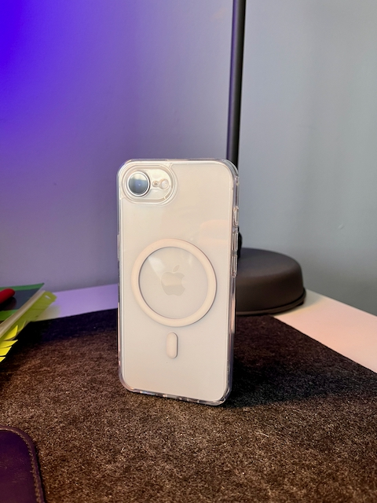
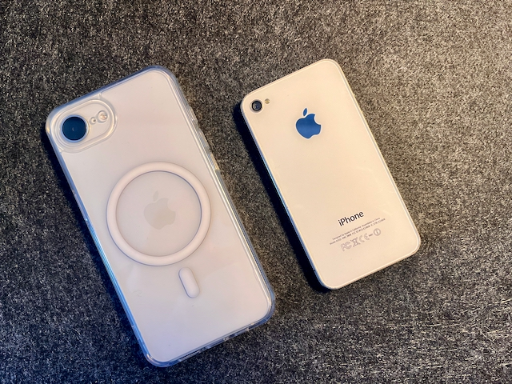
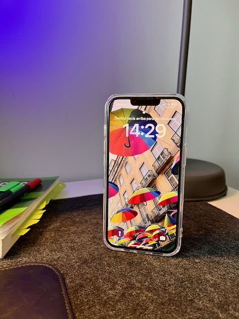
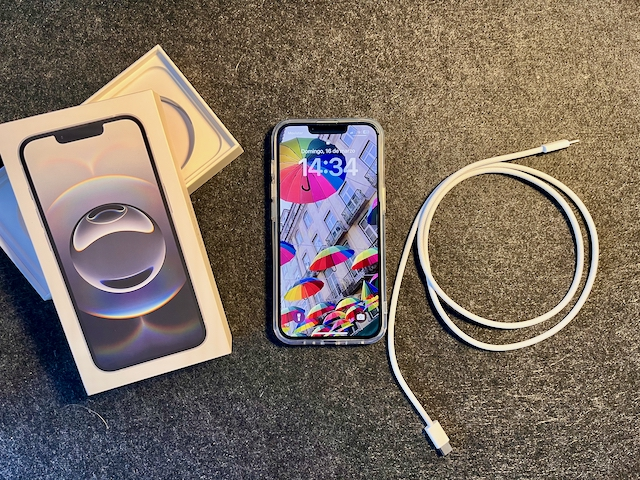

The iPhone 16e has been one of Apple's most interesting releases in recent years. While many expected a more affordable successor to the iPhone SE, Apple instead positioned this device as a streamlined, no-nonsense iPhone for those upgrading from older models. Here are my thoughts after choosing this device for my partner, who was upgrading from an iPhone 8.

**Design & Build**  
The iPhone 16e brings back strong iPhone 4/4S vibes with its white color and aluminum sides. This combination gives the device a premium and nostalgic feel while maintaining the durability and simplicity that Apple is known for. The design is refined yet minimalistic, making it a great choice for those who appreciate a sleek and classic look.

**Camera**  
The iPhone 16e features a single rear camera, but don’t let that fool you—it's the only one that truly matters. The photo and video quality are excellent, thanks to Apple’s powerful image processing. Unlike models with multiple lenses, this camera is designed to deliver solid performance without unnecessary complexity, making it perfect for everyday photography.

**Display**  
The display of the iPhone 16e retains the notch design from the iPhone 14, a screen that never received complaints about brightness. While it may lack high-end features like ProMotion, it still delivers a crisp and vibrant viewing experience. However, the 60Hz refresh rate feels a bit outdated compared to competitors that now offer smoother 120Hz displays. Additionally, the absence of Dynamic Island is unlikely to be a dealbreaker, as most users wouldn’t utilize it extensively.

**Performance & Longevity**  
Powered by Apple’s latest chip, the iPhone 16e guarantees years of software support and compatibility with Apple Intelligence features. This means users can enjoy future updates and performance enhancements for a long time. Battery life is another highlight, offering excellent endurance throughout the day, making it a highly reliable device for daily use.

**Ports & Charging**  
The switch to USB-C is a welcome upgrade, bringing better compatibility with modern accessories. However, Apple has limited its speed to USB 2.0, which is a bit disappointing for those who frequently transfer large files. Additionally, the absence of MagSafe may be a drawback for some, but this can easily be solved with a compatible case that adds the feature.

**Action Button**  
The inclusion of an Action Button adds a layer of customization, allowing users to assign different functions such as launching the camera or activating shortcuts. However, in reality, most users will continue using it as a mute switch, just like in previous iPhone models. It’s a nice addition, but not a game-changer for the majority of buyers.

**No Camera Control Touch Button**  
One of the exclusive features of the iPhone 16 is the new touch-sensitive camera control, which is missing on the 16e. While it might sound like a cool feature, the truth is that most users wouldn’t rely on it. Traditional camera controls remain intuitive and effective, so its absence doesn’t significantly impact the user experience.

**Price & Financing**  
At €709 new, the iPhone 16e is significantly more affordable than the standard iPhone 16, which costs €869. This price difference makes it an attractive option for those who want a new iPhone without breaking the bank. Furthermore, Apple.com/es offers 0% interest financing over 24 months, making it even more accessible for buyers looking to spread out the cost.

**Who Is This Phone For?**  
Although some may compare the iPhone 16e to the standard iPhone 16, the reality is that it targets users who are upgrading from much older models such as the iPhone 7, 8, X, XS, XR, or 11. For these users, the 16e represents a massive leap in performance, battery life, and long-term software support. While a second-hand iPhone 15 Pro may seem like a tempting alternative due to its premium materials and additional features, the iPhone 16e offers better long-term software support and access to future Apple Intelligence features, making it a smarter investment in the long run.

**Final Thoughts**  
The iPhone 16e is not just a budget replacement for the iPhone SE—it is a modern take on the classic iPhone experience. It removes unnecessary extras while focusing on what truly matters: great performance, battery life, and longevity. For those who have been holding onto older iPhones and want a solid upgrade without going all-in on a Pro model, the iPhone 16e is an excellent choice.