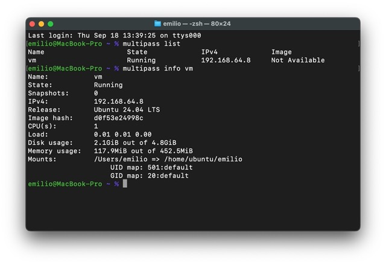
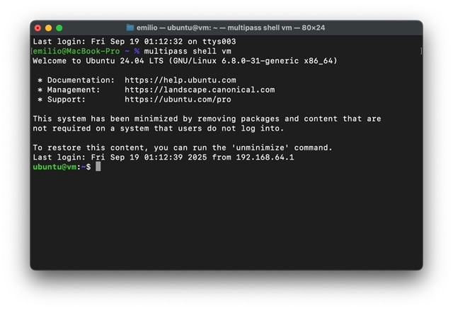

If you need a quick, reliable way to run Ubuntu virtual machines (VMs) on your local machine, **Multipass** is one of the best tools available. It’s a lightweight VM manager that makes it easy to launch, configure, and manage Ubuntu instances with just a few commands — perfect for developers, sysadmins, and anyone who wants isolated test environments. Multipass is made by **Canonical**, the same company behind the development of Ubuntu.

**Installing Multipass**  
You can download Multipass for Linux, macOS, and Windows from the official Canonical website: https://multipass.run/

On macOS, you can also install it directly via **Homebrew**:  
```
brew install --cask multipass
```

After installation, you can verify that it works by running:  
```
multipass version
```

This should print the client and daemon version, confirming that Multipass is ready to use.



**Key Multipass Commands**  
Here are the most common commands you’ll use with Multipass:  
- `multipass find`: Lists the available Ubuntu images you can launch.
- `multipass launch`: Creates a new virtual machine. By default, this will use the latest available Ubuntu LTS image.
- `multipass shell <name>`: Opens an interactive shell session inside the VM with the given name.
- `multipass start <name>`: Starts a stopped VM.
- `multipass stop <name>`: Stops a running VM.
- `multipass delete <name>`: Marks a VM for deletion. You’ll need to run multipass purge afterward to actually remove it from disk.
- `multipass list`: Displays a table with all your VMs, including their state (Running/Stopped), IP address, and resource usage.
- `multipass info <name>`: Shows detailed information about a specific VM, including allocated resources and mount points.

**Listing Available Images and Using a Custom File**  
Before launching a VM, you can see which images are available by running:  
```
multipass find
```

This will output a table with the supported Ubuntu releases and their aliases (e.g., 24.04, 22.04, lts). By default, multipass launch uses the latest Ubuntu images available, usually the current LTS release.

However, you can also launch a VM from a custom image. For example, here is a command that launches a small VM using a specific Ubuntu 24.04 minimal cloud image:  
```
multipass launch -c 1 -m 512M -d 5G -n vm --mount=$HOME file://ubuntu-24.04-minimal-cloudimg-amd64.img
```

Let’s break down each option:  
- `-c 1`:  Allocates 1 CPU core to the VM.
- `-m 512M`: Sets the memory to 512 MB, keeping the VM lightweight.
- `-d 5G`: Specifies a 5 GB disk for the VM.
- `-n vm`: Names the VM vm. You can use any name you prefer.
- `--mount=$HOME`: Mounts your host system’s home directory inside the VM, making it easy to share files between host and guest.
- `file://ubuntu-24.04-minimal-cloudimg-amd64.img`: Tells Multipass to use the specified local image file instead of downloading the default image.

Once the VM is running, you can inspect it with:  
```
multipass info vm
```

**Where to Get Cloud Images**  
You can download official Ubuntu cloud images (including minimal images, server images, and daily builds) from Canonical’s repository at https://cloud-images.ubuntu.com/  
From there, you can choose the Ubuntu release you want (e.g., 24.04), and pick the appropriate .img file for your architecture (usually amd64 for most modern systems).

