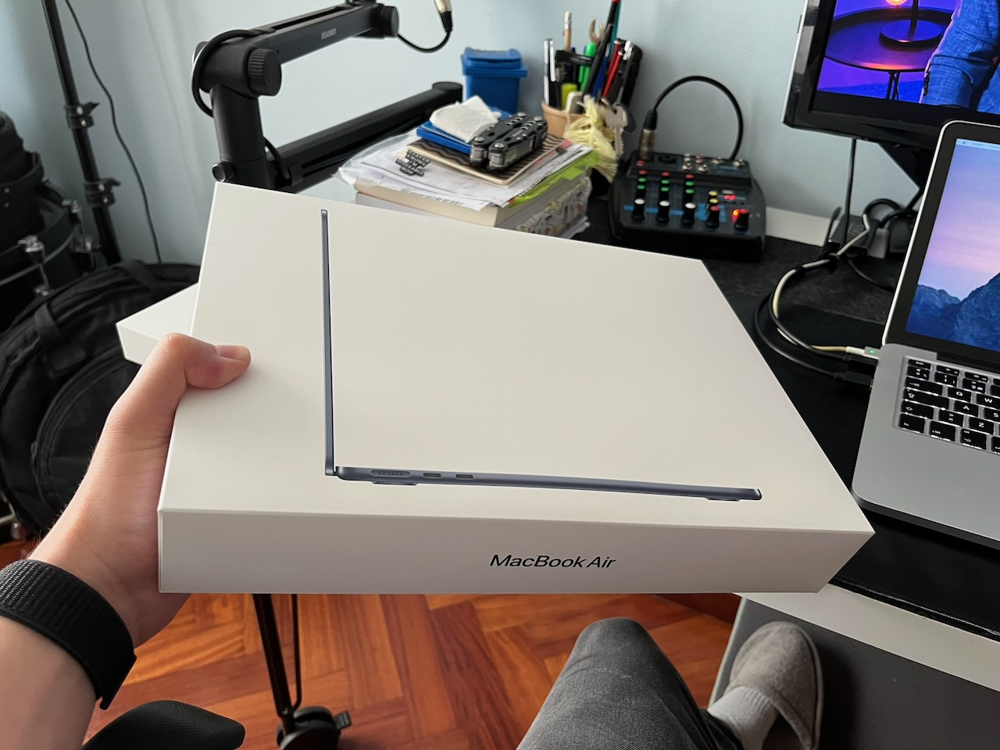
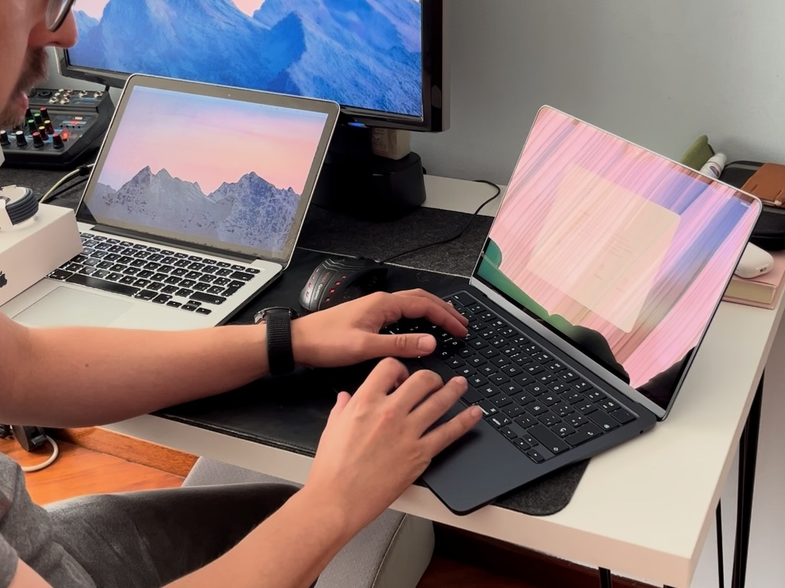
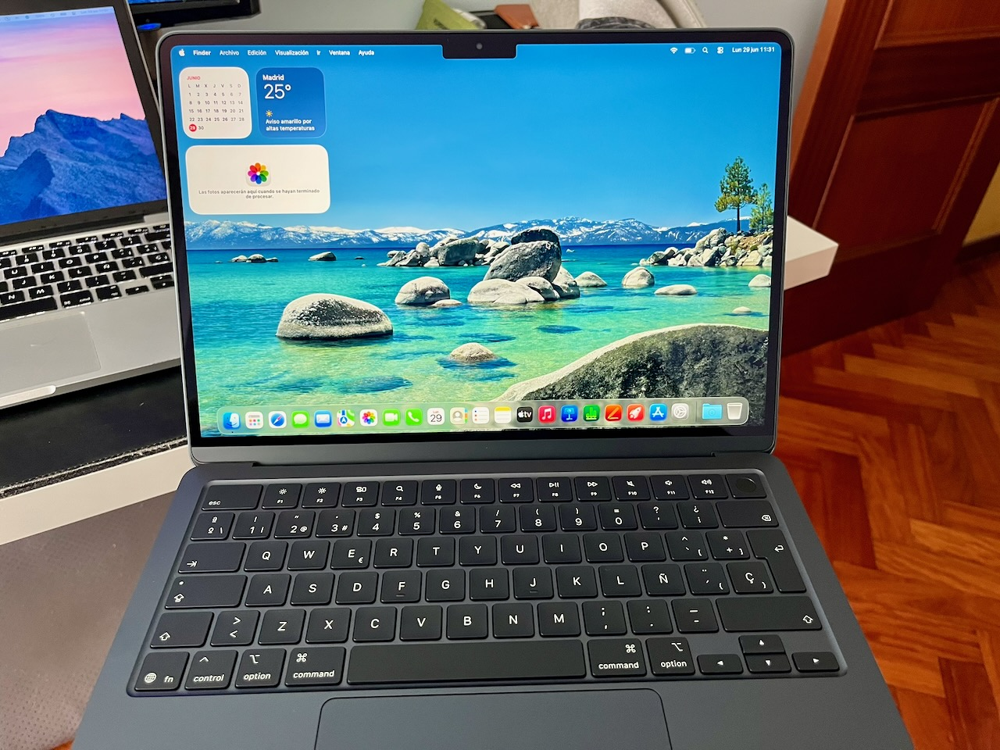
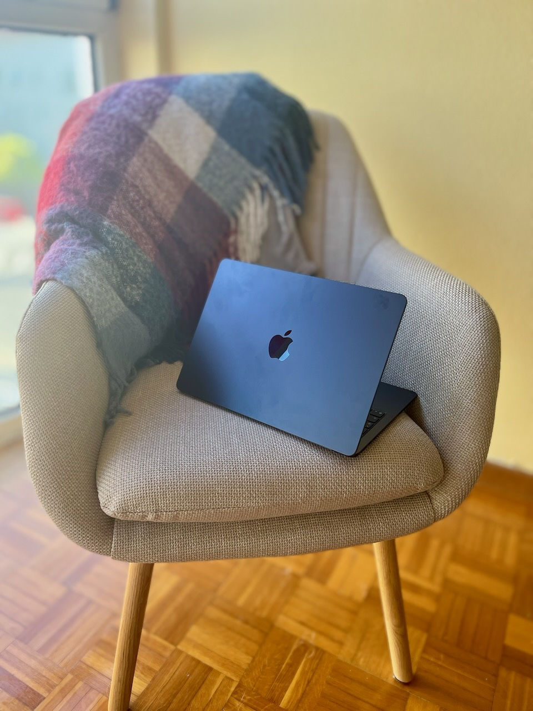

**Technical specifications:**  
Name: MacBook Air  
Manufacturer: Apple  
Price: 1568.99 €

It was about time to replace my old [2014 13-inch MacBook Pro](../../../2025/02/macbook-pro-2014/) and find computer that better suited my current needs. Just before Apple's latest price increases, I managed to get a 13-inch MacBook Air M5 (10-core CPU, 10-core GPU, 24 GB RAM, 1 TB SSD) for 1569 €.

**Starting point**  
After twelve years of service, my 2014 13-inch MacBook Pro is still working, but it is clearly beginning to show its age. It weighs 1.54 Kg and battery life is no longer what it used to be, even after replacing the battery eighteen months ago, in February 2025.  
When working at home, I usually connect it to its charger, my [Acer P241W](../../../2009/06/acer-p241w) monitor, and a USB hub with external hard drives, an audio interface and a mouse.

One of its two USB 3.0 ports had failed and could only transfer data at 2.0 speeds. The screen suffered from the infamous staingate problem, with the anti-reflective coating peeling off. Performance was becoming increasingly limited, heat was a constant problem, software updates were no longer officially supported (even with OpenCore Legacy Patcher), and the speakers had started to fail. As I said... it was definitely time.

**The analysis**  
There were several options I could consider for purchasing a new computer and I wanted to make the right choice. To have a clear understanding of what to look for and what to avoid, I started by analysing how I actually used my laptop, the type of tasks I performed, the software I relied on, and the features I valued the most.

I mainly use my computer for web browsing, watching videos, e-mail and messaging, calendar and note management, listening to music, reading and writing music scores, and teaching online lessons over Zoom. Once or twice a month I also edit videos, and from time to time I work on small software development projects.

I was also prepared to invest a little more in a machine that I could connect to an external display using a single USB-C cable carrying both video and power. That would also require replacing my monitor, but it would definitely be a significant quality of life improvement to me and a worthwhile long-term investment.

We're fortunate to live in a time when Linux has become more and more popular nowadays, and computers like the Framwork Laptop 13 Pro can be a very interesting option for having a very good display, battery life, and construction in pair to those of MacBooks'. Its repairability and upgradeability make it one of the few Windows/Linux laptops that genuinely caught my attention.

However, at this point I've been a MacOS user for more than a decade, and over the years I've become pretty good at editing on FinalCut Pro and Logic Pro. My custom domain e-mails run on top of iCloud, that also serves as an online cloud backup of my most important documents. I rely heavily on the seamless integration with my iPhone. The Photos app alone is one of the strongest reasons why I have never seriously considered switching to Android.

Taking all of this into account, I concluded that buying another Mac was the most sensible choice.

**Asking ChatGPT**  
After gathering all this information, I presented all those requirements to ChatGPT. It's conclusion was surprisingly accurate: updating to a new computer would give me a great leap forward in performance, but I would be using the machine for the same purposes. In other words: I wouldn't be doing new stuff, but I would be doing everything faster and with less friction.

At first, I was really tempted by the new Mac Mini for its small footprint, great performance and affordable price; or I could also go for an iMac and have a cleaner desk setup with a much better screen. And while these two are desktop computers, I could simply have kept my old MacBook Pro for the occasions when I needed portability.  
However, I can't stand having things stored in two different computers or having an anemic internal storage that forces me to carry external drives for whatever task; so the iMac and the Mac Mini were quickly ruled out since I would need a laptop to be able to carry it with me around the house or when traveling, and thus, long battery life.

At this point it became clear that my next computer was going to be a MacBook again. The internet is full of reviews comparing each new generation of this computers with the previous one, but that's not what I needed. I was already expecting an enormous jump in performance after twelve years with the Intel-based MacBook Pro.  
Benchmarks and synthetic performance charts were no longer my priority. Instead, I cared much more about battery life, display quality, keyboard and trackpad feel, webcam quality, silent operation, portability and build quality. Those are the things I interact with hundreds of times every day, and therefore the aspects that would have the greatest impact on my daily experience.

**Pros and cons**  
For the MacBook Neo, this machine is capable enough for almost everything I do. It's a lightweight computer that would be great for traveling without compromises since battery life is very good, and it's very inexpensive, at 799 € for the TouchID model with 512 GB (before price increase). The Indigo color variant was my favourite, ahead of Silver, Lime or Pink.  
Its main drawbacks, however, were the display and the storage options. While perfectly adequate, the screen wouldn't have represented a significant improvement over my old MacBook Pro, and 512 GB of storage felt rather limiting for a computer I intended to keep for many years.

Next came the MacBook Air. Since I was willing to buy it new and have as many years of support as possible, the M5 generation was the obvious choice.  
Like the Neo, it is light, well-built and highly portable, buit it offers considerable more computing power and capacity. I could choose between 1 TB or 2 TB of internal storage and, in ChatGPT's words, it is the modern equivalent to the MacBook Pro from 2014.  
The screen is a noticiable upgrade, supports greater color representation, it's brighter and .6 inches larger thanks to its thinner bezels. It also features a significantly better webcam, Magsafe 3 or USB-C charging, and Thunderbolt 4 enabled ports.

Finally, the MacBook Pro family was simply more than I needed considering its higher price tag. It would be an investment very hard to justify for an equivalent configuration, and I would be carrying a laptop as heavy as the one I already had.  
I don't need the extra power, wouldn't take advantage of the better screen in most of my use cases and waiting for redesigns or OLED screens would only mean postponing the purchase while spending considerably more money.

**Choosing the configuration**  
There were still a few questions left to answer before placing the order.

The first one was memory. ChatGPT suggested that 16 GB of unified memory would be perfectly adequate for my current workload. However, since my goal was to keep the computer for another ten years or more, we also discussed whether upgrading to 24 GB would make sense.

The additional memory would not make the computer noticeably faster today, but it would provide more headroom for future versions of macOS, more demanding web browsers and development tools, and any occasional video editing projects I might tackle in the years to come. On the other hand, we also concluded that 16 GB would probably remain sufficient for my needs throughout the lifetime of the computer, making the upgrade worthwhile only if the price difference was relatively small.

Storage was another important consideration. One of the things I like the most about my current setup is having everything stored locally. I don't rely on cloud storage for my daily work, and I dislike carrying external SSDs just because the internal storage is too small. While the 2 TB option was certainly tempting, it represented a significant increase in price. The 1 TB model, on the other hand, offered enough space for my documents, music library, photos, software and ongoing projects, while leaving external drives exclusively for backups and long-term archival.

Last but not least, I wanted something that actually felt new. After more than a decade with a silver MacBook Pro, I preferred one of Apple's darker finishes — Black, Space Gray or Midnight — as choosing another silver laptop simply wouldn't have felt like much of a change.

**Financial perspective**  
Since I use my computer both professionally and personally, replacing it wasn't simply a matter of buying a new gadget. It is one of the main tools I use for teaching music lessons, preparing educational material, giving online classes, travelling for work and, of course, for my own leisure time.  
Rather than asking whether the computer was expensive, we asked a different question: *when does an expensive computer stop being an expense and become an investment? how long would it take to pay for itself?*

We estimated how much of my monthly income depended, directly or indirectly, on having a reliable computer.  
We deliberately chose a conservative approach. Instead of assuming that all of my professional income depended on the laptop, we only attributed a small fraction of the income generated through activities such as teaching music lessons, preparing educational material, giving online lessons and travelling for work. Leisure activities, despite representing a significant part of my daily use, were specifically assigned no monetary value.

Using those assumptions, we estimated that around €200 per month could reasonably be attributed to the computer. Dividing the purchase price by that monthly amount gave an estimated payback period of roughly one year.

Of course, this calculation is far from perfect. The computer doesn't generate money on its own, and not every euro I earn depends exclusively on it. However, the exercise proved surprisingly useful because it shifted the discussion away from the initial purchase price and towards the value the machine would provide over many years of daily use.

Looking at it another way, my previous MacBook Pro had served me for more than twelve years. Spread over that period, its monthly cost was remarkably low. Even if the new MacBook Air turned out to cost somewhat more per month over its lifetime, the improvement in performance, battery life, portability, display quality and overall user experience made the investment much easier to justify.

In the end, the amortisation wasn't intended to predict the future with mathematical precision. It was simply a rational framework that helped me answer a much more practical question: *if I expect to use this computer almost every day for the next decade, is the investment reasonable?* 

For me, the answer was clearly yes.

**Final decision**  
With all this in mind, ChatGPT recommended an M5 MacBook Air with 1 TB of storage and, possibly, 16 GB of unified memory as the sweet spot between price and performance. Before Apple's price increase, this configuration retailed for around 1450 euros on apple.com.

My original plan was to wait until the new generation of monitors became available and upgrade my entire setup at once. However, when Apple announced a price increase, I felt some urgency to buy the laptop first if I could still find it at the original price.

As it turned out, I found a 24 GB model on sale for just 1568 euros, only slightly more than the configuration I had originally planned to buy, so that became my final choice. This model lauched at 1699 euros and briefly dropped to 1589 euros on Amazon Spain back in april. Compared with its current retail price of 1979 euros, I ended up saving about 410 €.

The most valuable part of the whole experience wasn't that ChatGPT recommended a particular computer. It was that it helped me ask better questions. Instead of comparing products, we compared how each option matched my actual needs, how long I expected to keep the machine, and whether the additional cost translated into meaningful improvements for the way I work. By the time I placed the order, the decision felt less like buying a new gadget and more like making a well-reasoned long-term investment.

**Next step**  
Choosing the laptop turned out to be only half of the story. Once the computer had been decided, there was another piece of the setup that had remained virtually unchanged for almost two decades: my external monitor. Surprisingly, that decision would end up being even more difficult.