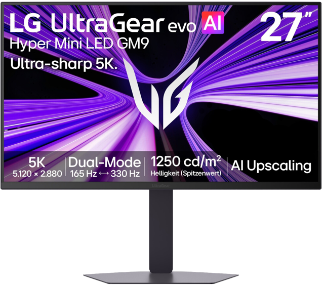
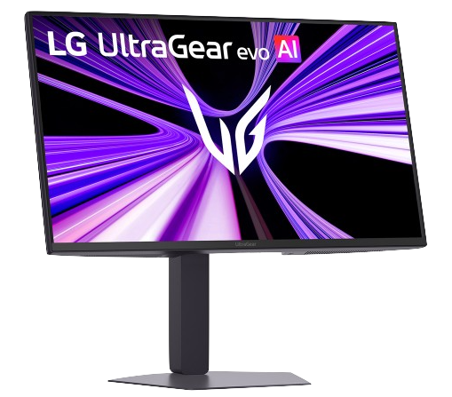
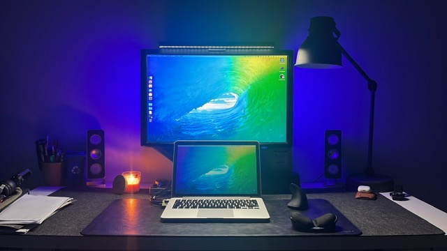
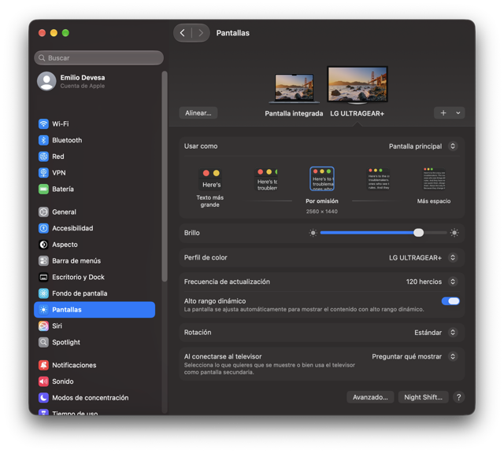
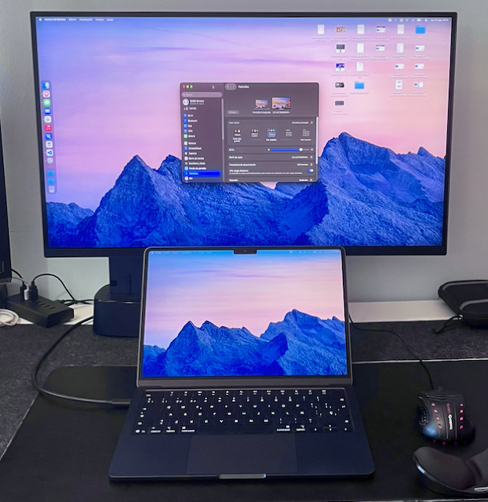
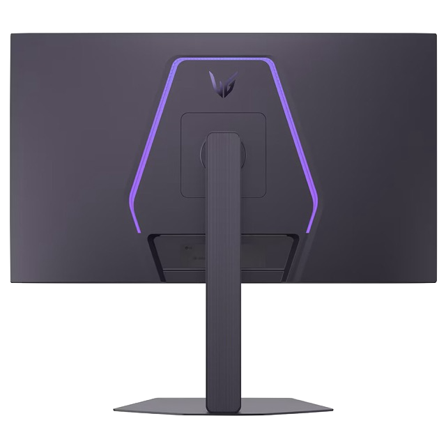
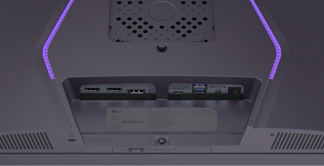

**Technical specifications:**  
Name: UltraGear evo AI GM9 (27GM950B)  
Manufacturer: LG  
Price: 1199 €

**Choosing a monitor for the next decade**  
My new [MacBook Air M5](../../../2026/07/macbook-air-m5/) had solved one half of my computer setup. There was, however, another piece of hardware that had remained virtually unchanged for much longer: my external monitor.

My previous monitor was an [Acer P241W](../../../2009/06/acer-p241w) that I bought in 2009. Seventeen years later, it was still working, which says quite a lot about how I approach technology purchases. I don't replace my devices very often, so when I finally do, I tend to look for something that I can keep using for a very long time.

This time, however, I didn't want to simply replace an old monitor with a newer version of the same thing. I wanted to rethink the entire desktop setup around the MacBook Air M5 I had just bought.

**The starting point**  
When I bought my 2014 13-inch MacBook Pro, the Acer P241W was already part of my setup. At home, the laptop was connected to the monitor, a USB hub, external drives, an audio interface and a mouse. The setup worked, but it had become increasingly cumbersome over the years.

The old MacBook had only two USB ports, one of which had eventually become unreliable. The external monitor was more than capable of showing what I needed at the time, but its resolution and image quality were now far behind what I had become accustomed to from modern high-density displays.

Replacing the MacBook therefore created an opportunity to rethink the whole system.

The new MacBook Air M5 was dramatically more powerful, lighter and more efficient than my old Intel MacBook Pro. But if I was going to use it as my main computer for another ten years, I also wanted the desktop experience to feel like a genuine generational upgrade.

That meant replacing the monitor as well.

| | Acer P241W (2009) | LG 27GM950B (2026) |
|---|---|---|
| Size | 24-inch | 27-inch |
| Aspect ratio | 16:10 | 16:9 |
| Resolution | 1920 × 1200 | 5120 × 2880 |
| Pixel density | ~94 ppi | ~218 ppi |
| Panel technology | TN LCD | IPS Mini-LED |
| Refresh rate | 60 Hz | 165 Hz |
| HDR | No | Yes |
| USB-C | No | Yes |
| USB hub | No | Yes |
| Laptop charging | No | Up to 90 W |
| Single-cable connection | No | Yes |
| Years in service | 17 | Just started |

**Understanding how I actually use a monitor**  
As with the MacBook purchase, I didn't want to start by looking at specifications and then try to find a use for them. I started from the opposite direction: what do I actually do in front of the screen?

Most of my computer use consists of web browsing, reading and writing, watching videos, e-mail and messaging, managing documents, reading and writing music scores, programming and teaching online lessons.

I also use the computer for music-related work, including preparing educational material and working with audio. Gaming is not a major part of my computer use and that distinction turned out to be important.

A monitor designed primarily around competitive gaming can have incredible specifications, but 240 Hz or 360 Hz are not particularly valuable to me if they come at the expense of the things I interact with every day: text sharpness, image quality, connectivity and long-term reliability.

On the other hand, I didn't want to go to the other extreme and buy a traditional 5K 60 Hz office monitor. I wanted the smoothness of a high-refresh-rate display as well.

**The ideal monitor**  
Once we had defined my use cases, the requirements became much clearer.

First, I wanted a 27-inch display. I sit approximately 80 cm from the monitor, and after looking at the relationship between screen size, viewing distance and pixel density, 27 inches seemed like the right balance for my desk.

Second, resolution was extremely important. I had become accustomed to the sharpness of Apple's Retina displays and wanted something comparable on the desktop.

A conventional 4K 27-inch monitor provides a respectable pixel density of 163 ppi in a 16:9 aspect ratio. Using 2x integer scaling, macOS effectively gives you a 1920 × 1080 workspace. If you want a larger workspace, however, you have to use fractional scaling, which does not provide the same pixel-perfect rendering as a 2× Retina configuration. In practice, this means choosing between a smaller workspace with sharper rendering or a larger workspace with some loss of text sharpness.

This was particularly relevant because my previous Acer had a 16:10 aspect ratio and a 1920 × 1200 resolution. The extra vertical space compared with a 1080p display had always been useful when working with documents and music notation. I therefore didn't want the move to a modern 16:9 monitor to feel like a step backwards in terms of usable vertical workspace. 

At 27 inches, a 5K display provides around 218 pixels per inch, which is close to the density I was looking for. With macOS scaling, it can provide a 2560 × 1440 workspace while using the additional pixels to render the interface and text much more sharply. In other words, I could have the working area of a 1440p display while retaining the extremely high pixel density of a Retina screen.

Third, I wanted a high refresh rate. Yes, 60 Hz is perfectly usable for my work, but after using modern high-refresh displays, scrolling through long documents, web pages and code feels considerably smoother at 120 Hz and above.

Fourth, connectivity mattered almost as much as image quality.  
My ideal setup was extremely simple: a single USB-C cable should be enough to connect the Mac to the display, while also handling some peripherals such as an external backup drive, an audio interface and a mouse. In other words, I wanted one cable to carry video, data and power.  
This was particularly important because I wanted the monitor to replace the old combination of display + USB hub + laptop charger.

Finally, I wanted a monitor that I could realistically keep for ten years or more. This wasn't going to be a purchase based solely on today's specifications. I wanted to buy something that would still feel good to use years from now.

**The first problem: there aren't many monitors like this**  
Once these requirements were combined, the list of possible monitors became surprisingly short. There are countless 27-inch monitors on the market, but most of them compromise on at least one of the things I considered essential.

Some have 4K resolution instead of 5K. Others have 5K but only 60 or 70 Hz. Some have OLED panels with spectacular contrast but raise concerns about burn-in and long-term use with static elements such as text, menus and code. Others have excellent connectivity but lack the pixel density I wanted. And some of the most interesting gaming monitors had USB-C ports that could transmit video and data but provided very little power to the laptop.

So the research became a search for a very specific combination:
- 27-inch display
- 5K resolution
- High refresh rate
- USB-C capable of charging my laptop and acting as a USB hub

**Apple**  
The obvious place to start was Apple.

I had already considered the Studio Display and the Studio Display XDR while researching the MacBook Air.

The Studio Display has exactly the kind of experience I was looking for: 27 inches, 5K resolution, excellent integration with macOS and the kind of build quality I would expect to keep for many years. But it has two major drawbacks for this particular purchase: its price and its 60 Hz refresh rate.

The Studio Display XDR was even more difficult to justify. Its Mini-LED backlight and HDR capabilities are impressive, but its price puts it in an entirely different category.

I wasn't looking for the best monitor money could buy. I was looking for the best monitor that made sense for my actual use. Apple therefore provided a useful reference point rather than the final solution.

**BenQ, Dell, MSI, Asus...**  
BenQ was another interesting alternative because the company has several monitors specifically aimed at professional and creative users.  
The 5K models offered the pixel density I wanted and were clearly designed around productivity, colour accuracy and long-term desktop use. The problem was refresh rate.  
The traditional 5K BenQ options were primarily 60 Hz or around that range, while the newer high-refresh models did not always offer the complete combination of features I was looking for.  
For someone primarily doing photography, graphic design or office work, these monitors could make a lot of sense. For my particular combination of music notation, programming, web browsing, video and general use, however, I wanted something more versatile.

Dell offered another interesting route.  
The UltraSharp range has always been appealing because of its professional orientation, connectivity and excellent build quality. Some of the 27-inch 4K models also offered very good USB-C and Thunderbolt connectivity. But once again I had to choose between features.  
A 4K 27-inch display would give me excellent image quality, but it would not provide the same pixel density as 5K. And because I was buying a monitor specifically to keep for a decade or more, I didn't want to compromise on the one characteristic that I knew I would appreciate every single day: sharpness.  
Dell therefore remained an interesting alternative, but not the one I wanted.

Several manufacturers had released 27-inch 4K OLED monitors with extremely impressive specifications. Among them were models such as the MSI MPG 272URX, ASUS ROG Strix XG27UCDMG and ASUS ROG Swift PG27UCDM.  
These monitors offered 4K resolution, 240 Hz refresh rates, QD-OLED panels and excellent HDR performance. And they were considerably cheaper than the LG.

The MSI, for example, was around €660, while the ASUS models were approximately €650 and €850 depending on the version. On paper, they looked like incredible bargains.  
But I kept coming back to the same question: Would OLED actually be better for the way I use a computer? For gaming and video consumption, absolutely. For ten years of programming, documents, browser windows, music notation and other static interface elements, I wasn't convinced.  
OLED has obvious advantages, especially its perfect blacks and contrast. But it also introduces the possibility of image retention and burn-in over very long periods.  
That doesn't mean modern OLED monitors are unsuitable for productivity. They have increasingly sophisticated protections and many people use them successfully for years.

But I wasn't looking for a monitor for three or four years. I was looking for one that I could potentially keep for ten or fifteen.

The ASUS ROG Strix XG27JCG became the most serious alternative to the LG. It offered almost everything I wanted: 27 inches with 5K resolution (around 218 ppi), high refresh rate, USB-C connectivity... And, most importantly, it was considerably cheaper.  
At around €770, it was roughly €430 cheaper than the LG at the prices I was initially seeing in Spain. For a while, this looked like the obvious value choice.

There was, however, an important problem: The USB-C port only supplied around 15 W of power. That meant it could carry video and data, but it wasn't really a replacement for the MacBook's charger. My original idea was to connect the MacBook to the monitor using a single USB-C cable. With the ASUS, I would still need another power connection.

This seemed like a minor detail at first, but it was actually one of the requirements I had considered most important.  
I could use a Thunderbolt dock such as the CalDigit TS5 to provide the power and connectivity, while the monitor would only be responsible for displaying the image. An integrated monitor hub is convenient, but a separate dock is modular. If the monitor fails or is replaced ten years from now, the dock can remain. The problem was that once the price of the dock was added, the total cost of the ASUS solution became much closer to the LG.

**And then something else happened**  
During the research, MSI and Gigabyte announced new 27-inch 5K Mini-LED monitors.  
The problem was timing: These monitors were not yet established products on the European market when I needed to make my decision.  
I could wait, but there was no guarantee about their final prices in Spain, availability, firmware quality or real-world performance.

At this point I had already been thinking seriously about replacing the monitor for several months, and the waiting game had become almost as important as the technical analysis itself. I had been patient, watching new products being announced and prices changing, but I knew I couldn't keep waiting indefinitely. September, when the new academic year started, became my deadline for making a decision.

**The LG 27GM950B**  
Eventually, the LG UltraGear evo AI 27GM950B emerged as the monitor that best matched the complete set of requirements.

It wasn't the cheapest, or the fastest, or an OLED display, but it combined the things I actually cared about.

The 27-inch 5K panel gives me the high pixel density I wanted for text, code and music notation. The Mini-LED backlight with thousands of independently controlled zones provides much better HDR performance than a conventional IPS display. The 165 Hz refresh rate is far beyond what I need for most of my work, but it should make everyday interaction feel smoother. And, critically, the USB-C connection can provide up to 90 W of power.

**Financial perspective**  
The financial side of the decision was particularly important because I had just bought a new MacBook Air for €1,569, configured with 24 GB of unified memory and 1 TB of storage.

As with the MacBook, the key was to change the way I thought about the purchase: I expected to use this monitor for a couple of hours or more per day, every day, for at least ten years. With that in mind, my take on the price shifted from 'expensive' to simply 'high'.

In Spain, prices were around €1,200, although I eventually found the same monitor on Amazon Germany for a dramatically lower price. The initial advertised price was €879, which only rose to €922.96 after adding shipping and taxes.

Buying such an expensive piece of hardware from Amazon Germany rather than a Spanish retailer initially made me hesitate, particularly because of the implications of returns and warranty service. In the end, however, the price difference was simply too large to ignore. Compared with the €1,200 Spanish price I had initially been considering, I saved roughly €277, or about 23%.

After months of research, comparison and waiting, I finally placed the order.

**First impressions**  
After spending some time with the monitor, I can now say whether it actually delivered what I was expecting. So far, the answer is a clear yes.

The physical size was one of the first things I noticed. Moving from 24 to 27 inches makes a very positive difference because the visible screen area is considerably larger. At the same time, the much thinner bezels mean that the monitor doesn't take up much more physical space on the desk than the old Acer.

The sharpness really is impressive. The pixel density provides a huge improvement in definition, particularly when reading text. Letters and fine details look extremely clean, with no visible jagged edges even at small sizes. Colour reproduction is also much better than on the old Acer, even without making any adjustments and simply using the factory settings.

I also ran the display through EIZO's online monitor test and couldn't find any dead pixels or any significant problems with uniformity, brightness or sharpness. As far as I can tell, the panel is simply immaculate.

The other change that immediately stands out is the refresh rate. Moving from 60 Hz to more than 120 Hz makes a surprisingly big difference in everyday use. Scrolling through web pages and documents feels much smoother, but the improvement is also noticeable when moving around macOS, switching between virtual desktops or simply dragging windows around the screen. This is one of those improvements that is difficult to appreciate from a specification sheet. Once you have used it for a while, however, going back to 60 Hz suddenly feels surprisingly sluggish.

Inside the monitor, there is a pair of modest built-in speakers. They are perfectly adequate for listening to a podcast or watching a quick video, but they are neither powerful nor clear enough for watching movies or playing games. For anything more demanding, I'll continue using my [HiFiMAN Sundara](../../../2023/01/hifiman-sundara/) headphones.

The monitor also offers a comprehensive selection of connections. On the rear, it includes two HDMI ports, a DisplayPort 2.1 connection, a USB-C port with up to 90 W power delivery, two USB-A ports and a headphone output. This gives me considerably more flexibility than my previous setup and, most importantly, allows the monitor to act as the central connection point for my desk.

This integrated USB hub works perfectly with my setup. I have connected a hard-drive dock to the first USB port, while the second one is connected to another hub on my desk. That hub is where I connect the audio interface, mouse, USB flash drives and other peripherals. This has turned out to be particularly convenient for connecting temporary USB devices. For example, plugging a phone into this external hub is much easier than having to reach behind the screen.

More importantly, the single-cable setup works exactly as I had hoped. The MacBook is connected to the monitor using a single USB-C cable, and that same cable carries the video signal and data while providing enough power to charge the laptop's battery without any problems. This means that the original goal of simplifying my desk has actually been achieved: when I sit down, I only have to connect one cable to the MacBook.

The monitor also has LED lighting on the back. Initially, I thought I would simply disable it because the display is positioned very close to the wall. However, it can be configured with different static colours or set to cycle automatically through a range of colours, and I've ended up finding it a rather nice addition.

There are also a couple of features that I haven't really put to use yet: the Dual Mode and the AI upscaling features. Both are primarily aimed at gaming, allowing the monitor to switch between different resolutions and aspect ratios or use AI-based image processing to improve lower-resolution content. Since gaming isn't an important part of how I use my computer, these features haven't played a role in my experience so far. They are nice extras to have, but they weren't part of the reason I chose this monitor.

The stand is another strong point. It is robust, very easy to assemble and allows adjustment of the display's height, tilt and rotation. It is essentially a VESA-compatible solution, so I can also continue using the VESA arm I previously had with the Acer.

There are, however, a few minor details worth mentioning.

First, the monitor's power adapter is monstrously large, so I had to hide it underneath the desk. It isn't something I'll ever have to look at, but it is considerably larger than I expected.

The monitor also has an internal fan, which is known to operate very quietly. So far, I haven't been able to hear it at all, even when running HDR content at 120 Hz. This is particularly reassuring because fan noise was something I had been slightly concerned about before buying a Mini-LED monitor.

Inside the box, LG also includes the manual, HDMI and DisplayPort cables, and a small plastic clip that attaches to the monitor stand to provide some basic cable management.

Overall, I am extremely satisfied with the monitor. It meets all the requirements I established at the beginning of the process, while providing a substantial improvement in image quality, workspace and everyday comfort. Most importantly, the features that looked good on paper have translated into real improvements in the way I use my computer.

**From laptop to desktop**  
The most interesting thing about this purchase is that the monitor is not simply a larger display. It changes the way the MacBook functions at my desk.

When I sit down to work, one USB-C cable can connect the MacBook to the monitor, while the monitor provides the hub for my external storage, audio interface and mouse.  
The laptop remains a portable computer when I leave the desk, but becomes the centre of a much more capable desktop environment when I return.

From a hardware perspective, the change is enormous. My old setup consisted of a 2014 Intel MacBook Pro and a 2009 24-inch monitor. The new one combines a 2026 Apple Silicon MacBook Air with a 27-inch 5K Mini-LED display.

However, the biggest improvement from my previous setup is not any individual specification. It is the reduction in friction. 
The old setup was already capable of doing most of the things I needed, while the new one doesn't fundamentally change what I do; it changes how easily I can do it.

The MacBook is faster, silent, lighter and vastly more capable. The display is dramatically sharper and larger, while also being much smoother thanks to its high refresh rate. The USB-C connection simplifies the desk, the internal 1 TB storage means I can keep my working files locally while using external storage primarily for backups.  
And, perhaps most importantly, the whole system is designed around the way I actually work rather than around a list of impressive specifications.

The old monitor had served me for seventeen years. The old MacBook had served me for twelve. If the new equipment lasts anything close to that long, I won't be writing another article about replacing this setup for quite some time.

**What I saved**  
The MacBook Air M5 was purchased for €1,569, while its price in Spanish stores is around €1,979 at the time of writing. The LG monitor ended up costing €922.96 delivered, despite Spanish prices being around €1,200. Compared with the current prices of both products in Spain at the time of writing, I estimate that I saved approximately €687 across the two purchases. That's a saving of around 21.6% on the combined price.

Together, the two purchases represent a major investment, but one that I expect to amortise over roughly a decade. I hope this setup will provide me with a comfortable, high-quality workspace throughout that time.

The most satisfying part of the process isn't simply that I found the cheapest possible price, but that I managed to reduce the cost without compromising on the things I considered important. More importantly, I didn't arrive at the decision by simply looking for the highest specifications or the lowest price. I started by asking what I actually needed, compared the available technologies, and then waited. Finally, when the right combination of product, price and timing appeared, I bought it.

The best technology isn't necessarily the one with the best specifications. It's the one whose compromises make the most sense for how you actually intend to use it — and for how long you intend to keep it.