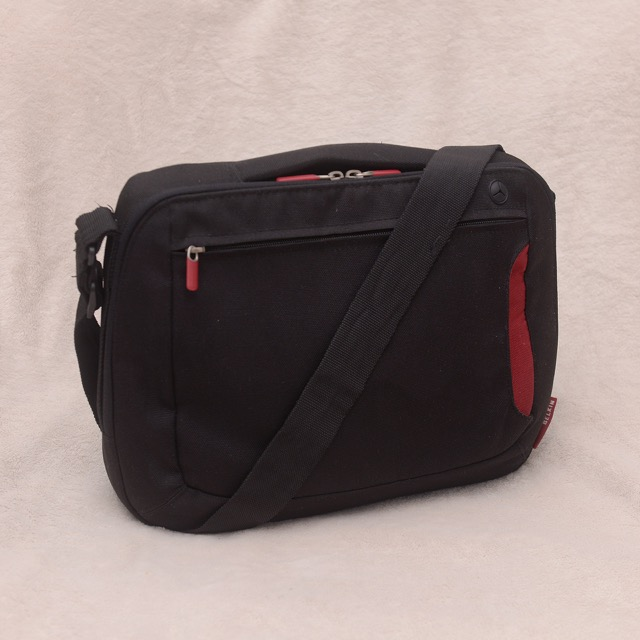
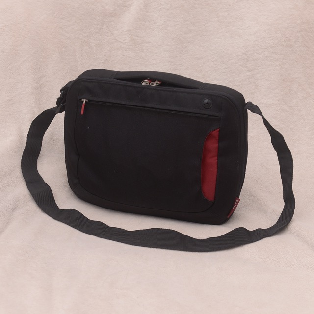
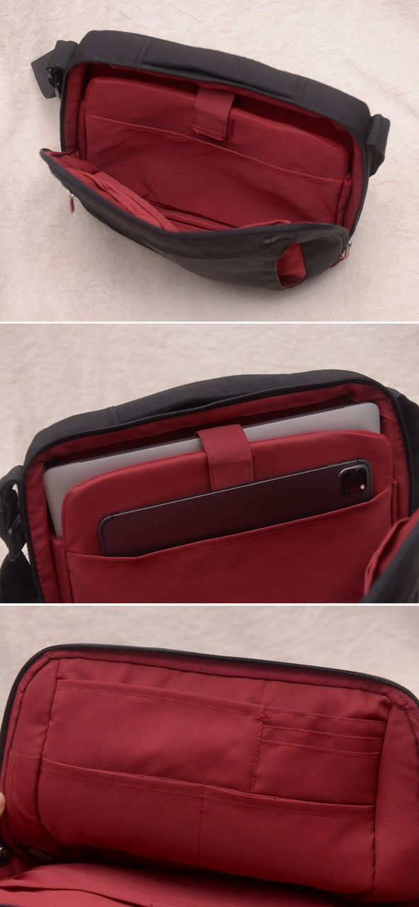
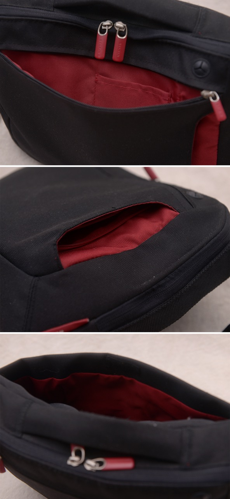
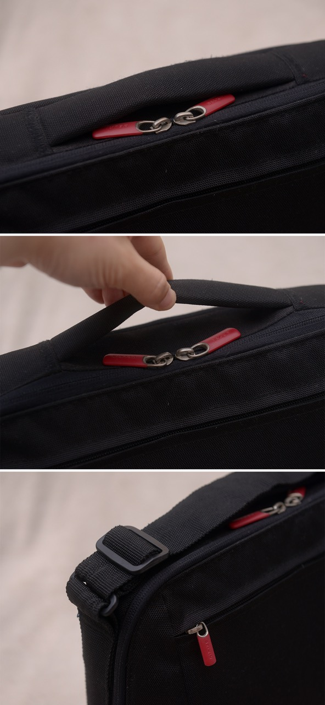
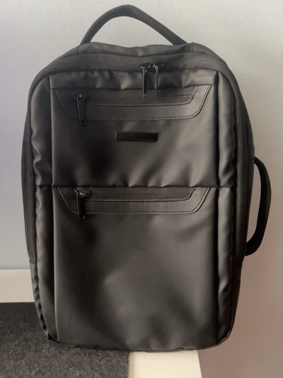
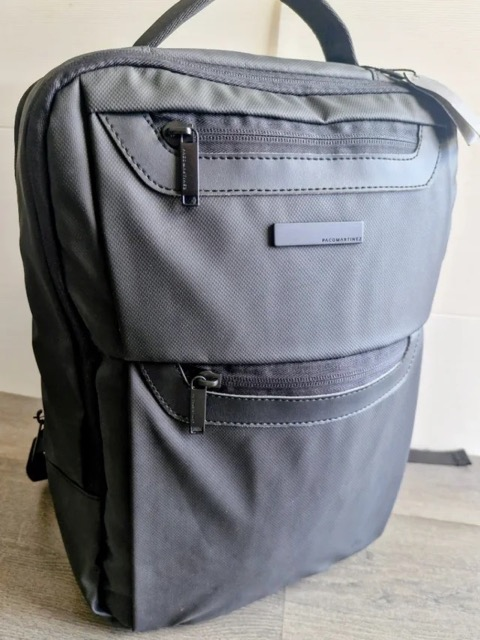
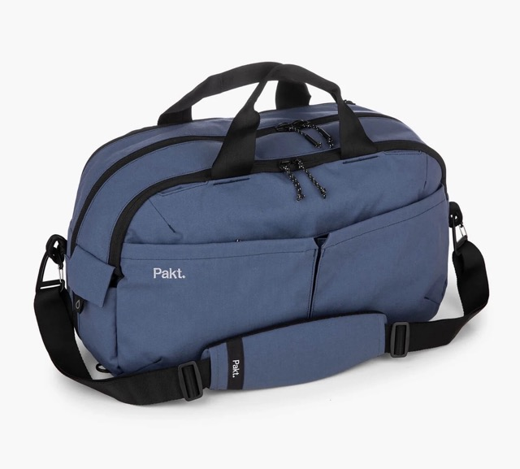
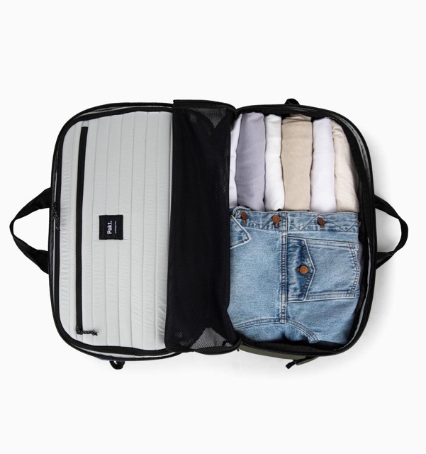
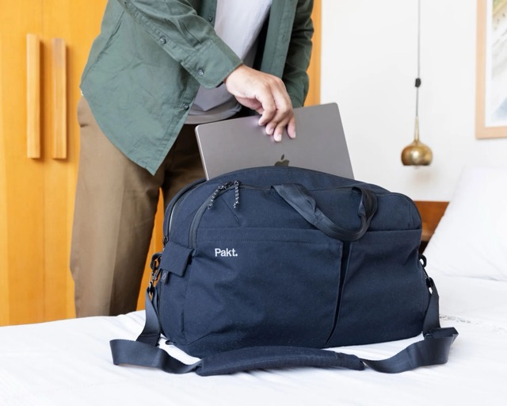

For almost twenty years, I have used only one computer at a time. When I in my first year at university, my parents bought me a 15-inch Packard Bell laptop. It was a decent machine, but carrying it back and forth to university made my daily commute miserable. I had to carry it in a large backpack or laptop bag along with its charger, as the battery lasted barely two hours. It worked well enough, but portability was definitely not its strongest point.

That changed when I discovered the [Asus Eee PC 901](../../../2008/10/asus-eee-pc-901/). I immediately fell in love with this small, lightweight computer. I could carry it around every day in its included bag, and still get some work done: basic coding, taking notes and keeping PDFs of my lessons close at hand.

It was a computer with limited resources, but it was more than capable of handling everything I needed it to do. The battery lasted around four to five hours, which made a real difference. Many students had computers that were overkill for our needs, which mostly involved browsing the web, programming in Pascal, doing some basic Java development and working with PDF documents.

I eventually sold the Packard Bell and stuck with the Asus for three years. Then I upgraded to the [Asus Eee PC 1215N](../../../2011/08/asus-eee-pc-1215n/), which offered better performance, a more comfortable keyboard, a larger screen, discrete graphics and more storage. It served me well for another three years. I could run larger IDEs such as NetBeans and Eclipse, use a lightweight virtual machine and even play some games. I ended up reviewing some of those games on my blog, too.

The 1215N was larger than the 901, so I needed a slightly bigger bag. That was when I bought the Belkin Messenger Bag that I still own today.

**Belkin Messenger Bag**  
Looking back, I don't think I gave this bag enough credit for its everyday performance, appearance and comfort. It is compact, practical and surprisingly capable. It can accommodate a laptop, its charger and even a tablet, with additional pockets for a pen, smartphone, headphones and sunglasses. There is also room for a few documents, provided you don't mind bending their corners a little.

There are two things I have always missed, though: an external pocket for a water bottle and the option to detach the shoulder strap completely. The strap can be tucked away in an exterior pocket, but it cannot be removed.

The bag combines nylon and neoprene, and its overall construction has held up remarkably well. The zippers, Velcro fasteners and padding around the laptop compartment have all proved dependable, while the interior dividers help keep small accessories organised. You can carry it by the handle, over your shoulder or across your body.

After around fifteen years of use, it remains a bag I genuinely like. It has needed a repair to a torn seam at one corner, but that is a pretty good track record for something I have carried through several computers and countless commutes.

Its main limitation is capacity. When all I need is my laptop and a few everyday essentials, it is excellent. When I need to bring extra clothes, shoes or a water bottle, things become much more complicated.

|  |  |  |
|---|---|---|

**Backpacks**  
At the end of 2014, I replaced the Eee PC 1215N with my [13-inch MacBook Pro](../../../2025/02/macbook-pro-2014/). I travelled quite a lot with this Mac, both for work and leisure, and the Belkin continued to serve me well.

However, I often carried the computer in a backpack instead. I tried several models, including a couple of inexpensive ones I bought on Amazon because of their simple design and low prices. None really stood out. More importantly, I never felt entirely confident about how well they protected my laptop.

I started looking for something better: a bag that was comfortable to carry, offered proper laptop protection and could handle the demands of travelling without being unnecessarily bulky.

**Paco Martínez Executive Backpack**  
Fast-forward to November 2021, and I was still using my 2014 MacBook Pro. I was about to start flying more frequently within Spain and occasionally to Germany, so my mother decided it was time for a more suitable travel bag. She bought me a black Paco Martínez executive backpack.

This model has a professional, understated appearance and combines the portability of a backpack with features designed for carrying documents and electronics.

The exterior is made of black rubberised nylon. Two front pockets provide quick access to smaller items, while the main compartment features an interior organiser and a padded laptop or tablet sleeve that accommodates devices up to 15 inches. The back panel is breathable, and a luggage pass-through allows the backpack to slide over the handle of a rolling suitcase.

It has served me well, but there are still a couple of things I would change. Like the Belkin, it lacks a dedicated external water bottle pocket. More importantly, the main compartment does not open fully in clamshell style, which would make packing and accessing my belongings much easier when travelling.

I can fit a pair of shoes inside if necessary, but that leaves little room for anything else. It is a useful work backpack, but its capacity becomes a limitation when I need to carry both my usual equipment and additional clothing.

**Looking for something new**  
It is now autumn 2026. I don't fly as frequently as I used to, but I still travel for work and leisure. My cabin suitcase has been passed on to my partner, whose own suitcase has a broken handle, and I have been looking for a lighter, smaller alternative for short trips.

My needs have not changed dramatically. I still carry a laptop and a collection of everyday essentials, but my trips are often shorter, and I want to be able to travel for a couple of days without feeling constrained by my luggage.

I also want something that will last. I have never been particularly interested in replacing my equipment every few years, and my fifteen-year-old Belkin is a good example of what I value in a product.

Ideally, my next bag would have the following features:
- A well-padded laptop compartment with adequate clearance from the bottom of the bag, suitable for a 13-inch laptop
- A clamshell-style opening for easy packing and unpacking
- Water-resistant materials
- High-quality zippers, preferably from a manufacturer such as YKK
- A luggage pass-through, just in case
- An external pocket for a 500 ml water bottle
- A practical design that doesn't look out of place in a professional setting

I initially looked at backpacks, but none quite met my expectations. I found a Parfois model that ticked almost every box, but its laptop compartment did not appear to offer enough clearance from the bottom of the bag. I wanted the laptop sleeve to be "suspended" or "floating", so the computer would not take the full impact every time I put the bag down.

There were plenty of cheaper alternatives on Amazon, but I was less interested in buying something inexpensive if it meant compromising on construction and long-term durability. At the other end of the market, I considered several Bellroy backpacks. They looked promising, but none felt quite right for my needs, especially given their prices.

Then I remembered a documentary.

**Pakt One Travel Duffel (28L)**  
I remembered Mat D'Avella's documentary "[Minimalism: a documentary about the important things](https://www.youtube.com/watch?v=J8DGjUv-Vjc)" which is available to watch on YouTube. One of the men featured in the film used a bag that was praised as "the only bag you will ever need". Could that really be true?

After watching this documentary again and going through promotional videos and customer reviews, I finally bit the bullet and bought the Pakt One Travel Duffel (28L), the latest version of a bag originally launched under the Malcolm Fontier brand.

The Pakt One Travel Duffel is a 28-litre travel bag designed to combine the portability of a duffel with the organisation of a suitcase. It opens in clamshell style, making packing and unpacking straightforward. It has a padded laptop compartment for devices up to 16 inches, several quick-access pockets, a hideaway water bottle pocket and a luggage pass-through for attaching it to a rolling suitcase.

The exterior is made from 500D recycled nylon with a water-resistant coating, and the bag features YKK zippers. The materials are designed to withstand everyday use and resist water, although the bag is not fully waterproof. Pakt also offers a lifetime guarantee, which is reassuring for a product in this price range.

On paper, it seemed to meet most of my requirements. However, specifications alone could not tell me whether it would be comfortable to carry every day or whether its capacity would prove useful rather than excessive.

I had a few concerns, though. Would it be too large for everyday carry? How well would it protect my laptop? Could I fit a computer, a water bottle, a pair of shoes, and a jacket or coat without everything feeling crammed in? Would it be comfortable to carry on my daily commute? And could it also hold everything I would need for a two-day trip?

I was about to find out, as the first rainy days of autumn arrived.

**The first test: a rainy commute**  
My first real test came on a rainy day when I needed to carry more than usual. Along with my MacBook Air, charger and everyday essentials, I had to pack a pair of trainers and some extra clothing to change into at work.

This was precisely the kind of situation that had made me reconsider my old bags in the first place. The Belkin Messenger Bag would simply have been too small for all of this, while the Paco Martínez would have struggled to accommodate everything comfortably.

The Pakt, on the other hand, had plenty of room. Perhaps a little too much room, in fact.

That was my first impression: the bag felt slightly oversized for everyday use. It is not necessarily a problem with the bag itself, but rather a reminder that a 28-litre travel duffel is a very different proposition from a compact laptop messenger bag. When you carry only a laptop and a few accessories, all that extra space can feel unnecessary. When you need to bring spare shoes, a warm layer and everything else that a wet day demands, it suddenly makes a lot more sense.

This is the trade-off I wanted to explore. I did not want to buy another bag that could only carry my usual essentials; I wanted something that could handle the days when I needed to take more with me, without having to resort to a separate piece of luggage.

**The first trip: Tuesday to Thursday**  
A few days later, I took the Pakt One on a Tuesday-to-Thursday trip, and it turned out to be the perfect size for a short getaway.

I managed to fit a pair of shoes, a pair of slippers, a coat, my laptop and its charger, clean clothes, a notebook, headphones, a toiletry bag, keys, sunglasses, and a few other everyday essentials. Everything fitted comfortably, without having to squeeze things in or leave anything behind.

The clamshell opening proved particularly useful. It made packing and unpacking much easier, allowing me to see the contents of the bag at a glance instead of digging through a single large compartment. The numerous pockets and compartments were another major advantage, as I could give everything its own place and find what I needed quickly.

After worrying that the bag might be too large for everyday use, I was pleased to discover that its capacity was just right for a two-night trip. It offered a good balance of space, accessibility and organisation, without requiring me to bring a separate cabin suitcase.

Of course, a single trip is not enough to establish whether the Pakt is the right bag for every situation. But it has already proved its worth when carrying a laptop and clothing together, which is exactly what I wanted it to do.

**Comparing the three bags**  
| Feature | Belkin Messenger Bag | Paco Martínez Executive Backpack | Pakt One Travel Duffel (28L) |
|---|---|---|---|
| Everyday carry | Very compact | Medium-sized | Large |
| Carrying style | Shoulder / crossbody / hand | Backpack / hand | Duffel / shoulder / crossbody |
| Organisation | Small accessory pockets | Front pockets and internal organiser | Multiple pockets and compartments |
| Short trips | Not enough capacity | Very limited | Very suitable |
| Room for shoes and a jacket | Not enough room | Very limited | Plenty of room |
| Clamshell opening | No | No | Yes |
| Laptop protection | Very good | Very good | Very good |
| Years of use | Around 15 years | Since 2021 | Recently purchased |

These are my own assessments based on the bags' design and my experience using them, rather than the results of standardised tests. In particular, although the Pakt has a well-padded laptop compartment, I haven't used it long enough to assess its long-term protective performance or durability.

**The approximate price of the bags**  
Price is another important difference between these three bags. I paid around €270, including shipping, for my Pakt One Travel Duffel, placing it firmly in the premium category. At the time of writing, Pakt lists the current version at $285 before any discounts or shipping costs. 

My Belkin was a much more affordable purchase. I found an archived retailer listing showing a price of approximately €22, although I cannot confirm that this was the exact price I paid. I bought the Paco Martínez Executive Backpack in November 2021 for €40.

The comparison is therefore not simply about which bag offers the most features for the money: the Belkin was an inexpensive everyday accessory, the Paco Martínez was a mid-range work backpack, and the Pakt was a deliberate investment in a more versatile travel bag.

Whether that investment proves worthwhile will depend on how frequently I use it and how well it holds up over time.

**The right size depends on what you need to carry**  
My first impression of the Pakt was that it felt slightly too large for everyday use. On a rainy commute, however, I needed to carry my laptop, charger, trainers and extra clothing, and the Belkin would not have been big enough. A few days later, the Pakt proved ideal for a two-night trip.

The lesson is that capacity is only useful when you need it, but having that extra room can make a real difference. The challenge is finding a bag that offers enough space for occasional trips without feeling unnecessarily bulky on ordinary working days.

**Durability matters more than impressive specifications**  
My Belkin Messenger Bag has been with me for around fifteen years, through several computers and countless commutes. It has needed some repair, but it has also demonstrated how much value a well-chosen product can offer over time.

The Pakt is built with more premium materials and comes with a lifetime guarantee, but that does not automatically mean it will last as long as my Belkin. Only time will tell. For me, the important question is whether its materials, zippers, padding and organisation justify the higher price over years of real-world use, rather than simply looking good in a product description.

**There may not be one perfect bag for every situation**  
The Belkin, the Paco Martínez and the Pakt serve slightly different purposes. The Belkin remains an excellent choice for a light commute when I only need my laptop and a few accessories. The Paco Martínez offers a more conventional backpack format for carrying work essentials on my back. The Pakt, meanwhile, has proved particularly useful when I need to combine work and travel, with enough room for shoes, a coat, clothes and all my usual electronics.

Perhaps the best solution is not to find a single bag that does everything perfectly, but to understand which one works best for each situation. I will continue using the Pakt for workdays when I need extra capacity and for short trips, while keeping the Belkin as a compact alternative.

The real test will be what happens over the next few months. Will I keep reaching for the Pakt on ordinary working days, or will its size make me appreciate the Belkin even more? And will the Pakt prove durable enough to become a long-term companion, just as my old messenger bag has?

For now, I am pleased with the purchase. It has already made travelling for a couple of nights simpler, and it has given me the flexibility I was looking for. Whether it becomes the only bag I will ever need remains to be seen.